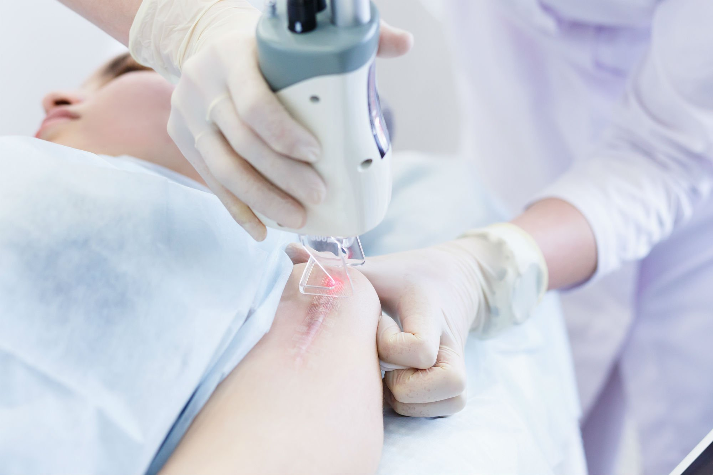

**Każdy z nas na swojej skórze może znaleźć z powodzeniem od kilkunastu do nawet kilkudziesięciu znamion, pieprzyków, brodawek i im podobnych zmian skórnych. Niektóre z nich dodają nam uroku, inne stanowią problem estetyczny, a jeszcze inne mogą stać się zagrożeniem dla naszego zdrowia, a nawet życia. Usuwanie znamion stało się jedną z opcji poradzenia sobie z problemem, jednak liczne mity z nim związane sprawiają, że wiele osób ma sporo obaw. Poniżej przedstawiamy popularne mity oraz fakty, które rozwieją wątpliwości na temat usuwania znamion!**

## **Usuwanie znamion - mity vs fakty**

**MIT 1 – Wszystkie znamiona muszą być niezwłocznie usuwane**

**FAKT** – Pojawienie się nowego pieprzyka czy znamienia na skórze nie jest podstawą do ich szybkiego usunięcia. Nie oznacza to również, aby nową zmianę skórną zlekceważyć i „lepiej jej nie ruszać”. Pierwszym krokiem powinno być jej dokładne przebadanie. Najlepszą nieinwazyjną i zupełnie bezpieczną opcją jest tutaj [badanie dermatoskopem](https://twojeznamiona.pl/dermatoskopia-badanie-znamion), które pomoże ocenić czy pojawiły się niepokojące cechy zmiany, a dopiero w razie ich stwierdzenia i potwierdzenia obecności komórek nowotworowych można je usunąć. Celem usuwania znamion jest wycięcie znamion podejrzanych i skierowanie ich do badania histopatologicznego, bo dzięki temu można dowiedzieć się, czy był w nich nowotwór - nie usuwanie znamion jako takich.

**MIT 2 – Każde znamię jest takie samo**

**FAKT** – Nie trzeba być ekspertem, aby zauważyć różnorodność zmian, które pojawiają się na naszej skórze. Mogą przybierać one bardzo różne rozmiary, barwy czy wypukłości. Medyczne kryteria różnicujące znamiona są jeszcze bardziej złożone, bowiem obejmują również struktury skóry, z których znamiona się wywodzą. Można zatem rozróżnić między innymi zmiany barwnikowe, naczyniowe, naskórkowe czy przydatkowe. Najczęściej spotykanymi zmianami są barwnikowe, które z reguły uwarunkowane są genetycznie – są wrodzone, a ich liczba najczęściej zwiększa się wraz z naszym wiekiem.

**MIT 3 – Badanie znamion należy wykonywać tylko, gdy pojawią się niepokojące zmiany**

**FAKT** – O ile pojawienie się niepokojącej zmiany na skórze jest dobrym pretekstem do wykonania badania znamion, to profilaktycznie zaleca się również regularne badania skóry całego ciała przynajmniej raz do roku. Nie jesteśmy w stanie samodzielnie ocenić wszystkich pojawiających się zmian na skórze. Poddając się komputerowemu badaniu znamion - [widedermatoskopii](https://twojeznamiona.pl/wideodermatoskopia-komputerowe-badanie-znamion) , możemy uzyskać pełną analizę występujących na naszym ciele zmian. Pojawiające się asymetrie, nieregularne krawędzie, niejednolita barwa, większa niż do tej pory średnica zmiany itp., mogą zostać podczas badania zauważone nawet w trudno dostępnych miejscach. W razie niepokojących objawów, lekarz może skierować nas do usunięcia znamienia dobraną do jego charakteru metodą niechirurgiczną lub chirurgiczną.

[Zobacz, jakie są rodzaje czerniaka](https://twojeznamiona.pl/czerniak/rodzaje-czerniaka-zdjecia)

**MIT 4 – Nie usuwa się znamion z powodów estetycznych**

**FAKT** – W sytuacji, gdy zmiana skórna zostanie uznana przez lekarza jako niegroźna dla naszego zdrowia, nadal mamy możliwość jej usunięcia. Możemy się jej pozbyć, gdy nam przeszkadza bądź jest dla nas źródłem kompleksów i kierujemy się walorami estetycznymi. Usuwanie znamienia można wykonać [laserowo](https://twojeznamiona.pl/laserowe-usuwanie-znamion) po badaniu wideodermatoskopowym (gdy znamię jest niegroźne) lub [chirurgicznie](https://twojeznamiona.pl/chirurgiczne-usuwanie-znamion) z badaniem histopatologicznym.

**MIT 5 – Znamię może zostać usunięte wyłącznie przez chirurga**

**FAKT** – Rozwój medycyny i różnych metod o mniejszej inwazyjności (w tym metod niechirurgicznych) sprawia, że poza chirurgiem, zabiegu usuwania znamienia mogą podjąć się również inni lekarze z doświadczeniem. W zależności od charakteru zmiany, pomocy w tym zakresie może udzielić nam zatem dermatolog lub inny lekarz zabiegowy. Każdy zabieg powinien być jednak każdorazowo poprzedzony badaniem znamion.

**MIT 6 – Każde znamię można usunąć laserem**

**FAKT** – Laserowe usuwanie znamion jest bardzo popularną alternatywą, jednak w sytuacji, gdy zmiana skórna jest atypowa lub pojawia się podejrzenie o jej złośliwym charakterze, jest ono wykluczone. Tutaj konieczne staje się chirurgiczne usuwanie znamion, z których wycinki poddawane są [badaniom histopatologicznym](https://twojeznamiona.pl/chirurgiczne-usuwanie-znamion#histopatologia). W przypadku pochopnego użycia metody laserowej, usuwanie znamion może nieść poważne powikłania, w tym niepotrzebne podrażnienie zmiany nowotworowej. Metoda laserowa sprawdza się jednak w likwidowaniu plam i przebarwień, kurzajek, brodawek, blizn itp.

