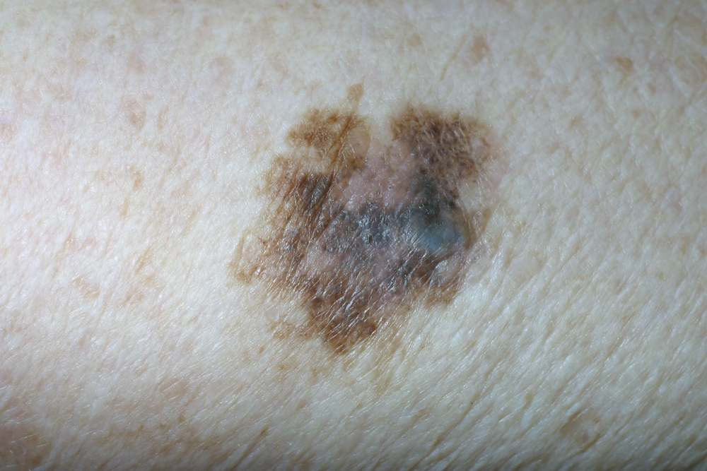

**Czerniak skóry** należy do najbardziej złośliwych nowotworów. Wczesna diagnostyka zmian jest warunkiem skutecznego leczenia, a **wideodermatoskopia** (mikroskopia epiluminescencyjna) jest w niej bardzo pomocna. Umożliwia ona również miarodajne badanie znamion atypowych i ich monitorowanie. Wszystko to dzięki systemom komputerowym pozwalającym na precyzyjną ocenę obrazów uzyskanych w **badaniu wideodermatoskopowym**.

Aby jednak można było mówić o wykorzystaniu w pełni potencjału technologii musi ona znaleźć się w rękach doświadczonych specjalistów. W tym artykule opowiemy, czy możliwe jest wykonanie **bezpłatnego badania znamion w Poznaniu w 2020 roku** i czy warto.

## Jak odróżnić pieprzyk od czerniaka?

Znamiona barwnikowe zwane potocznie pieprzykami to zmiany skórne, które występują na ludzkim ciele powszechnie. Przyjmują różne odcienie od tych praktycznie niewidocznych, przez czerwone, brązowe, aż po całkiem czarne. Barwa zależy bezpośrednio od ilości nagromadzonej punktowo w skórze melaniny.

Z reguły mają one charakter łagodny. Towarzyszą człowiekowi od urodzenia (znamiona wrodzone) lub pojawiają się we wczesnym dzieciństwie. Nie wystawiane na promieniowanie UV rzadko się uzłośliwiają.

Znamiona atypowe o nieregularnych kształtach i barwie, które pojawiły się niespodziewanie są obarczone większym ryzykiem rozwoju [czerniaka](/czerniak). Powinny być obserwowane – podobnie jak te łagodne – jednak również jak najszybciej poddane badaniu wideodermoskopowemu wysokiej jakości.

<More link="/blog/jak-wyglada-czerniak-zdjecia" text="Jak wygląda czerniak? ZDJĘCIA" cta="Zobacz" />

## Badanie znamion w Poznaniu

Znamiona przyjmują różne formy. Jeśli jakikolwiek pieprzyk – ten, który jest z nami od urodzenia lub taki, który pojawił się niedawno – budzi wątpliwości należy niezwłocznie udać się do LEKARZA z odpowiednią wiedzą i doświadczeniem w zakresie badań dermatoskopowych.

## Bezpłatne badanie znamion na NFZ?

Pierwszym skądinąd słusznym krokiem jest podjęcie decyzji o udaniu się na [badanie znamion](/dermatoskopia-badanie-znamion "Badanie Znamion"). Można to zrobić, rejestrując się na konsultację dermatologiczną w swojej przychodni, jednak **lekarz dermatolog** przyjmujący w ramach **Narodowego Funduszu Zdrowia** z reguły **nie ma dostępu do** nowoczesnego sprzętu diagnostycznego jakim jest **wideodermatoskop**, nie ma tym samym możliwości wykonania odpowiedniej jakości zdjęć i ich zapisania celem oceny dynamiki zmian w nich zachodzących w trakcie badań kontrolnych. Ponadto krótka wizyta podyktowana brakiem wystarczającej ilości czasu, bez **dokładnych oględzin** całego ciała i **archiwizacji** zebranych danych, nie sprzyja właściwej ocenie i prawidłowemu zakwalifikowaniu znamion skórnych do dalszego postępowania diagnostycznego.

Oczywiście nie zniechęcamy do konsultowania niepokojących znamion w trakcie wizyty u dermatologa jednak należy **pamiętać**, że pełnowartościowym badaniem profilaktycznym jest **badanie WSZYSTKICH znamion na ciele**, a nie tylko tych wskazanych przez pacjenta.

## Gdzie w takim razie udać się po szybką pomoc i diagnozę?

Najlepszym rozwiązaniem będzie wyspecjalizowany ośrodek. W Poznaniu jednym z nich jest [Centrum Badania Znamion ­Twoje Znamiona](/poznan/badanie-znamion "Poznańskie Centrum Badania Znamion
        ­Twoje Znamiona"). Centrum zlokalizowane jest w budynku **Nobel Tower przy ul. Dąbrowskiego 77a**.

To miejsce całkowicie ukierunkowane na wideodermatoskopową diagnostykę i leczenie zmian skórnych z wykorzystaniem opieki wielospecjalistycznej i najnowszej wiedzy medycznej.

**Wideodermatoskopia** w Centrum **Twoje Znamiona w Poznaniu** wykonywana jest na wysokiej klasy urządzeniu medycznym **Fotofinder Vexia**. Wideodermatoskop ten jest wszechstronnym systemem wyposażonym w kamerę, która dostarcza doskonałą jakość zdjęć zmian skórnych w rozdzielczości **Full HD**. Obrazy dermoskopowe są przypisane do konkretnego pacjenta, w ten oto sposób bardziej efektywnie można obserwować dynamikę zmian zachodzących w znamionach i postępy leczenia.

Urządzenie umożliwia identyczne ustawienie kamery i wykonanie zdjęć "przed i po" w celu ich rzetelnego porównania oraz automatycznie kalibruje zdjęcia i pozwala na wykonanie ręcznych pomiarów wielkości znamienia. W ten oto sposób system umożliwia tworzenie i rozbudowę wirtualnej karty pacjenta zawierającej niezbędne dane z każdej wizyty. Stwarza to szerokie możliwości ich zapisywania w postaci raportu i kiedy zachodzi taka potrzeba konsultowania przypadków z innymi specjalistami.

## Przebieg badania w Centrum Badania Znamion Twoje Znamiona

Wideodermoskopia w poznańskim ośrodku Centrum Badania Znamion, jest wystandaryzowaną procedurą, podczas której badane są wszystkie pieprzyki i przebarwienia występujące na ciele pacjenta. Z reguły trwa to **pół godziny**, gdy zmian barwnikowych jest bardzo dużo, zarezerwowane zostaje **więcej czasu** , gdyż żadna zmiana skórna nie może zostać zbagatelizowana.

Każdy pacjent, który trafia do Centrum Twoje Znamiona ma możliwość uzyskania wielospecjalistycznej pomocy – nie tylko w okresie diagnozy, ale także samego leczenia. Co bardzo istotne pomoc ta jest w stanie nadejść bardzo szybko, bez konieczności czekania na odległe terminy.

### A może zbadać znamiona na Ogrodowej 10?

Innym profesjonalnym Ośrodkiem świadczącym usługi z zakresu badania znamion jest Centrum Diagnostyki Znamion przy ul. Ogrodowej w Poznaniu, gdzie Państwo Federowicz kompleksowo zajmują się diagnostyką pacjentów w zakresie zmian skórnych. W Centrum przy ul. Ogrodowej pacjenci mogą liczyć na profesjonalne badanie z zastosowaniem wideodermatoskopu wraz z archiwizacją znamion wymagających późniejszej oceny.

Niestety z uwagi na ograniczoną liczbę dni przyjęć pacjenci muszą liczyć się z długim, często wielomiesięcznym terminem oczekiwania. Zdarzają się także okresy kiedy Centrum Diagnostyki Znamion przy ul. Ogrodowej nie rejestruje już nowych pacjentów, o czym można dowiedzieć się dzwoniąc na podany numer rejestracyjny.

Z uwagi na długie terminy oczekiwania dla pacjentów będących już pod opieką oraz brak możliwości umówienia się na wizytę pierwszorazową, wielu pacjentów wybiera inne miejsca, które zajmują się diagnostyką znamion w Poznaniu.

W Centrum Badania Znamiona **Twoje Znamiona** można wykonać wideodermatoskopowe badanie znamion, ale także skorzystać z **konsultacji dermatologicznej**, **onkologicznej** oraz **usunąć zmiany** barwnikowe zarówno nieinwazyjnie (krioterapia), jak i chirurgicznie oraz wykonać **badanie histopatologiczne**.

## Bezpłatne badania znamion w ramach akcji profilaktycznych w Poznaniu i okolicy.

Nawet łagodne znamiona i niepozorne pieprzyki warto poddawać rok rocznej kontroli. Jeśli obawiamy się badań lub „niepotrzebnych kosztów”, to skierujmy swe kroki chociażby na bezpłatne badania profilaktyczne sponsorowane przez niektóre fundacje i stowarzyszenia. Można wówczas bezpłatnie skorzystać z doraźnego badania i porady lekarskiej w zakresie niepokojących zmian skórnych.

Należy jednak zwrócić uwagę na to, czy badanie wykonywane jest przez lekarza, gdyż zdarza się, iż tego typu badania wykonują osoby bez odpowiedniej wiedzy i wystarczających kwalifikacji np. nie przez lekarzy, co jest niezgodne z obowiązującym prawem i szkodliwe dla pacjentów.

Pamiętajmy ponadto, że badanie kilku znamion nie zwalnia nas z obowiązku wykonania badania całego ciała, gdyż tylko badanie od stóp do głów, wykonane przez doświadczonego specjalistę zapewnia nam bezpieczeństwo i możliwość postawienia trafnej diagnozy.

<More link="blog/jak-chronic-sie-przed-nowotworem-skory" text="Jak chronić się przed nowotworem skóry?" cta="Sprawdź" />