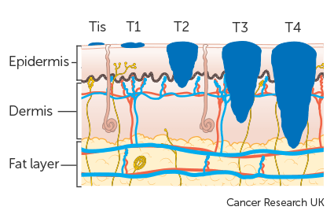
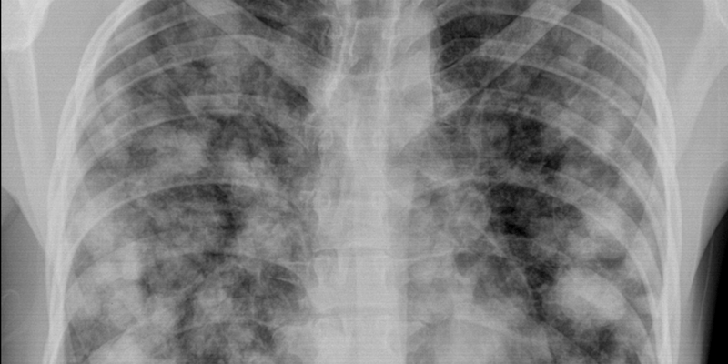
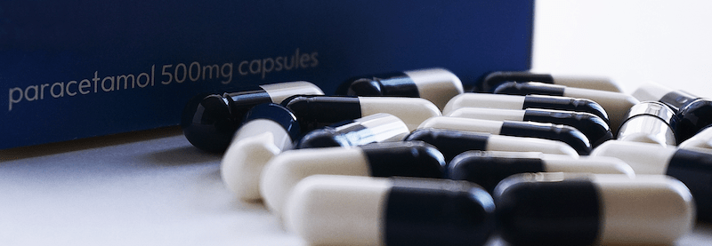
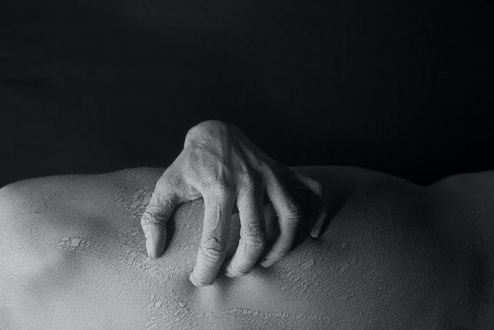

**Czerniak jest nowotworem, który w początkowych fazach rozwoju nie daje żadnych objawów bólowych. Cierpienie może pojawić się wraz ze wzrostem czerniaka w głąb skóry oraz w przypadku przerzutów. Jest ono ściśle związane ze stopniem zaawansowania tej choroby, a ból i skala jego odczuwania są zawsze uzależnione od cech osobniczych.**

Czerniaki na wczesnym etapie zaawansowania nie muszą dawać żadnych dolegliwości bólowych, co utrudnia ich rozpoznanie gdyż mogą wyglądać jak zwykłe znamiona i w ogóle nie zwracać na siebie uwagi. Dopiero wnikliwe badanie dermatoskopowe może ujawnić ich obecność na skórze pacjenta.

## Wideodermatoskopia to szansa na wczesną diagnozę.

Współczesne nowoczesne metody obrazowania zmian skórnych i ich mapowanie dają niepowtarzalną szansę na wczesną diagnozę, a tym samym bardzo dobre rokowania oraz możliwość całkowitego wyleczenia, zanim pojawią się objawy bólowe. Dlatego **jeśli na skórze pojawi się nietypowe znamię należy niezwłocznie udać się na badanie dermatoskopowe**.

## Co to jest wideodermatoskopia?

Za pomocą narzędzi takich jak Wideodermatoskop FotoFinder Medicam 1000 można skutecznie odnaleźć i dokonać oceny wszystkich pieprzyków – przeprowadzić wspomniane już mapowanie czyli zapisywanie zmian skórnych celem ich obserwacji w czasie. To przekłada się oczywiście na szybkie zlokalizowanie zmian podejrzanych, które łatwo mogą dać początek czerniakowi.

<More link="/kontakt" text="Sprawdź czy w Twoim mieście można wykonać wideodermatoskopię znamion." cta="Sprawdź" />

Wykonanie tego badania w wyspecjalizowanym ośrodku daje gwarancję jakości przeprowadzonej diagnostyki i jednocześnie szybkiego skierowania pod opiekę specjalisty – jeśli tylko zajdzie taka potrzeba.

## Stopnie zaawansowania czerniaka - skala Clarka, a dolegliwości bólowe.

Stopień zaawansowania czerniaka , jego wielkość, grubość oraz obecność przerzutów w węzłach chłonnych i innych narządach, bezpośrednio wpływa na rokowanie i na pojawienie się objawów choroby. Pamiętajmy, że im szybciej znamię podejrzane o czerniaka zostanie usunięte chirurgicznie, tym mniejsze jest prawdopodobieństwo rozwoju uogólnionej choroby nowotworowej i pojawienia się bólu w przebiegu zaawansowanego czerniaka.

