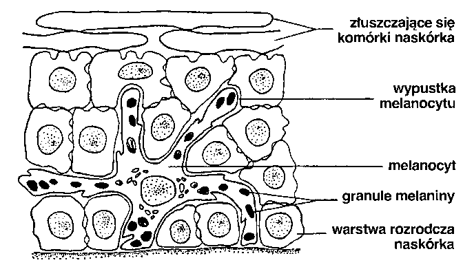
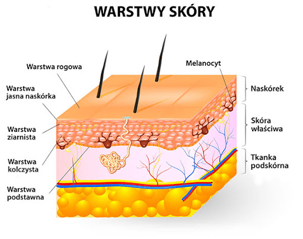
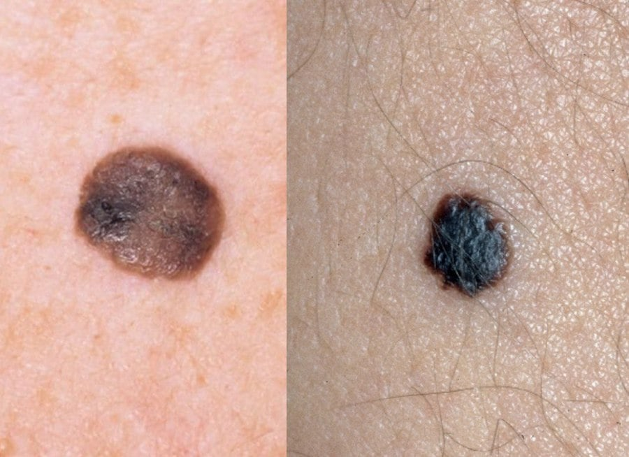

**Czerniak złośliwy jest nowotworem wywodzącym się z komórek barwnikowych - melanocytów. By zrozumieć, jak tworzą się znamiona barwnikowe zwane potocznie pieprzykami, dobrze jest poznać komórki, które biorą udział w procesie ich powstawania. Pozwoli to lepiej zrozumieć, czym są popularne pieprzyki i dlaczego niektóre z nich mogą być groźne dla zdrowia.**

Melanocyty to komórki barwnikowe (pigmentowe), zlokalizowane w warstwie podstawnej naskórka, które stanowią 1–2% jego komórek. Ich liczba nie jest w żadnym razie proporcjonalna do koloru skóry. Melanocyty są rozmieszczone nierównomiernie na całej powierzchni ciała. Ich rolą jest produkcja substancji zwanej melaniną.

## Skąd się biorą pieprzyki?

Karnacja, kolor włosów, wrażliwość na promieniowanie słoneczne, skłonność do piegów i pieprzyków zależą od całkowitej ilości melaniny, jaką mamy w organizmie. Kiedy wystawiamy swoją skórę na działanie słońca, melanocyty gwałtownie się namnażają, rozpoczynając produkcję melaniny, która ma ochronić naszą skórę przed szkodliwym działaniem promieniowania UV. Melanina pełni w tym wypadku rolę fotoprotektora, sprawiając, że nasza skóra brązowieje, a gdzieniegdzie powstają nowe znamiona barwnikowe.

## Dlaczego pieprzyki mogą być groźne?

Znamiona dzieli się głównie na wrodzone oraz nabyte. Ze znamionami wrodzonymi przychodzimy na świat, natomiast nabyte pojawiają się w trakcie naszego życia. Znamiona mogą mieć charakter łagodny lub atypowy i o ile te pierwsze nie stwarzają dla nas zagrożenia, tak atypowe znamię może nieść ze sobą ryzyko zachorowania na czerniaka.

<More link="/blog/jak-wyglada-czerniak-zdjecia" text="Jak wygląda typowy czerniak" cta="Sprawdź" />

## Atypowe znamię – co to znaczy?

Charakteryzuje się ono asymetrycznym kształtem, wielkością powyżej 5 mm, nieregularnymi, poszarpanymi brzegami, niejednorodnym kolorem, zmienia się (ewoluuje) w czasie. Pod mikroskopem u wielu znamion atypowych zaobserwować można cechy dysplastyczne, czyli nacieki limfatyczne i powstającą wokół sieć naczyń krwionośnych. Niekontrolowane namnażanie się komórek i ich dysmorfia prowadzą do zezłośliwienia. Aż 50% pacjentów ze sporadycznym czerniakiem ma znamiona atypowe, a z czerniakiem rodzinnym odsetek ten rośnie nawet do 90%.

<More link="/dermatoskopia-badanie-znamion" text="Zobacz, jak samemu kontrolować swoje znamiona" cta="Sprawdź" />

[Czerniak](/czerniak "Czerniak") powstaje kilkanaście razy częściej w grupie pacjentów ze znamionami atypowymi i zazwyczaj ma bardziej inwazyjny charakter. Ryzyko jest tym większe, im więcej znamion atypowych występuje u pacjenta. Ci, którzy mają powyżej 100 znamion barwnikowych zwykłych i jedno lub więcej znamion atypowych o szerokości powyżej 8 mm, są w równym stopniu zagrożeni czerniakiem, co pacjenci z bardzo licznymi znamionami atypowymi. Ryzyko zmniejsza się jedynie wraz z mniejszą liczbą znamion zwykłych i atypowych.

<More link="/blog/jak-odroznic-zwykly-pieprzyk-od-typowego-czerniaka-zdjecia" text="Sprawdź, jak odróżnić zwykły pieprzyk od czerniaka" cta="Sprawdź" />

## Jak uniknąć powstawania pieprzyków?

Powstawania znamion barwnikowych nie da się uniknąć, jednak można ten proces ograniczyć, stosując właściwe metody ochrony przed słońcem i [działania profilaktyczne.](/dermatoskopia-badanie-znamion "Profilaktyczne badania znamion"). Dlatego też tak istotne jest unikanie wystawiania skóry na słońce w godzinach 11-16, zakrywanie jak największej powierzchni ciała, używanie kremów z odpowiednio dobranym filtrem oraz unikanie opalania. Szczególnie ważna jest też świadomość szkodliwego wpływu korzystania z solarium.

## Jak zmniejszyć ryzyko czerniaka?

Oprócz ochrony przed słońcem, warto pamiętać o badaniach kontrolnych w profesjonalnych ośrodkach. Obecnie zaawansowana technologiczne [wideodermatoskopia](/wideodermatoskopia-komputerowe-badanie-znamion "Wideodermatoskopia") pozwala bezpiecznie i bezinwazyjnie mapować znamiona na całym ciele (archiwizować ich zdjęcia w pamięci komputera) oraz efektywnie obserwować ich ewentualne zmiany. Wtedy nawet przy spełnieniu się czarnego scenariusza, wczesna diagnoza czerniaka da szansę na całkowite wyleczenie.

<More link="/cennik" text="Sprawdź, czy w Twoim mieście badamy znamiona wideodermatoskopowo." cta="Sprawdź" />

<More link="/kontakt" text="Skontaktuj się z nami." cta="Kontakt" />