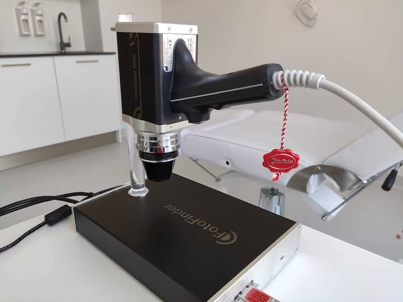
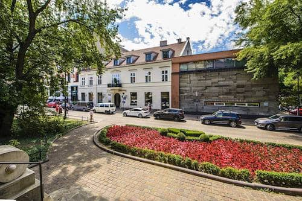
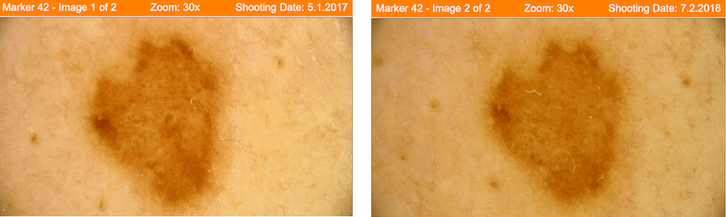

Na stronach **małopolskiego oddziału Narodowego Funduszu Zdrowia w Krakowie** dostępne są statystyki mówiące o tym, że **nowotwory skóry** stanowią około **10%** wszystkich **wykrywanych nowotworów** złośliwych w Polsce. Spośród nowotworów skóry **czerniak** jest jednym z najczęściej występujących, ale nie jedynym. Jak można się ich ustrzec? Dlaczego należy przeprowadzać **regularne badanie znamion** oraz w jaki sposób [wideodermatoskopia](/wideodermatoskopia-komputerowe-badanie-znamion "wideodermatoskopia") umożliwia wczesne wykrycie raka skóry?

## Profilaktyka raka skóry

Słońce pomaga syntetyzować w skórze witaminę D, ale jednocześnie za sprawą wysyłanych promieni UVA i UVB potrafi ją poparzyć, a to jeden z czynników pomagających [czerniakowi](/czerniak "Czerniak") pojawić się w naszych znamionach. Szczególnie narażone na zachorowanie są osoby wykonujące pracę na świeżym powietrzu, w sektorach takich jak rolnictwo, sadownictwo, ogrodnictwo, rybołówstwo czy budownictwo, które nie stosują żadnej ochrony przed promieniowaniem słonecznym. Tymczasem niewiele trzeba, by się chronić, stosowne ubranie, nakrycie głowy, krem z filtrem to najlepsze rozwiązania na co dzień.

Wyróżnia się 3 główne **fenotypy skóry**.

* Ludzie o mlecznej karnacji, których skóra w wyniku opalania łatwo ulega poparzeniom powinni stosować filtry o jak najwyższym faktorze. Obecnie jest to faktor 100.
* Ludziom o jasnej karnacji ze skórą normalną zaleca się stosowanie faktora 50+.
* Osoby z ciemną karnacją również nie mogą rezygnować z ochrony przeciwsłonecznej. Rekomendowany dla nich filtr to 30+.

Należy pamiętać, że są to jedynie zalecenia i wszyscy, którzy przez dłuższy czas eksponują skórę na słońce muszą chronić ją kremem z wysokim faktorem.

Filtry nie są doskonałe. Trudno całkowicie uniknąć słonecznych poparzeń i osłonić pieprzyki (a na pewno nie wszystkie). Dlatego kolejnym elementem profilaktyki powinno być **coroczne badanie znamion**. Służy temu [dermatoskopia](/dermatoskopia-badanie-znamion "dermatoskopia") a dziś nawet zaawansowana [wideodermatoskopia](/wideodermatoskopia-komputerowe-badanie-znamion "wideodermatoskopia").

<More link="/blog/jak-chronic-sie-przed-nowotworem-skory" text="Szczegóły ochrony przed czerniakiem" cta="Sprawdź" />

## Wideodermatoskopia – czym jest?

Ocena stanu znamion, zwanych potocznie pieprzykami, tzw. gołym okiem bywa trudna, a często nawet niemożliwa. **Wideodermatoskopia** jest prostą i sprawdzoną techniką diagnostyczną polegającą na oglądaniu zmian skórnych w powiększeniu. Badanie jest nieinwazyjne i łatwo powtarzalne, a z pomocą obecnej technologii możliwe jest archiwizowanie zdjęć podejrzanych **pieprzyków**, co ułatwia monitorowanie zachodzących w nich ewentualnych groźnych dla naszego zdrowia zmian. Dzięki temu zyskujemy szansę na **wczesne rozpoznanie czerniaka** lub innych nowotworów skóry, przykładowo, mniej znanego, ale równie groźnego, raka **kolczystokomórkowego skóry**.

## Gdzie można się zbadać?

Najczęściej, próbując dowiedzieć się czegoś o naszych znamionach i potencjalnych metodach ich usunięcia, **idziemy do dermatologa**. Przyjmujący w przychodni specjalista **często nie dysponuje jednak wideodermatoskopem**, a nawet jeśli go posiada, limity czasowe nie pozwalają na wykonanie pełnowartościowego badania. Kierując kroki do gabinetu kosmetologii estetycznej, niejednokrotnie mamy wątpliwości, czy usunąć zmianę [laserem](/laserowe-usuwanie-znamion) - nie można wówczas wykonać [badania histopatologicznego](/chirurgiczne-usuwanie-znamion) i dowiedzieć się, **czy znamię było nowotworem**. Zamiast biegać w stresie po przychodniach, można wybrać sprawdzone miejsce i zbadać znamiona, nawet podczas spaceru po Krakowie. Niedaleko Sukiennic, na Placu Szczepańskim 3, [umówisz się na badanie](/kontakt "Umów się na badanie znamion") **Ogólnopolskie Centrum Badania Znamion Twoje Znamiona** przyjmuje szybko i **bez kolejek**.

<More link="/krakow/badanie-znamion" text="Więcej o badaniu znamion w Krakowie" cta="Sprawdź" />

## Wideodermatoskopia w Centrum Badania Znamion Twoje Znamiona - jak przebiega?

Specjalista dermatolog przeprowadza z pacjentem **dokładny wywiad**. Warto wiedzieć więcej o chorobach w rodzinie i coś więcej o swoich pieprzykach. Nawet jeśli wcześniej nie wzbudzały one zainteresowania. Lekarz zapyta też o stosowane **kremy z filtrem** i **wizyty w solarium**. Samo badanie wykonywane jest w Krakowie jednym z **najnowocześniejszych urządzeń dostępnych na rynku** - FotoFinder Medicam 1000. Kamera wideodermatoskopu pokazuje obraz znamion w czasie rzeczywistym na ekranie komputera i rejestruje go w rozdzielczości Full HD. Pozwala na **mapowanie zmian** i skuteczną oraz dokładną ich długoterminową obserwację.

Całe **badanie trwa około 30 minut** i obejmuje **całą powierzchnię ciała**. Tylko odnalezienie i badanie wszystkich znamion ma sens i wartość w profilaktyce nowotworów skóry. Nie wszystkie zmiany jesteśmy w stanie znaleźć sami, jeszcze mniej z nich jesteśmy w stanie sklasyfikować, jako groźne lub łagodne, a tylko część z nich ma charakter barwnikowy. Dlatego tak ważne jest [komputerowe badanie znamion](/wideodermatoskopia-komputerowe-badanie-znamion "komputerowe badanie znamion").

<More link="/blog/dlaczego-powstaja-znamiona-i-skad-sie-biora-pieprzyki" text="Dowiedz się, skąd się biorą pieprzyki." cta="Sprawdź" />

## Jak często badać znamiona?

Gdy nie chorujemy, nie jesteśmy w grupie ryzyka - wystarczy **badanie raz w roku**, jednak gdy któreś znamię wzbudza nasz niepokój, nie należy zwlekać. Korzystając z **Centrum Badania Znamion Twoje Znamiona** mamy pewność, że w razie konieczności usunięcia pieprzyka zostaniemy objęci właściwą opieką.

<More link="/cennik" text="Sprawdź cenę badania " cta="Sprawdź" />

<More link="/kontakt" text="Skontaktuj się z Centrum Badania Znamion w Krakowie" cta="Kontakt" />