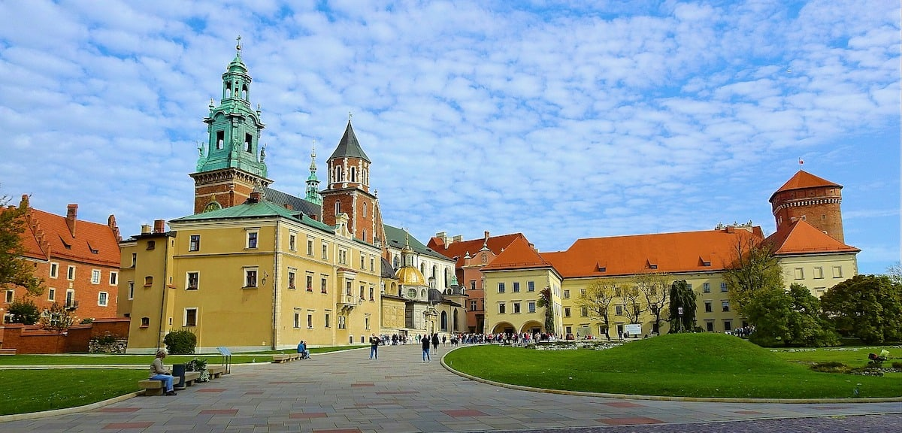

Na stronach **małopolskiego oddziału Narodowego Funduszu Zdrowia w Krakowie** dostępne są statystyki mówiące o tym, że **nowotwory skóry** stanowią około **10%** wszystkich **wykrywanych nowotworów** złośliwych w Polsce. Spośród nowotworów skóry **czerniak** jest jednym z najczęściej występujących, ale nie jedynym. Jak można się ich ustrzec? Dlaczego należy przeprowadzać **regularne badanie znamion** oraz w jaki sposób [wideodermatoskopia](/wideodermatoskopia-komputerowe-badanie-znamion "wideodermatoskopia") umożliwia wczesne wykrycie raka skóry?

## Profilaktyka raka skóry

Słońce pomaga syntetyzować w skórze witaminę D, ale jednocześnie za sprawą wysyłanych promieni UVA i UVB potrafi ją poparzyć, a to jeden z czynników pomagających [czerniakowi](/czerniak "Czerniak") pojawić się w naszych znamionach. Szczególnie narażone na zachorowanie są osoby wykonujące pracę na świeżym powietrzu, w sektorach takich jak rolnictwo, sadownictwo, ogrodnictwo, rybołówstwo czy budownictwo, które nie stosują żadnej ochrony przed promieniowaniem słonecznym. Tymczasem niewiele trzeba, by się chronić, stosowne ubranie, nakrycie głowy, krem z filtrem to najlepsze rozwiązania na co dzień.

Wyróżnia się 3 główne **fenotypy skóry**.

* Ludzie o mlecznej karnacji, których skóra w wyniku opalania łatwo ulega poparzeniom powinni stosować filtry o jak najwyższym faktorze. Obecnie jest to faktor 100.
* Ludziom o jasnej karnacji ze skórą normalną zaleca się stosowanie faktora 50+.
* Osoby z ciemną karnacją również nie mogą rezygnować z ochrony przeciwsłonecznej. Rekomendowany dla nich filtr to 30+.

Należy pamiętać, że są to jedynie zalecenia i wszyscy, którzy przez dłuższy czas eksponują skórę na słońce muszą chronić ją kremem z wysokim faktorem.

Filtry nie są doskonałe. Trudno całkowicie uniknąć słonecznych poparzeń i osłonić pieprzyki (a na pewno nie wszystkie). Dlatego kolejnym elementem profilaktyki powinno być **coroczne badanie znamion**. Służy temu [dermatoskopia](/dermatoskopia-badanie-znamion "dermatoskopia") a dziś nawet zaawansowana [wideodermatoskopia](/wideodermatoskopia-komputerowe-badanie-znamion "wideodermatoskopia")

