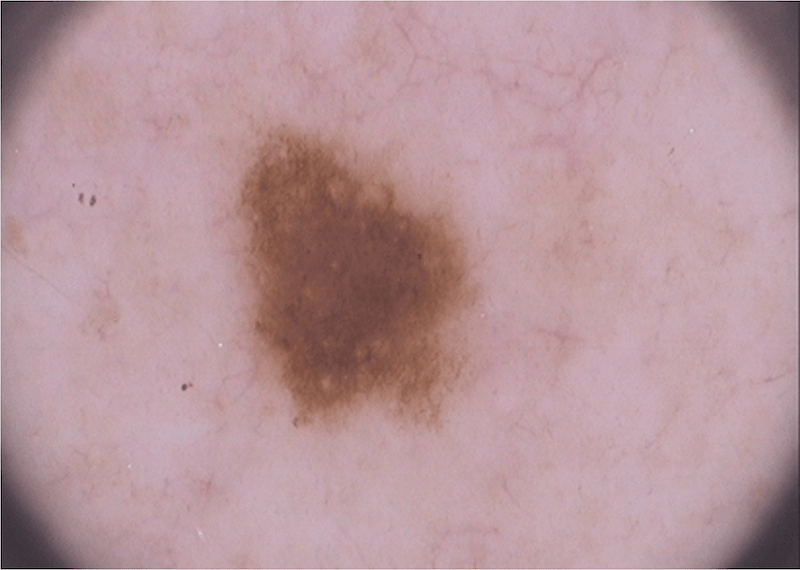
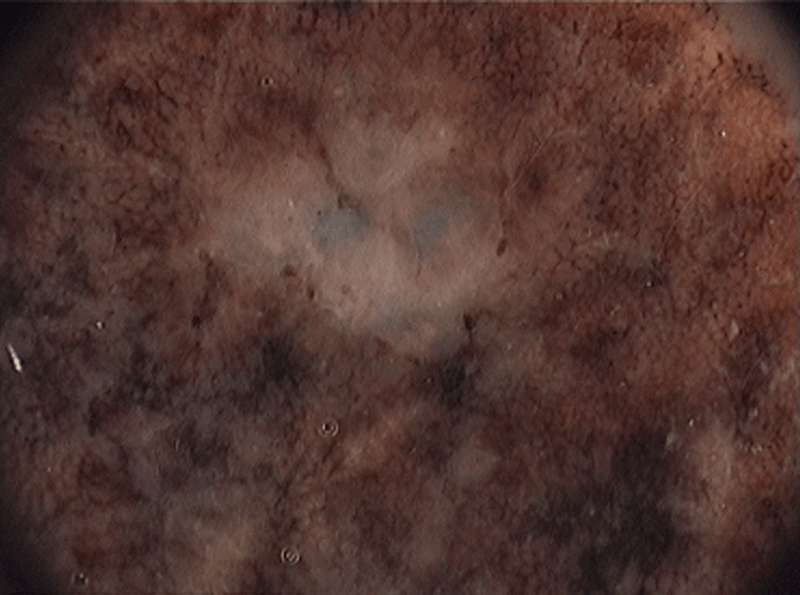
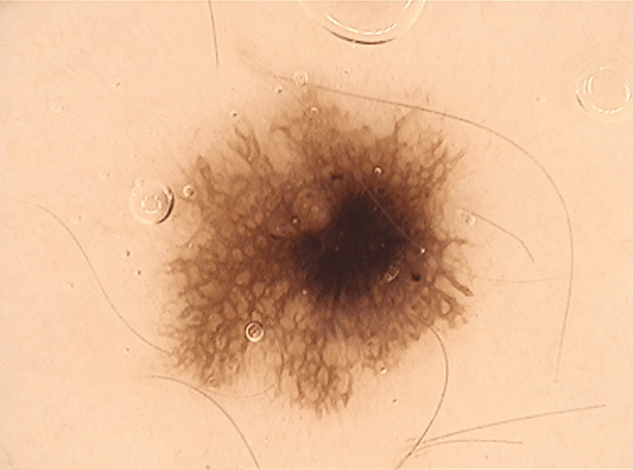

**Lato rozpieszcza słońcem, ale nie jest już tak opiekuńcze dla skóry. Dlatego żegnając wakacje, zaczynamy intensywniej pielęgnować ciało i walczyć z oznakami przesuszenia skóry. Pieprzyki również powinny znaleźć się w centrum uwagi. Artykuł ten opowie o zagadnieniach dotyczących:**

* profilaktyki nowotworów skóry, jakim jest czerniak,
* nowoczesnych metod badania znamion,
* wyboru profesjonalnego centrum diagnostyki znamion.

## Profilaktyka czerniaka

Lipiec **2020 roku** przyniósł kolejny, IX już Tydzień Świadomości Czerniaka, a wraz z nim raport o wiedzy i zachowaniach Polaków w kwestii zapobiegania tej postaci choroby nowotworowej. Blisko 96 proc. badanych słyszało o czerniaku, co jednak nie przeszkadza większości z nich opalać się w godzinach 11-16, kiedy słońce operuje najmocniej i dawka promieniowania UV jest największa. Nadal nie stosujemy regularnie kremów z filtrem, a jeśli już, to są to często preparaty o zbyt niskim faktorze.

Profilaktyka wtórna – obserwacja pieprzyków i **badania znamion** – jest mocniejszą stroną respondentów. Coraz częściej podejmujemy słuszną decyzję o kontakcie z lekarzem i wykonaniu **dermatoskopii** lub **wideodermatoskopii**; nowoczesnych i nieinwazyjnych metod diagnostyki skóry.

## Dermatoskopia niepokojącej zmiany skórnej wydłuża badanie kliniczne tylko o 72 sekundy

Te 72 sekundy mogą uratować życie. Bo ta konkretna metoda obrazowania zmian w obszarze skóry, włosów i paznokci wyróżnia się czułością diagnostyczną na poziomie 83 proc.i pozwala wykryć czerniaka w bardzo wczesnym stadium, które poddaje się leczeniu i daje dobre rokowania. Wysoce wyspecjalizowane placówki medyczne dysponują dodatkowo możliwością archiwizacji wyglądu zmian oraz poddania ich analizie programem komputerowym.

**Wideodermatoskopia** w Ogólnopolskim [Centrum Badania Znamion w Szczecinie](https://twojeznamiona.pl/szczecin/badanie-znamion "Szczecińskie Centrum Badania Znamion
        ­Twoje Znamiona") pozwoli na szybką interpretację nawet niepozornych czy niezauważalnych pieprzyków na podstawie stosowanych i uznawanych na świecie algorytmów oceny. W trakcie jednej wizyty wszystkie **twoje znamiona** znajdą się pod kontrolą.

## Reguła oceny zmian skórnych w kierunku czerniaka ABCDE

Dzięki analizie asymetrii, rodzaju brzegów, koloru, wymiarów i ewolucji zmian – stąd angielski akronim ABCDE (asymetry, border, color, diameter, evolution) – pacjenci, w tym wspomnianego już **szczecińskiego Centrum Badania Znamion** przy ul. Arkońskiej, są w stanie monitorować wygląd pieprzyków i gdy zajdzie taka potrzeba zasięgnąć porady lekarskiej. **Wideodermatoskopia** umożliwia dokładną ocenę wszystkich znamion Charakter zmian może być bardzo zróżnicowany, tym bardziej profesjonalizm i dostęp do nowoczesnej aparatury mają tutaj duże znaczenie.

")

## **Twoje znamiona** to **pieprzyk** czy już **czerniak**?

Dlaczego samoobserwacja jest niewystarczająca? Kierujmy się zawsze zdrowym rozsądkiem i nie popadajmy w panikę. Miejmy jednak świadomość, że określenie charakteru danej zmiany skórnej, bywa problematyczne także dla samych lekarzy, którzy nie zajmują się tym obszarem w codziennej praktyce. Przytaczane już na początku artykułu **badania** świadomości Polaków na temat czerniaka z **2020 roku** pokazują, że jedynie 50 proc. respondentów skonsultowałoby się ze specjalistą, gdyby zmiana zmieniła kolor lub wielkość. Ten odsetek jest zdecydowanie za mały. Taka sytuacja powinna być tzw. dzwonkiem alarmowym. Ignorowanie objawów to nie jedyny problem. Bez okresowej **wideodermatoskopii** możemy ich zwyczajnie nie dostrzec.

<More link="https://twojeznamiona.pl/blog/jak-wyglada-czerniak-zdjecia" text="Jak wygląda czerniak? ZDJĘCIA" cta="Sprawdź" />

Łapiąc opaleniznę w ostatnich promieniach letniego słońca na Wałach Chrobrego warto pomyśleć o zdrowiu swojej skóry i zajrzeć także na ulicę Arkońską 51/01. Umówienie wizyty w Ogólnopolskim **Centrum Badania Znamion** nie oznacza perspektywy długiego czekania. Dostępne są szybkie terminy. A jeżeli wracamy z wakacji w Szczecinie, to zarezerwujmy konsultację u siebie lub w pobliskiej aglomeracji. Centrum posiada jeszcze swoje ośrodki w Warszawie, Poznaniu,Wrocławiu oraz prowadzi zaawansowane przygotowania, by jego specjaliści zawitali do Gdańska, Krakowa, łodzi, Katowic i wielu wielu innych miast.

<More link="https://twojeznamiona.pl/blog/jak-chronic-sie-przed-nowotworem-skory" text="Jak chronić się przed nowotworem skóry?" cta="Sprawdź" />