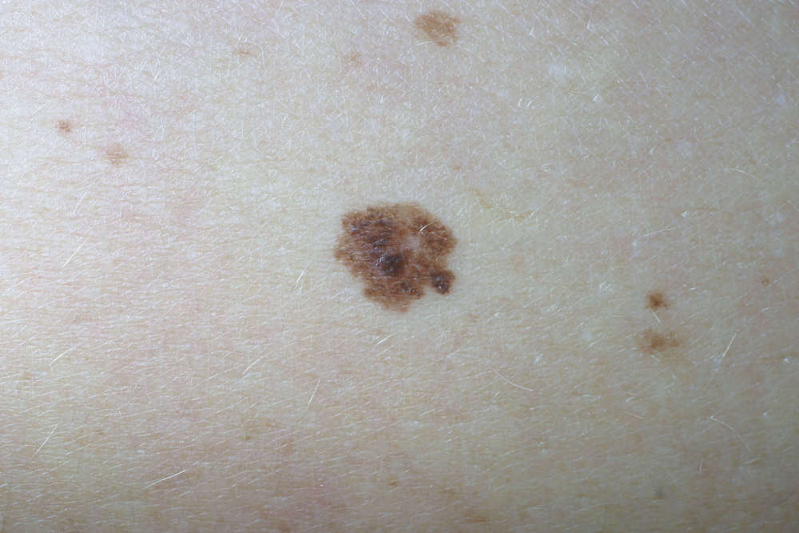

**W 2020** roku nigdzie nie wyjeżdżałeś? Spędziłeś wakacje w Lake Park Wilanów **w Warszawie**? Wykupiłeś lekcje wakeboardingu i pograłeś w siatkówkę plażową. Po kąpielach wodnych i słonecznych kupiłeś karnet do mini-spa by zadbać o skórę, ale czy korzystałeś z kremów z filtrem?

Zbadałeś czy na jej powierzchni nie ma nowych **znamion**? Nawet jeśli odpowiedź na dwa ostatnie pytania brzmi "nie", to zawsze możesz to zrobić. Warto, bo…

## Czerniak to nowotwór złośliwy

Pojawia się najczęściej w obrębie skóry i powstaje z melanocytów, komórek skóry wytwarzających melaninę, które zostały uszkodzone przez promieniowanie UV. Ryzyko wzrasta wielokrotnie, jeżeli jesteś w grupie ryzyka i na słońce zostały wystawione znamiona wrodzone, czyli pieprzyki które dobrze znasz. Ryzyko rozwoju nowotworu ze zmian o średnicy powyżej 20 cm wynosi aż 10%.

<More link="/blog/jak-wyglada-czerniak-zdjecia" text="Jak wygląda czerniak? ZDJĘCIA" cta="Sprawdź" />

<More link="/czerniak" text="Jak wyglada  czerniak" cta="Sprawdź" />

