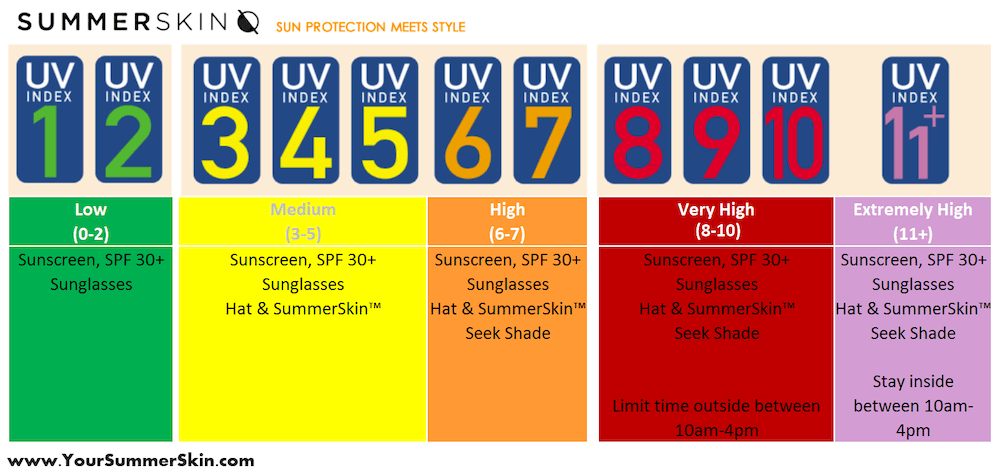

**Światowa Organizacja Zdrowia WHO** opracowała wytyczne dotyczące ekspozycji na promieniowanie UV jako głównego czynnika zwiększającego ryzyko **zachorowania na nowotwory skóry**. W tym artykule opowiemy:

* jak unikać zachorowania na nowotwory skóry,
* czym jest Indeks UV oraz jakie kremy przeciwsłoneczne wybrać,
* jak stosować kremy z filtrem uv,
* dlaczego solarium jest szkodliwe,
* czym jest metoda ABCDE,
* jak często należy **badać znamiona**.

W ramach **unikania** zachorowania na **raka skóry** zaleca się

* unikanie ekspozycji na promieniowanie słoneczne UV szczególnie w godzinach, kiedy jest ono najbardziej intensywne pomiędzy **godziną 10:00 a 16:00**,
* możliwie jak najdłużej powinno się **przebywać w miejscach zacienionych**, pamiętając o tym, że żaden cień nie daje 100% protekcji,
* nie należy ponadto dopuszczać do **poparzeń słonecznych** skóry szczególnie **przed 15 rokiem życia** - o wiele bardziej niebezpieczne niż przewlekła ekspozycja jest krótkotrwałe i intensywne narażenie na promieniowanie UV,
* noszenie odzieży ochronnej, okularów przeciwsłonecznych i nakryć głowy,
* stosowanie **filtrów ochronnych UVA i UVB - SPF15(+)** w miejscach odsłoniętych,

## Jak stosować kremy z filtrem?

Stosując krem z filtrem pamiętajmy o nakładaniu go na skórę co 2 godziny w trakcie przebywania na słońcu. Według danych z badań z losowym doborem chorych, właściwe stosowanie kremów z filtrem zmniejsza ryzyko zachorowania na czerniaka. (Green A.C i in., 2011)

<More link="https://www.akademiaczerniaka.pl/artykuly/artykul/zlote-zasady-ktore-moga-pomoc-ochronic-sie-przed-czerniakiem" text="Złote zasady ochrony przed czerniakiem wg prof. dr hab. Piotra Rutkowskiego" cta="Sprawdź" />

## Solarium - czy jest szkodliwe?

Niezwykle groźne jest korzystanie z łóżek opalających, gdzie emitowane promieniowanie UV jest 10-15-krotnie silniejsze niż UV w południe podczas słonecznego dnia.

## Czy solarium zwiększa ryzyko czerniaka?

Z uwagi na fakt, iż korzystanie z solariów zwiększa ok. 2-krotnie ryzyko zachorowania na czerniaka, szczególnie u osób młodych przed 35 rokiem WHO zaleca unikanie korzystania z solariów a u osób przed 18 rokiem życia wprowadza całkowity zakaz. Osoby korzystające z solariów otrzymują 1,2-4,7- krotnie większą dawkę promieniowanie UV rocznie w porównaniu z osobami, niekorzystającymi z łóżek opalających.

## Czy dzieci mogą się opalać ?

Szczególną uwagę zwraca się na ochronę dzieci przed słońcem - odpowiednia odzież ochronna, zacienione place zabaw, unikanie przebywania na słońcu w godzinach południowych.

## Wskaźnik słonecznego promieniowania UV

Światowa Organizacja Zdrowia opracowała specjalny wskaźnik słonecznego promieniowania UV ( Solar UV Index- UVI) - stosowany jako wskaźnik zachowań dotyczących profilaktyki przeciwsłonecznej. Informuje on o stopniu narażenia na działanie szkodliwego promieniowania w zależności od określonych czynników i ma na celu pomoc w doborze odpowiedniej ochrony przeciwsłonecznej. Skala Indeksu UV zawiera się między 0 a 16, rzadko jednak spotyka się wartości powyżej 11.

“Indeks UV jest zalecany do stosowania w powszechnym rozbudzaniu świadomości o potencjalnie szkodliwym oddziaływaniu na zdrowie nadmiernej ekspozycji na promieniowanie UV i ostrzeganiu ludzi o konieczności stosowania środków ochronnych.” (Instytut Meteorologii i Gospodarki Wodnej Państwowy Instytut Badawczy - IMiGW PIB)

## Metoda ABCDE - Jak obserwować znamiona?

Jeśli chodzi o zachowania profilaktyczne należy też oczywiście pamiętać o samobadaniu znamion stosując kryteria ABCDE Freidmana i Rigela jako najprostszej metody samokontroli w warunkach domowych. Stosując metodą ABCDE możemy sami obserwować swoje znamiona.

* A – asymetria (ang. asymetry) - zmiana kształtu zmiany skórnej
* B – brzegi(ang. border) - nierówne, postrzępione brzegi zmiany
* C - kolor - niejednolity (ang. colour) zmiana w zabarwieniu, różne kolory w obrębie tego samego znamienia skórnego,
* D - duża średnica znamienia (ang. diameter) - średnica powyżej 6 mm,
* E - ewolucja (ang. evolving over time) - widoczne zmiany zachodzące w znamieniu.

Na rzecz oceny czerniaka guzowatego (ang. nodular melanoma -NM) stosuje się też :

* E - uniesienie (ang. elevated) - uniesiony nad powierzchnię skóry,
* F - twardy (ang. firm) - twardy przy dotykaniu,
* G - szybki wzrost (ang. growing) – dość szybki wzrost np. w ciągu kilku tygodni

## Badania znamion, dermatoskopia, wideodermatoskopia - najlepsza metoda diagnostyki.

Ważnym elementem profilaktyki jest ponadto badanie dermatoskopowe, które powinno być wykonywane regularnie z częstotliwością zależną od wskazań i zaleceń lekarskich ( średnio 1 x rok) oraz poddawanie znamion budzących jakikolwiek niepokój onkologiczny chirurgicznej resekcji.

<More link="/dermatoskopia-badanie-znamion" text="Dowiedz się więcej o badaniu dermatoskopowym" cta="Sprawdź" />