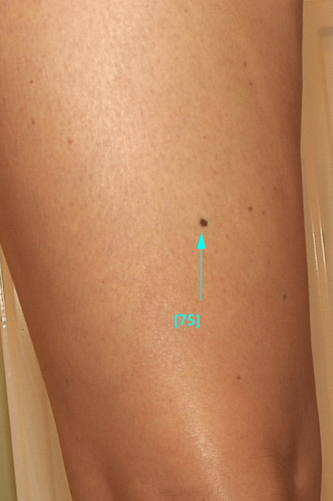

**Nie każdy pieprzyk jest czerniakiem, jednak czerniak może mieć formę pieprzyka. Porównaj zdjęcia zwykłych znamion i typowych czerniaków. Poniższy artykuł ma na celu przybliżenie wiedzy na temat obserwacji i różnicowania zmian skórnych.**

<More link="/czerniak" text="Jak wyglada  czerniak" cta="Sprawdź" />

