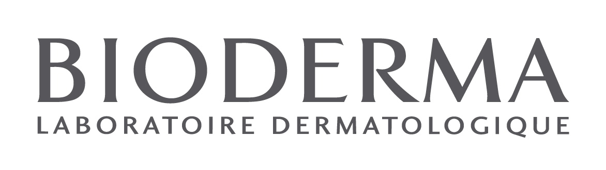
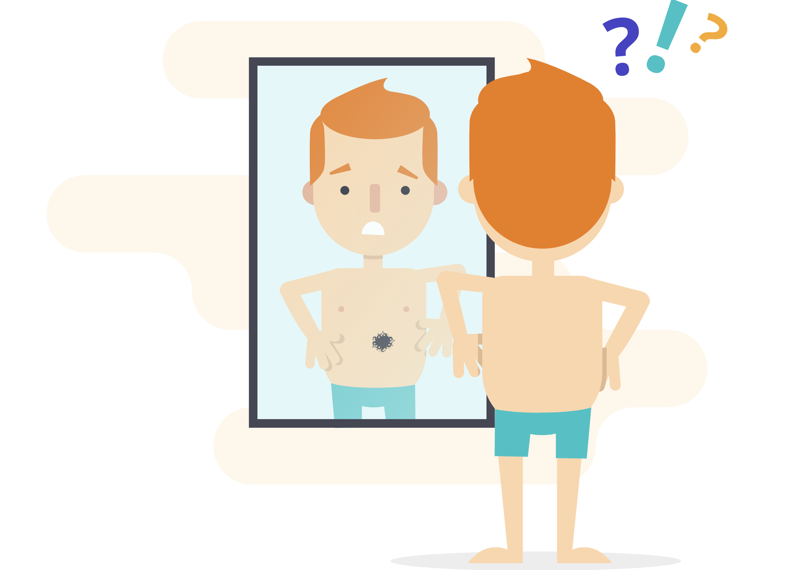
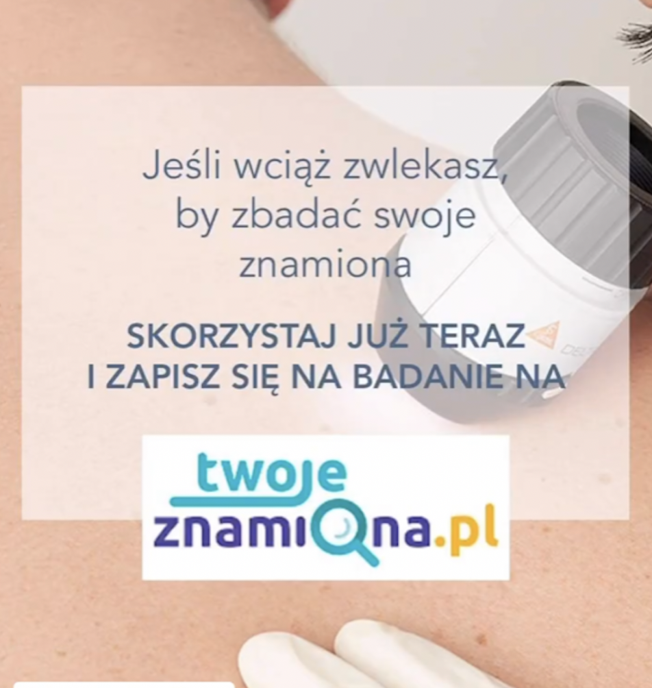
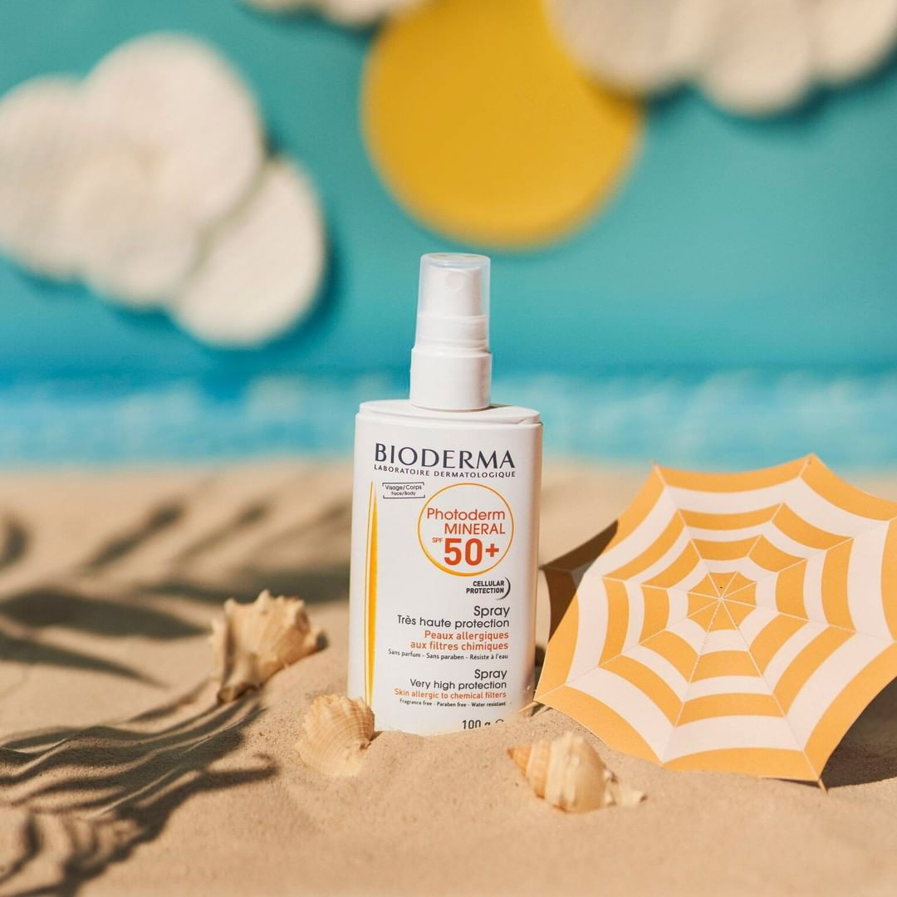

Najważniejszym udowodnionym naukowo czynnikiem ryzyka rozwoju czerniaka złośliwego jest ekspozycja na promieniowanie UV, zarówno to pochodzenia naturalnego - promienie słoneczne jak i pochodzenia sztucznego - lampy opalające w solariach. Wyniki badań naukowych wskazują, że oparzenia słoneczne w okresie dzieciństwa aż kilkukrotnie zwiększają ryzyko rozwoju nowotworów skóry i czerniaka. 

## Promieniowanie UV a czerniak

Według obserwacji międzynarodowej Agencji Badań Nowotworów (IARC, International Agency for Research on Cancer), promieniowanie UVA i UVB zalicza się do czynników rakotwórczych. Odległe działania niepożądane UVR wynikają z jego zdolności do uszkadzania DNA w komórkach naskórka i skóry właściwej. W ciągu całego roku narażeni jesteśmy na działanie długich promieni UVA (320-400 nm), które wnikają głęboko do skóry właściwej i mają zdolność uszkadzania włókien kolagenowych, natomiast promienie krótkie UVB (290-320 nm) wpływają na naszą skórę (głównie naskórek) w miesiącach wiosenno-letnich. 

<More link="/blog/typowe-objawy-czerniaka-zlosliwego" text="Jakie są objawy czerniaka złośliwego" cta="Sprawdź" />

## Fotoprotekcja - jak uchronić się przed nowotworami skóry

Przed działaniem promieni UVA, w przeciwieństwie do UVB, nie chronią nas szyby okienne ani samochodowe. Z tego względu, że promienie ultrafioletowe docierają do naszej skóry przez cały rok, właściwą fotoprotekcję należy stosować przez 12 miesięcy, jednakże szczególną uwagę należy zwracać na nią pomiędzy drugą połową marca a październikiem, gdyż wówczas natężenie UVR na ziemi jest największe. Poprzez fotoprotekcję należy rozumieć unikanie ekspozycji na słońce w godzinach pomiędzy 11 a 16, stosowanie odpowiedniej odzieży (np. czapki z daszkiem, kapelusze), a przede wszystkim odpowiednią aplikację kremów ochronnych zawierających filtry UVA i UVB.

## Mam nowe znamiona po opalaniu - czy mam je badać?

Ekspozycja na słońce często powoduje pojawianie się nowych znamion na skórze. Oprócz stosowania zasad fotoprotekcji bardzo ważnym elementem profilaktyki przeciwnowotworowej jest badanie znamion. Najlepszą jak do tej pory metodą profilaktyki raków skóry jest [wideodermatoskopia](https://twojeznamiona.pl/wideodermatoskopia-komputerowe-badanie-znamion). 

 Badanie polega na oglądaniu wszystkich znamion na skórze w dużym powiększeniu w poszukiwaniu struktur, które mogą świadczyć o złośliwości zmiany. Wszystkie nowe zmiany, które pojawiły się po ekspozycji na promieniowanie UV powinny zostać zbadane gdyż czerniak najczęściej pojawia się na podłożu niezmienionej skóry jako nowe znamię na ciele. 

<More link="/kontakt" text="Gdzie możesz zbadać swoje znamiona" cta="Sprawdź" />

## Jakie inne problemy powoduje promieniowanie UV?

Dla wielu osób cieszących się zdrową skórą słońce może okazać się równie uciążliwe jak dla tych uczulonych. 

### Przebarwienia posłoneczne

Ogromnym problemem są przebarwienia posłoneczne. Jesienią i zimą w gabinetach dermatologicznych pojawiają się pacjentki z grubymi warstwami makijażu przykrywającymi szpecące plamy na skórze. Należy pamiętać, że przebarwienia pojawiają się i ciemnieją pod wpływem słońca. Nie da się opalić skóry tylko w tych miejscach gdzie ich nie ma. Te osoby koniecznie muszą używać przez cały rok wysokiej fotoochrony, nie tylko podczas urlopu. Należy pamiętać ,że nawet te wodoodporne filtry wymagają kilkurazowych aplikacji, ponieważ zmywają się ze skóry wraz z potem, pocieraniem i dotykaniem do ciała czy twarzy. Jeśli nie chcemy rozpocząć nowego sezonu od odbarwiania plam w gabinecie dermatologicznym warto pamiętać o smarowaniu się kremem ochronnym co 1,5-2 godziny. 

### Poszerzone naczynka

Inny niezwykle częsty problem związany również ze złą tolerancją słońca to poszerzone naczynka na twarzy, dekolcie i nogach. Wykazano, że za największe spustoszenie w powierzchownych naczyniach krwionośnych odpowiedzialne są długie promienie ultrafioletowe- UVA (słońce, solarium!!!) a także podczerwone IR (cieplne). Ochrona przed nimi polega na stosowaniu nowoczesnych filtrów ochronnych o szerokim spektrum działania, które wychwytują krótkie UVB i długie promieniowanie UVA oraz podczerwień IR. O tego typu ochronie powinny pamiętać osoby z trądzikiem różowatym i ci którzy mają tendencję do zaczerwieniania się policzków. Bez odpowiedniej fotoochrony i stosowania preparatów leczniczych obie dolegliwości doprowadzą z upływem czasu do utworzenia się teleangiektazji. 

### Trądzik a słońce

Do niedawna uważano, że słońce ma zbawczy wpływ na łojotokową i trądzikową skórę. Dziś wiadomo, że choć latem stan skóry ulega poprawie, jesienią okazuje się, że nie tylko nie wyleczyliśmy sobie skóry, ale wręcz przeciwnie pogorszyliśmy jej stan. Skóra problemowa wykazuje większą wrażliwość. Ostre słońce podrażnia, wysusza skórę i powoduje wtórnie reaktywny łojotok. Można korzystać ze słońca, ale w rozsądny sposób i zawsze należy pamiętać o posmarowaniu skóry kremem z wysokim filtrem. 

## Profilaktyka starzenia się skóry a fotoprotekcja

Ponieważ proces starzenia jest nieodwracalny i dotyczy to również fotostarzenia się skóry, podczas którego powstałe zmarszczki i bruzdy można uznać za trwałe blizny, to najważniejsze jest pamiętanie o starej zasadzie, że” lepiej jest zapobiegać niż leczyć”. Profilaktyka starzenia i fotostarzenia się skóry powinna rozpocząć się już w zasadzie w dzieciństwie i powinna być systematycznie kontynuowana przez całe życie. Najważniejsze jest stosowanie racjonalnej fotoprotekcji, która polega na unikaniu nadmiernej ekspozycji na naturalne promieniowanie ultrafioletowe, szczególnie w miesiącach letnich, pomiędzy godziną 11 a 16, noszeniu odzieży ochronnej oraz stosowaniu kremów/balsamów z filtrami UVA/UVB. Ze względu na obecność UVA przez cały rok, stosowanie kremów ochronnych, szczególnie na twarz i grzbiety rąk jest uzasadnione przez cały rok. Takie postępowanie pozwala na opóźnienie procesu starzenia oraz zmniejszenie ryzyka rozwoju zmian przed nowotworowych oraz nowotworów skóry. 

## Jakie są rodzaje filtrów UV?

Spośród dostępnych obecnie na rynku filtrów wyróżnia się filtry fizyczne, które odbijają i rozpraszają promienie ultrafioletowe oraz chemiczne, które absorbują oraz rozpraszają promienie UV. Nowoczesne kremy ochronne stanowią mieszankę filtrów fizycznych i chemicznych. Dostępne są jednakże również tylko filtry fizyczne, które ze względu na minimalną toksyczność szczególnie zalecane są do stosowania u małych dzieci oraz u osób ze skóra wrażliwą, skłonną do podrażnień oraz rozwoju reakcji alergicznych.  Nowoczesne filtry UVB/UVA są bezpieczne, niezmiernie rzadko powodują powstanie reakcji fotoalergicznych. W celu uzyskania prawidłowej protekcji należy jednak używać ich w sposób właściwy. Oznacza to aplikację preparatu około 30 minut przed wyjściem na dwór, a następnie powtarzanie tej aplikacji co najmniej co 2-3 godziny, w tym zawsze po długiej kąpieli w wodzie. Ważne jest również to, żeby wiedzieć, że prawidłowa ochrona zostanie zapewniona jedynie przy stosowaniu preparatu co najmniej w ilości 2 mg/cm2, czyli aplikacja równoważna 1 łyżeczki do herbaty na skórę twarzy.

## Starzenie się skóry pod wpływem słońca

W świetle dostępnej wiedzy na temat przyspieszonego starzenia się skóry bez wątpienia ekspozycję na promieniowanie ultrafioletowe uznać można za najważniejszy czynnik wywołujący nieodwracalne zmiany w naskórku i skórze właściwej, w konsekwencji powodujący obraz kliniczny starzejącej się skóry. UVA i UVB  uszkadzają DNA komórek, dodatkowo promienie UVA powodują destrukcję kolagenu, elastyny i zmniejszają produkcję prokolagenu. W związku z tym najlepszą ochroną jest stosowanie preparatów ograniczających wpływ promieniowania UV na naszą skórę, ale równocześnie należy w ogóle unikać nadmiernej ekspozycji skóry na promieniowanie słoneczne. Stąd najważniejsza jest profilaktyka przeciwstarzeniowa polegająca w głównej mierze na prawidłowym stosowaniu kremów ochronnych zawierających filtry anty-UVB i anty-UVA. Kremy winny być stosowane przez cały rok, niezależnie od zachmurzenia i nasłonecznienia.

## **PHOTODERM - pierwsze produkty wzmacniające naturalny system obronny skóry**

W odpowiedzi na pojawiające się coraz częściej doniesienia naukowe alarmujące, że filtry to zbyt mało by ochronić struktury komórkowe przed działaniem UV, naukowcy Laboratorium Dermatologicznego BIODERMA rozpoczęli poszukiwanie najlepszych rozwiązań. W wyniku badań opracowali optymalne połączenie dwóch składników –  ectoiny i mannitolu, które zostało opatentowane jako BIOPROTECTION®. Ectoina jest naturalną cząsteczką wytwarzaną przez bakterie żyjące w ekstremalnym środowisku pustynnym. Działa ona jak ochronna tarcza, zapobiegająca uszkodzeniom komórki związanym z działaniem promieni UV, przegrzaniem oraz utratą wody. Mannitol to pochodna otrzymywana z wyciągu z jesionu. Ma bardzo silne własności usuwania wolnych rodników – kilkukrotnie silniejsze niż witamina E.