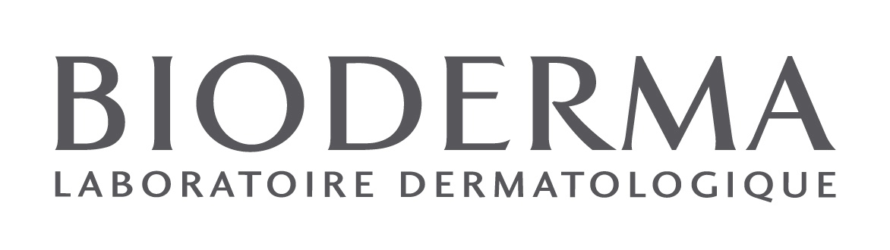
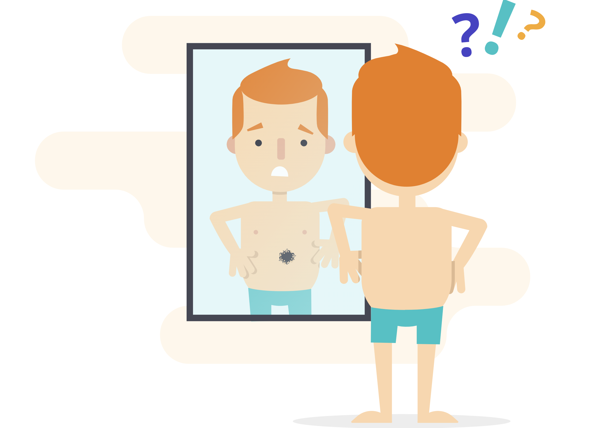

Najważniejszym udowodnionym naukowo czynnikiem ryzyka rozwoju czerniaka złośliwego jest ekspozycja na promieniowanie UV, zarówno to pochodzenia naturalnego - promienie słoneczne jak i pochodzenia sztucznego - lampy opalające w solariach. Wyniki badań naukowych wskazują, że oparzenia słoneczne w okresie dzieciństwa aż kilkukrotnie zwiększają ryzyko rozwoju nowotworów skóry i czerniaka. 

## Promieniowanie UV a czerniak

Według obserwacji międzynarodowej Agencji Badań Nowotworów (IARC, International Agency for Research on Cancer), promieniowanie UVA i UVB zalicza się do czynników rakotwórczych. Odległe działania niepożądane UVR wynikają z jego zdolności do uszkadzania DNA w komórkach naskórka i skóry właściwej. W ciągu całego roku narażeni jesteśmy na działanie długich promieni UVA (320-400 nm), które wnikają głęboko do skóry właściwej i mają zdolność uszkadzania włókien kolagenowych, natomiast promienie krótkie UVB (290-320 nm) wpływają na naszą skórę (głównie naskórek) w miesiącach wiosenno-letnich. 

<More link="[Jakie są objawy czerniaka złośliwego?](https://twojeznamiona.pl/blog/typowe-objawy-czerniaka-zlosliwego)" text="Jakie są objawy czerniaka złośliwego" cta="Sprawdź" />

## Fotoprotekcja - jak uchronić się przed nowotworami skóry

Przed działaniem promieni UVA, w przeciwieństwie do UVB, nie chronią nas szyby okienne ani samochodowe. Z tego względu, że promienie ultrafioletowe docierają do naszej skóry przez cały rok, właściwą fotoprotekcję należy stosować przez 12 miesięcy, jednakże szczególną uwagę należy zwracać na nią pomiędzy drugą połową marca a październikiem, gdyż wówczas natężenie UVR na ziemi jest największe. Poprzez fotoprotekcję należy rozumieć unikanie ekspozycji na słońce w godzinach pomiędzy 11 a 16, stosowanie odpowiedniej odzieży (np. czapki z daszkiem, kapelusze), a przede wszystkim odpowiednią aplikację kremów ochronnych zawierających filtry UVA i UVB.

## Mam nowe znamiona po opalaniu - czy mam je badać?

