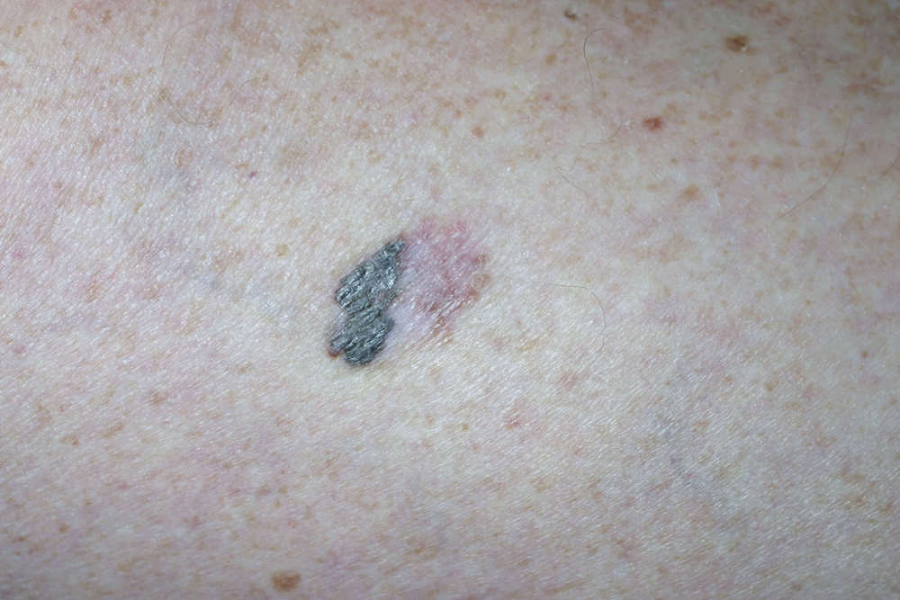
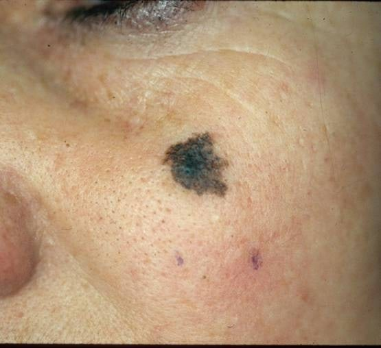

**Czerniak złośliwy jest nowotworem wywodzącym się z komórek barwnikowych - melanocytów.** Poniżej prezentujemy zdjęcia czerniaków, które wystąpiły u różnych osób, abyś mógł być jeszcze bardziej czujny w trakcie samobadania swoich znamion. Po zapoznaniu się z tym artykułem będziesz wiedzieć jak wygląda typowy czerniak.

## Czerniak zdjęcia

Rzadziej występuje u dzieci i młodzieży, natomiast u dorosłych **od kilkudziesięciu lat obserwujemy w Polsce stały trend wzrostowy zachorowalności na czerniaka**. Czynnik wpływający na powstanie czerniaka skóry to przede wszystkim promieniowanie UV związane z opalaniem się.

Czerniak jest nowotworem o wysokim stopniu złośliwości, dlatego też umieralność z powodu tego nowotworu skóry w Polsce jest wyższa niż przeciętnego obywatela Unii Europejskiej o około 20%.

Warunkiem wyleczalności jest wczesne wykrycie nowotworu i szybkie wycięcie chirurgiczne znamienia, dlatego też tak ważna jest profilaktyka czerniaka.

Czerniak może powstać w obrębie znamienia jak również w skórze niezmienionej. Czerniak rozwija się w 20-30 proc. z istniejących pieprzyków. Dlatego kładziemy tak duży nacisk na [badanie wszystkich znamion na ciele](/dermatoskopia-badanie-znamion "Badanie Znamion"), w celu usunięcia chirurgicznego tych, które mogą przekształcić się w czerniaka.

## Czerniak złośliwy skóry - typ guzkowaty

U mężczyzn najczęstszym umiejscowieniem czerniaka jest tułów, w przypadku kobiet czerniaka najczęściej wykrywamy na kończynach.

Nasz niepokój bezwzględnie budzić powinny jakiekolwiek zmiany dotyczące już istniejących znamion. Do częstych objawów czerniaka, wymagających konsultacji lekarza dermatoskopisty należą między innymi:

* zgrubienie
* swędzenie
* zaczerwienienie wokół znamienia
* krwawienie
* powiększenie
* zmiany zabarwienia
* zmiana kształtu

Osoby, z jasną karnacją skóry, mające w rodzinie chorych na czerniaka, które poddawane były leczeniu immunosupresyjnemu albo mają zespoły obniżonej odporności, np. AIDS, należą do grupy podwyższonego ryzyka zachorowania na czerniaka.

Zmiany skórne podejrzane w kierunku czerniaka należy bezwzględnie usunąć w całości metodą chirurgiczną do badania histopatologicznego. Nie wolno wykonywać biopsji cienkoigłowej lub biopsji wycinającej polegającej jedynie na częściowym wycięciu znamienia!

W przypadku przerzutów do węzła wartowniczego należy wyciąć wszystkie węzły regionalnego układu chłonnego. Przy stwierdzeniu mikroprzerzutów tj. przerzutów o średnicy poniżej 2 mm nie ma określonych wytycznych dotyczących postępowania.

<More link="/czerniak" text="Czerniak i inne nowotwory skóry" cta="Sprawdź" />

W przypadku wczesnych czerniaków skóry nie ma konieczności wykonywania rutynowych badań obrazowych takich jak USG, czy tomografia komputerowa klatki piersiowej. Istotnych informacji w takim przypadku dostarcza nam już [badanie dermatoskopowe guza](/dermatoskopia-badanie-znamion "Dermatoskopia").

Najczęściej czerniak pojawia się na skórze, ale może on powstawać także w obrębie błon śluzowych lub w gałce ocznej, a przerzuty daje najczęściej do okolicznych węzłów chłonnych.

Węzły wartownicze oraz wyciętą bliznę poddaje się badaniu histopatologicznemu. Po około dwóch tygodniach pacjent otrzymuje wynik badania. Zarówno wynik badania blizny, jak i węzła mają wpływ na dalsze leczenie.

Po przebytym leczeniu czerniaka pacjent wymaga regularnych kontroli, w tym dermatoskopowego badania znamion, ponieważ może dojść do nawrotu choroby.

Nawroty czerniaka po leczeniu w bliźnie po pierwotnie wyciętej zmianie oraz w okolicy tej blizny, jeżeli jest to technicznie możliwe, także powinno się kwalifikować do chirurgicznego usunięcia.

Zwykle przez pierwsze dwa lata po diagnozie czerniaka wizyty kontrolne odbywają się co 3-6 miesięcy, po dwóch latach co 6 miesięcy, a po pięciu latach co rok. Lekarz ocenia stan ogólny pacjenta, skórę, wszystkie znamiona na ciele, okolicę blizny i regionalne węzły chłonne.

## Czerniak podpaznokciowy

Bob Marley zmarł z powodu przerzutów czerniaka, który pojawił się u niego pod paznokciem palca stopy.

