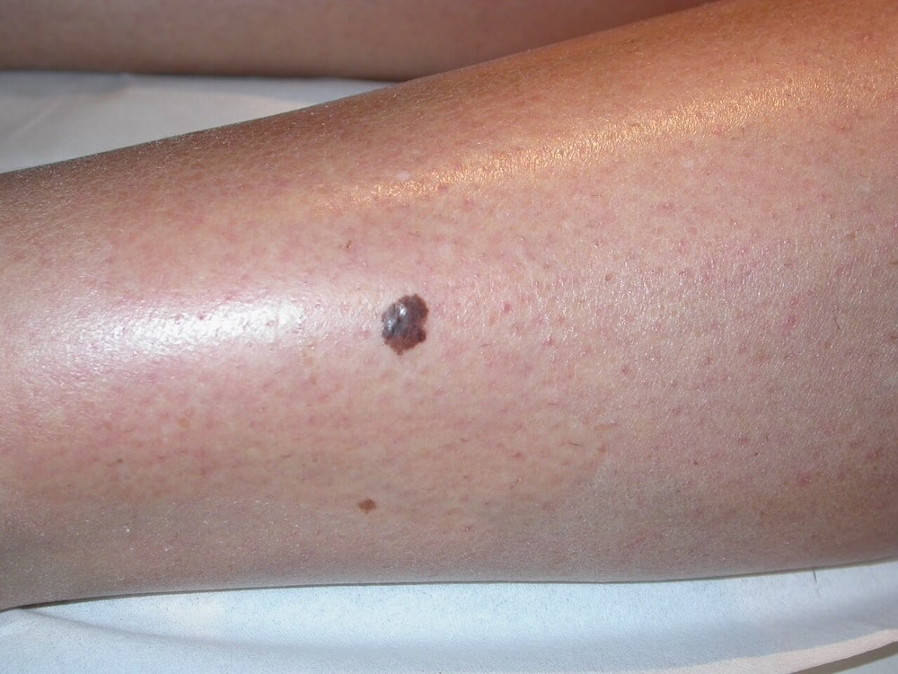

**Czerniak złośliwy jest nowotworem wywodzącym się z komórek barwnikowych - melanocytów.** Poniżej prezentujemy zdjęcia czerniaków, które wystąpiły u różnych osób, abyś mógł być jeszcze bardziej czujny w trakcie samobadania swoich znamion. Po zapoznaniu się z tym artykułem będziesz wiedzieć jak wygląda typowy czerniak.

## Czerniak zdjęcia

Rzadziej występuje u dzieci i młodzieży, natomiast u dorosłych **od kilkudziesięciu lat obserwujemy w Polsce stały trend wzrostowy zachorowalności na czerniaka**. Czynnik wpływający na powstanie czerniaka skóry to przede wszystkim promieniowanie UV związane z opalaniem się.

Czerniak jest nowotworem o wysokim stopniu złośliwości, dlatego też umieralność z powodu tego nowotworu skóry w Polsce jest wyższa niż przeciętnego obywatela Unii Europejskiej o około 20%.

Warunkiem wyleczalności jest wczesne wykrycie nowotworu i szybkie wycięcie chirurgiczne znamienia, dlatego też tak ważna jest profilaktyka czerniaka.

Czerniak może powstać w obrębie znamienia jak również w skórze niezmienionej. Czerniak rozwija się w 20-30 proc. z istniejących pieprzyków. Dlatego kładziemy tak duży nacisk na [badanie wszystkich znamion na ciele](/dermatoskopia-badanie-znamion "Badanie Znamion"), w celu usunięcia chirurgicznego tych, które mogą przekształcić się w czerniaka.

## Czerniak złośliwy skóry - typ guzkowaty

U mężczyzn najczęstszym umiejscowieniem czerniaka jest tułów, w przypadku kobiet czerniaka najczęściej wykrywamy na kończynach.

