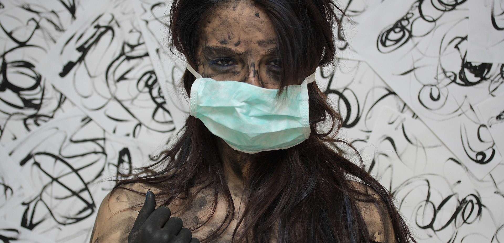
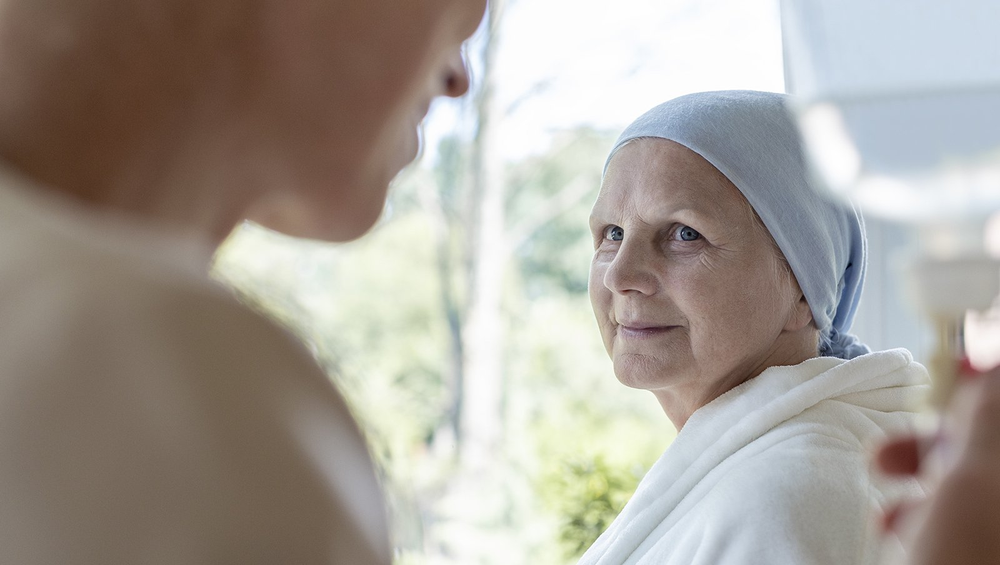

# Koronawirus a onkologia w Polsce - o sytuacji pacjentów onkologicznych w dobie COVID-19

Pandemia SARS-CoV-2 sprawiła, że sytuacja pacjentów onkologicznych zarówno w Polsce, jak i na całym świecie uległa sporym zmianom. Leczenie stało się o wiele większym wyzwaniem, a wszystko poprzez wydłużone terminy diagnostyki, mniejszą liczbę lekarzy, wdrożenie specjalnych procedur czy przekształcenie wielu oddziałów onkologicznych w jednoimienne jednostki zajmujące się pacjentami covidowymi. Sytuacja ta powoduje zatem niemałe zagrożenie dla chorych na nowotwory, którzy nadal wymagają wsparcia i dostępu do diagnostyki oraz leczenia.

## Ograniczenia w pracy szpitali i jednostek onkologicznych

Wraz z ograniczeniem działalności szpitali i jednostek onkologicznych, czy to z uwagi na zakażenia koronawirusem wśród personelu, jak również obowiązkową kwarantannę, narasta problem ograniczenia, a nawet całkowitego braku dostępu do leczenia onkologicznego. Jest to zatem wyjątkowo trudna sytuacja dla pacjentów, u których rozpoznano choroby nowotworowe, gdyż może być ona jednoznaczna z odebraniem szans na wyleczenie, jak również nagłym pogorszeniem rokowania. Brak należytej opieki medycznej powodować może większe zagrożenie i gorsze rokowania dla pacjentów onkologicznych, aniżeli osób zakażonych SARS-CoV-2.  

## Pacjenci onkologiczni – grupa zwiększonego ryzyka zgonu z powodu COVID-19

Powszechnie wiadomo, że grupą najbardziej narażoną na powikłania i zgon w wyniku zakażenia SARS-CoV-2 są osoby w podeszłym wieku, jak również te cierpiące na choroby współistniejące. Chorzy na nowotwory to szczególna grupa pacjentów wymagająca środków ochrony przed narażeniem na infekcje. Wystąpienie obu schorzeń jednocześnie ma charakter wyjątkowo niekorzystny. Problemem jest bowiem nie tylko ryzyko zgonu z powodu koronawirusa, ale także ograniczenia w przeprowadzeniu skutecznego leczenia onkologicznego u osoby zakażonej. To poważne wyzwanie, zarówno dla samego pacjenta, jak i całego systemu opieki zdrowotnej.

Okoliczność ta wymaga zabezpieczenia ciągłości terapii chorych na nowotwory. Polskie Towarzystwo Onkologii Klinicznej w odpowiedzi na problemy pacjentów onkologicznych w dobie pandemii opracowało specjalne zalecenia terapeutyczne, mające wspomóc ich leczenie. Ponieważ wiek chorych, choroby współistniejące, stopień zaawansowania choroby, a także trwające leczenie przeciwnowotworowe mogą zwiększać ryzyko ciężkich powikłań i śmierci w przypadku zachorowania na koronawirusa, konieczne stało się zróżnicowanie postępowania w okresie pandemii. Jak wynika z wdrażanych procedur, leczenie systemowe chorych z rozpoznaną chorobą nowotworową może przybierać charakter radykalny lub paliatywny. Dąży się do utrzymania rekomendowanych intensywności leczenia radykalnego – w tym leczenia przedoperacyjnego, pooperacyjnego czy chemioterapii. Brak możliwości kontynuowania danej formy leczenia wymaga przekazania chorego w trybie pilnym do funkcjonującego ośrodka onkologii klinicznej w danym województwie. W temacie terapii o założeniu paliatywnym, postępowanie ma na celu utrzymanie kontroli nad chorobą przy zmniejszeniu ryzyka narażenia pacjenta na infekcje. Leczenie może wymagać zmiany rytmu, dawkowania lub stosowanych leków, z naciskiem na utrzymanie stanu chorego w możliwie niepogorszonym stanie.

<More link="/blog/diagnostyka-i-leczenie-czerniaka-w-dobie-epidemii-koronawirusa" text="Leczenie czerniaka w pandemii - zalecenia." cta="Sprawdź" />

## Rak jest groźniejszy niż koronawirus

Strach przed zakażeniem SARS-CoV-2 sprawia, że wielu pacjentów rezygnuje ze zgłoszeniem się do lekarza w przypadku pojawienia się niepokojących objawów chorobowych. Obawa przed COVID-19 i kontaktem ze służbą zdrowia nie powinny jednak przesłaniać zdrowego rozsądku. Pandemia nie wpłynęła bowiem na ograniczenie występowania nowotworów, nadal  rak „zabija” nawet ponad 95% osób więcej, aniżeli koronawirus. Pandemii nie należy lekceważyć, jednak nie można zapominać o diagnostyce i leczeniu innych problemów zdrowotnych, przy jednoczesnym zachowaniu środków ochrony. W przypadku chorych na nowotwory jedynie regularne badania profilaktyczne stanowią sposób na wykrycie choroby we wczesnych stadiach, pozwalające na wprowadzenie skutecznego leczenia.