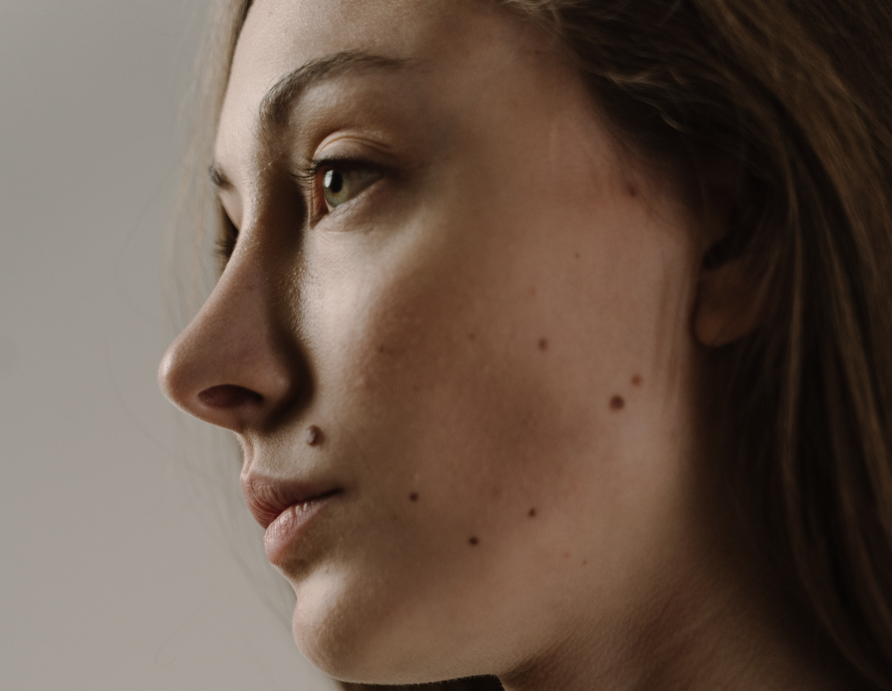
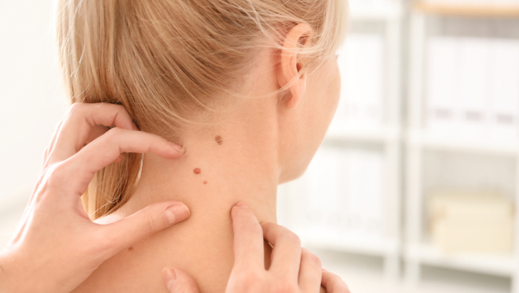
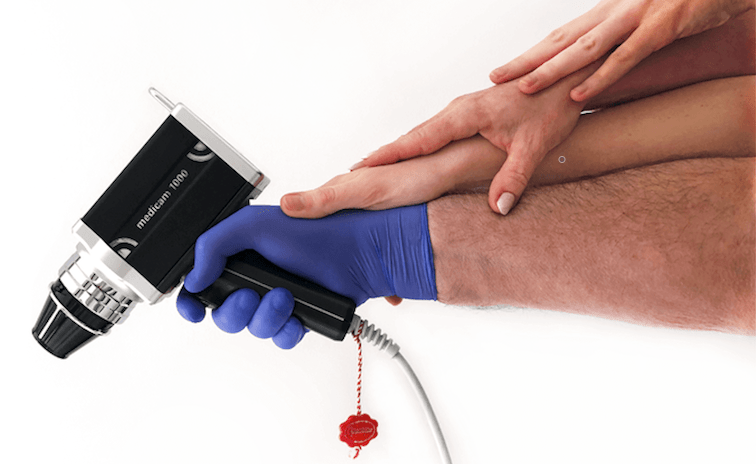

**Znamiona stanowią nieodłączną część skóry każdego z nas. Ich różne formy, w tym w szczególności znamiona barwnikowe (pieprzyki), zauważyć możemy w najróżniejszych punktach naszego ciała. Zmiany te mogą być naszym uroczym znakiem rozpoznawczym lub kompleksem, jednak często są także objawem poważnych chorób skóry, w tym nowotworów. Jak możemy zweryfikować, czy niepozorne pieprzyki wymagają laserowego usuwania? Gdzie w Warszawie możemy znaleźć profesjonalną pomoc i pozbyć się niechcianej ozdoby?**

Różnorodność zmian pojawiających się na skórze wymaga specjalistycznego podejścia i szczegółowej diagnostyki. Ważne są zatem dokładne badania, zanim zostaniemy skierowani na laserowe usuwanie znamion. Niezawodne wsparcie oferujemy w naszym [Centrum Usuwania Znamion w Warszawie](/warszawa/usuwanie-znamion-pieprzykow), na Woli przy ul. Sokołowskiej, gdzie można usunąć znamiona w sposób nieinwazyjny, nie pozostawiający widocznych blizn - metodą laserową. 

## Na czym polega laserowe usuwanie znamion?

Usuwanie zmian odbywa się w naszej placówce w Warszawie przy pomocy lasera frakcyjnego CO2 lasmed. Łagodne zmiany poddawane są działaniu wiązki lasera CO2, który powoduje odparowanie skóry. Jego efekty kosmetyczne są wyraźnie lepsze w porównaniu z zabiegami dokonywanymi chirurgicznie – jest to szczególnie ważne podczas usuwania znamion [na twarzy](/chirurgiczne-usuwanie-znamion#natwarzy).

Laserowe usuwanie pieprzyków nie wymaga stosowania skalpela, narzędzi chirurgicznych, czy zakładania szwów. Metoda laserowa jest bezkontaktowa, a narośle skórne są precyzyjnie odparowywane w sposób ciągły, punktowy lub warstwowy. Jeżeli to możliwe, część usuwanej zmiany oddawana jest do badań, celem wykluczenia nieprawidłowości. Po zabiegu laserowego usuwania znamion gojenie przebiega stosunkowo szybko. A im mniejszy był pieprzyk lub włókniak, tym mniejsza blizna pozostanie. Warto po zabiegu zadbać o odpowiednią pielęgnację skóry, aby nie dopuścić do jej zakażenia. Lekarz może zalecić specjalne maści i kremy przyspieszające regenerację naskórka.

Dlaczego usuwamy znamiona?

**Ogromna większość zmian skórnych ma charakter łagodny, jednak niektóre z nich mogą przybrać formę niebezpiecznego [czerniaka](https://twojeznamiona.pl/czerniak). Decyzję o ich usunięciu podejmujemy zwykle po wykonaniu badania dermatoskopowego wszystkich znamion na ciele, ze względów zdrowotnych - niepokojące, atypowe pieprzyki lub estetycznych - zmiany łagodne. Pieprzyki to znamiona skórne będące efektem stopniowo namnażających się komórek barwnikowych. Niektóre z nich mamy od urodzenia, inne nabywamy pod wpływem czynników zewnętrznych, jak nadmierna ekspozycja słoneczna, promieniowanie ultrafioletowe UVA/UVB, otarcia, skaleczenia czy zadrapania. Zdarza się także, że dziedziczymy je w genach.**

Diagnostyka a laserowe usuwanie pieprzyków

Kluczowym elementem, niezbędnym we wczesnym wykrywaniu podejrzanych zmian skórnych, jest regularne samobadanie, jednak okresowe wizyty u dermatologa to najlepsze co możemy zrobić dla zdrowia skóry. Jeżeli chcemy usunąć nieestetyczne znamię, uprzednio musimy poddać się specjalistycznym badaniom, celem jego szczegółowej oceny.

**Najpopularniejszą formą badania jest [dermatoskopia](https://twojeznamiona.pl/dermatoskopia-badanie-znamion), która stanowi skuteczny sposób diagnozowania oraz monitorowania znamion skórnych. W naszym gabinecie w Warszawie, wykonujemy [wideodermatoskopię](https://twojeznamiona.pl/wideodermatoskopia-komputerowe-badanie-znamion), czyli komputerowe badanie znamion przy pomocy wideodermatoskopu. Analiza skóry, przeprowadzona dzięki niemu, możliwa jest w bardzo dużym powiększeniu, przez co daje niesamowicie dokładny obraz.**

