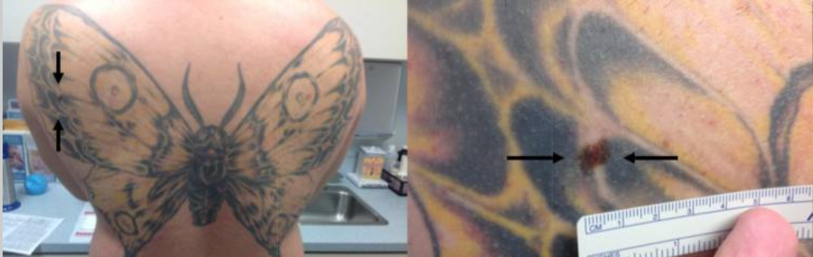

**Tatuaże to bez wątpienia jeden z najpopularniejszych sposobów zdobienia ciała na świecie. Ich wykonywanie niesie niewielkie ryzyko powikłań, jednak jak wykazują liczne przypadki, mogą być one sporym utrudnieniem w precyzyjnych badaniach skóry, a tym samym także kamuflażem dla czerniaka złośliwego.**

Szczególnie problematyczne są tatuaże ciemne, silnie napigmentowane oraz zajmujące rozległe partie ciała. Wytatuowany pieprzyk, tatuaż na piegach czy znamieniu jest nie lada wyzwaniem diagnostycznym, dlatego też te partie ciała należy obserwować ze szczególną troską i regularnie poddawać badaniom dermatologicznym, celem wczesnego wykrycia atypowych zmian.

## Mam tatuaż na pieprzyku – czy to bezpieczne?

Jak wynika z danych, średnio co 3 osoba posiada co najmniej jeden tatuaż. Faktem jest, że tatuowanie może prowadzić do powstawania stanów zapalnych i infekcji, jednak nie stanowią one bezpośredniej przyczyny powstawania [czerniaka](https://twojeznamiona.pl/czerniak). Ich obecność może jednak skutecznie maskować rozwijające się na skórze niebezpieczne zmiany. Przykładem może być wytatuowany pieprzyk - nietypowa wewnątrzskórna proliferacja melanocytów, odkryta w maskującym tatuażu pokrywającym sporą część pleców 39-letniego mężczyzny, który zgłosił się ma badanie dermatologiczne. Podobną sytuację przeżył 55-letni mężczyzna, odkrywając po 5 latach od wykonania tatuażu bezobjawową zmianę skórną, która z czasem owrzodziała i zaczęła krwawić. [Biopsja](https://twojeznamiona.pl/chirurgiczne-usuwanie-znamion#id10) zmiany wykazała powierzchownego czerniaka. Coraz częstsze liczne przypadki czerniaka w tatuażu sprawiają, że badanie skóry pacjentów z tatuażami jest niebywale ważne dla profilaktyki przeciwnowotworowej.

Opisano już rozliczne zmiany chorobowe – zarówno łagodne, jak i złośliwe, pojawiające się na tatuażach. Były to znamiona jak pieprzyk na twarzy, brodawczaki, ziarniaki czy czerniaki. Jak wykazują badania, czerniaki i im podobne nowotwory skóry mają tendencję do występowania na ciemnych tatuażach np. czarnych czy ciemnoniebieskich, ale i na barwach czerwonych. Poza maskowaniem zmian, tatuaż na znamieniu może podczas badania próbki z pigmentem atramentu być utrudnieniem do dokładnej oceny. Specjaliści zalecają zatem, aby przed podjęciem decyzji o tatuażu dokonać dokładnego dermatoskopowego [badania skóry](https://twojeznamiona.pl/dermatoskopia-badanie-znamion), celem wykluczenia ewentualnego rozwoju nowotworów skórnych w obrębie miejsca, które planujemy tatuować. Pozwala to uniknąć wykonania tatuażu na znamieniu, które w rzeczywistości jest rakiem skóry, co może niestety w sposób istotny opóźnić rozpoznanie nowotworu.

## Tatuażach na znamionach a rak skóry 

Decydując się na tatuaż w określonym miejscu, należy mieć na uwadze to, że pokrywanie nim pieprzyków czy znamion może być dla skóry niebezpieczne. Barwniki stosowane w tatuowaniu zaburzają obraz, czego efektem jest trudniejsze wykrycie i analizowanie zmiany, nawet podczas badania [dermatoskopem](https://twojeznamiona.pl/dermatoskopia-badanie-znamion). Tatuaż na znamionach może powodować podrażnienia mechaniczne zmian skórnych, dlatego tworząc wzór, należy omijać pieprzyki i im podobne. Najlepiej tworzyć tatuaż wokół pieprzyka. Nie należy zapominać również o tym, że każdy tatuaż należy wykonywać w pewnych, profesjonalnych i sterylnych miejscach. Warto mieć też na uwadze, że pokrycie skóry pigmentem nie oznacza, że nie pojawią się na niej kolejne pieprzyki, które będą wyjątkowo trudne do zauważenia. Co ciekawe, niektóre [znamiona błękitne](https://twojeznamiona.pl/blog/to-jednak-nie-czerniak) mogą do złudzenia przypominać tatuaż, przez co trudno czasami odczytać ze skóry, czy mamy do czynienia ze znamieniem błękitnym w tatuażu, czy przypadkiem nie kryje się pod nim czerniak.

## Laserowe usuwanie tatuażu a pieprzyki w tatuażu

Laserowe usuwanie tatuażu zyskuje na popularności, szczególnie wśród osób, które pragną pozbyć się niefortunnych pamiątek i błędów młodości. Warto jednak w tym wypadku pamiętać o dokładnym zbadaniu miejsca pokrytego tatuażem. Ukryte w wytatuowanej skórze zmiany powinny zostać wycięte, zanim przystąpimy do zabiegu usuwania pigmentu metodą laserową. Podejrzane znamiona występujące na tatuowanej skórze są bardzo problematyczne w ocenie, gdyż napigmentowane próbki z biopsji mogą imitować przerzuty. Przed podjęciem decyzji o usunięciu tatuażu zalecane jest zatem precyzyjne [badanie dermatoskopowe](https://twojeznamiona.pl/dermatoskopia-badanie-znamion).

Warto pamiętać, że leczenie zmian barwnikowych laserem opóźnia rozpoznanie czerniaka, a tym samym może uniemożliwić podjęcie stosownej terapii w optymalnym czasie. Wcześniej wspomniane, chirurgiczne usunięcie zmian skórnych okazać się może kluczowe w skutecznym leczeniu. Każdy zabieg, w tym laserowe usuwanie tatuaży, najlepiej wykonywać pod kontrolą lekarską np. u dermatologa.

## Badanie wytatuowanej skóry – profilaktyka przeciwnowotworowa

Osoby posiadające tatuaże powinny szczególnie zadbać o regularne oglądanie i badanie skóry pod kątem znamion. Każda nowa zmiana czy powiększenie się pieprzyka, powinno zostać skontrolowane u dermatologa. Wiele osób nie zdaje sobie sprawy z zagrożeń, jakie niesie wykonanie tatuażu, w tym w szczególności jego dermatologicznych następstw. Szczególnie czujne powinny być osoby z licznymi znamionami, piegami, pieprzykami, atypowym zespołem znamion czy czerniakiem występującym u członków rodziny. Konsekwentne monitorowanie skóry, w szczególności tej w obrębie tatuażu to spore ułatwienie dla wczesnej diagnostyki i leczenie rozwijających się nowotworów skóry.

<More link="https://twojeznamiona.pl/kontakt" text="Sprawdź, czy badamy znamiona w Twoim mieście" cta="Sprawdź" />