Nie każdy **pieprzyk** czy zmiana skórna przeradza się w **czerniaka**, nawet jeśli niepokoi swoim wyglądem i/lub wymaga interwencji lekarskiej. Artykuł ten będzie poświęcony kilku wybranym jednostkom chorobowym, które również bierze się pod uwagę przy różnicowaniu [czerniaka](/czerniak "Czerniak").

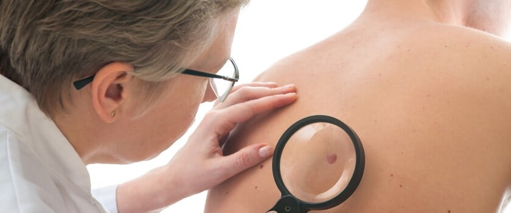

## Włókniak twardy skóry (dermatofibroma)

To **patologiczna, ale łagodna** zmiana osiągająca zwykle od 2 mm do nawet 5 cm, dlatego wiele osób decyduje się na jej [usunięcie](https://twojeznamiona.pl/chirurgiczne-usuwanie-znamion "Usuwanie Znanion") ze względów estetycznych. Najczęściej powstaje jako odpowiedź na stany zapalne lub **pękniętą kurzajkę**. Przyjmuje postać ciemnobrązowej brodawki, stosunkowo twardej, ale poruszającej się pod skórą. Tego typu zmianę zawsze powinien obejrzeć dermatolog, by podjąć decyzję o ewentualnej biopsji i bezpiecznym usunięciu włókniaka twardego. Uwaga! **Nie należy stosować domowych sposobów – kwasu salicylowego czy octu jabłkowego**. Takie próby mogą nieść za sobą przykre **powikłania i rozrost guza**.

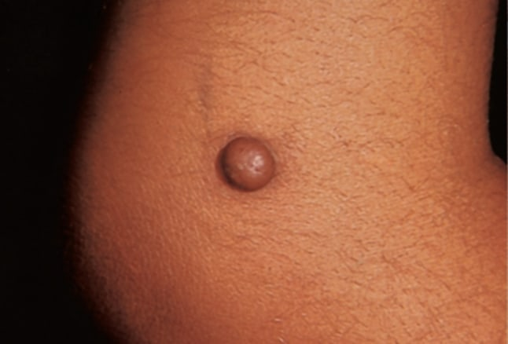

## Naczyniak (haemangioma)

To kolejna **łagodna zmiana** rozrostowa w postaci guza naczyniowego. Bardzo często jest obserwowana u **niemowląt i małych dzieci**, w przeważającej liczbie przypadków samoistnie się wchłania i nie daje żadnych objawów. Wyróżnia się następujące rodzaje naczyniaków:

* **naczyniak płaski** - najczęściej pojawiający się po urodzeniu,

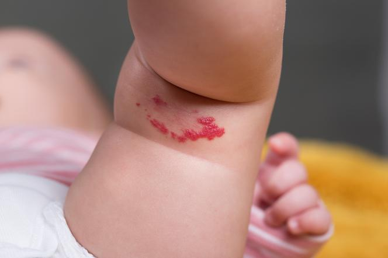

* **naczyniak włośniczkowy** - diagnozowany u noworodków kilka tygodni po urodzeniu (znika samoistnie około 6 roku życia),

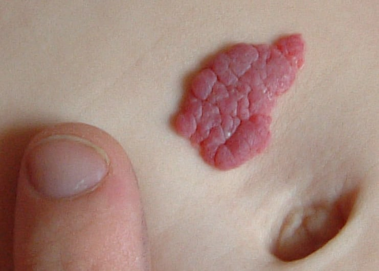

* **naczyniak limfatyczny** - występujący u dzieci w pierwszych latach życia,

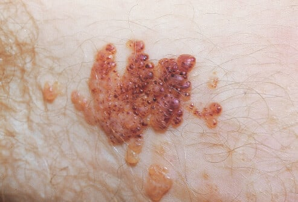

* **naczyniak jamisty** - najczęściej występujący u kobiet, pojawia się w każdym przedziale wiekowym,

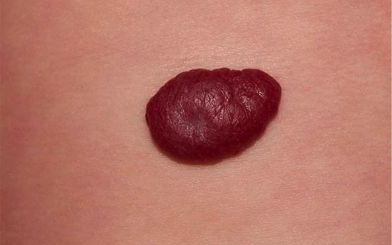

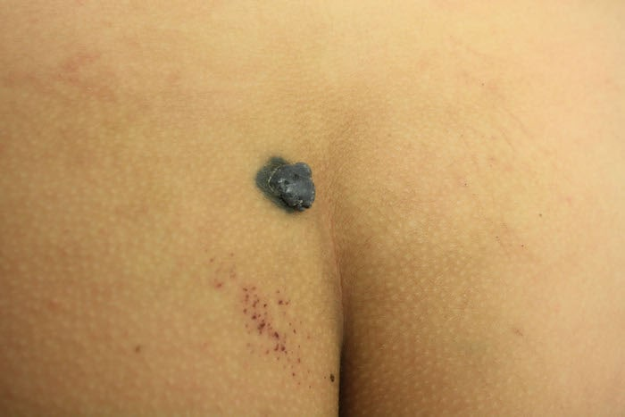

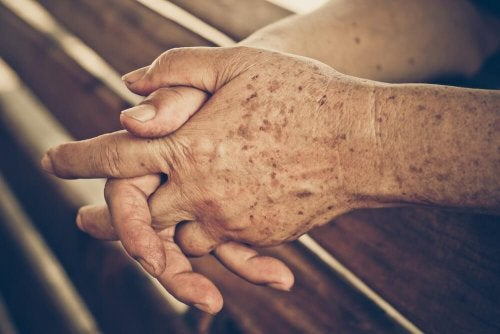

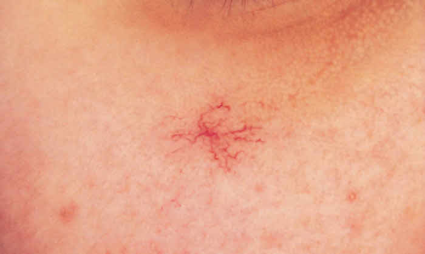

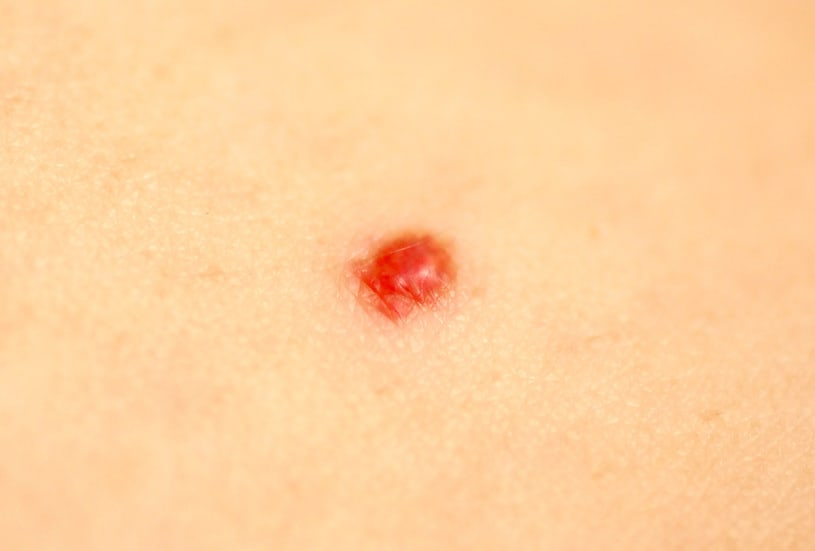
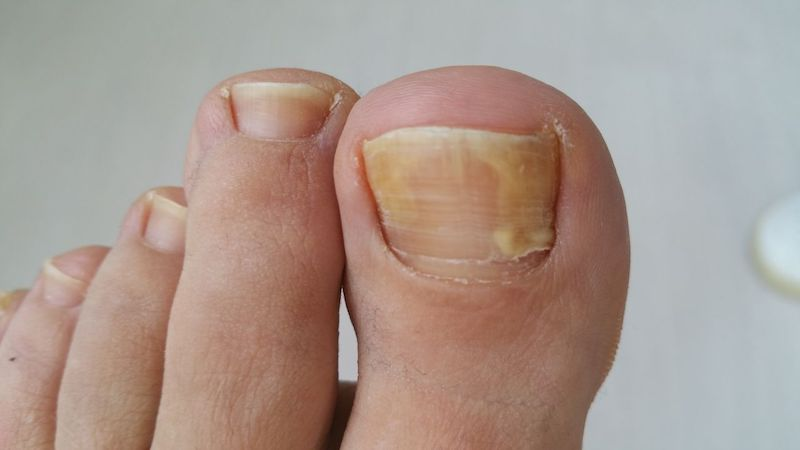