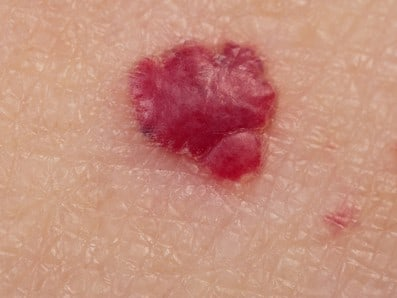

Nie każdy **pieprzyk** czy zmiana skórna przeradza się w **czerniaka**, nawet jeśli niepokoi swoim wyglądem i/lub wymaga interwencji lekarskiej. Artykuł ten będzie poświęcony kilku wybranym jednostkom chorobowym, które również bierze się pod uwagę przy różnicowaniu [czerniaka](/czerniak "Czerniak").

## Włókniak twardy skóry (dermatofibroma)

To **patologiczna, ale łagodna** zmiana osiągająca zwykle od 2 mm do nawet 5 cm, dlatego wiele osób decyduje się na jej [usunięcie](/chirurgiczne-usuwanie-znamion "Usuwanie Znanion") ze względów estetycznych. Najczęściej powstaje jako odpowiedź na stany zapalne lub **pękniętą kurzajkę**. Przyjmuje postać ciemnobrązowej brodawki, stosunkowo twardej, ale poruszającej się pod skórą. Tego typu zmianę zawsze powinien obejrzeć dermatolog, by podjąć decyzję o ewentualnej biopsji i bezpiecznym usunięciu włókniaka twardego. Uwaga! **Nie należy stosować domowych sposobów – kwasu salicylowego czy octu jabłkowego**. Takie próby mogą nieść za sobą przykre **powikłania i rozrost guza**.

## Naczyniak (haemangioma)

To kolejna **łagodna zmiana** rozrostowa w postaci guza naczyniowego. Bardzo często jest obserwowana u **niemowląt i małych dzieci**, w przeważającej liczbie przypadków samoistnie się wchłania i nie daje żadnych objawów. Wyróżnia się następujące rodzaje naczyniaków:

* **naczyniak płaski** - najczęściej pojawiający się po urodzeniu,

* **naczyniak włośniczkowy** - diagnozowany u noworodków kilka tygodni po urodzeniu (znika samoistnie około 6 roku życia),

* **naczyniak limfatyczny** - występujący u dzieci w pierwszych latach życia,

* **naczyniak jamisty** - najczęściej występujący u kobiet, pojawia się w każdym przedziale wiekowym,

* **naczyniak gwiaździsty** - występujący u dzieci i kobiet, rzadko u mężczyzn,

* **naczyniak starczy** - występuje u osób dorosłych, nazywany bywa naczyniakiem rubinowym, ze względu na barwę guzków. Pojawia się na tułowiu i kończynach górnych,

### Leczenie naczyniaków

* Naczyniaków powierzchownych niepowikłanych nie poddaje się leczeniu, a jedynie stałej obserwacji.
* Glikokortykosteroidy i beta-blokery stosuje się tylko w przypadku, gdy naczyniak rozrasta się lub jego obecność w jamach ciała grozi uszkodzeniem lub krwotokiem.
* Leczenie operacyjne stosuje się w ostateczności i zawsze jest ono poprzedzone wstrzykiwaniem substancji, które ma na celu niszczenie guza i jego zmniejszenie.

## Grzybica paznokci

Powszechna i dobrze znana, ale wciąż sprawiająca problemy terapeutyczne. Szczególnie problematyczna w różnicowaniu z [czerniakiem](/czerniak "Czerniak") jest grzybica powierzchowna biała, która atakuje płytkę paznokciową od strony jej powierzchni, a nalot przybiera często czarną barwę.

<More link="/czerniak/rodzaje-czerniaka/czerniak-na-dloniach-i-podeszwach-stop" text="Zobacz, jak może wyglądać czerniak na stopach" cta="Sprawdź" />

## Znamię błękitne

Należy ono do szczególnie trudnych w diagnozie znamion, które imitują czerniaka, a wątpliwości nie rozwiewa często nawet pierwsze [badanie histopatologiczne](/chirurgiczne-usuwanie-znamion "Badanie histopatologiczne") Jego wielkość najczęściej nie przekracza średnicy ziarna soczewicy, jest głęboko osadzone w skórze i przybiera barwę błękitną.

Wyróżnia się 3 rodzaje tych znamion:

* znamię błękitne pospolite,
* znamię błękitne komórkowe,
* złośliwe znamię błękitne.

Znamię **błękitne złośliwe** to w zasadzie już **forma czerniaka**.

Znamię błękitne, które ma poniżej jednego centymetra i nie zmienia się, nie podlega leczeniu. Wskazana jest jedynie jego obserwacja pod kątem zmian w nim zachodzących. Bardzo ważne w procesie diagnostycznym są także informacje od kiedy znamię znajduje się na skórze, czy był w tym miejscu jakiś uraz oraz czy znamię nie zmienia wielkości w ostatnim czasie.

<More link="/blog/jak-odroznic-zwykly-pieprzyk-od-typowego-czerniaka-zdjecia" text="Zobacz, jak odróżnić pieprzyk od typowego czerniaka" cta="Sprawdź" />

## Rogowacenie słoneczne

To jedno z najczęstszych rozpoznań w gabinecie dermatologicznym. Dotyczy ono skóry starczej i jest skutkiem oddziaływania promieniowania ultrafioletowego na skórę. W formie zaawansowanej niesie ze sobą ryzyko rozwoju raka kolczystokomórkowego, dlatego też wszelkie tego typu zmiany dokładnie się różnicuje i poddaje leczeniu zorientowanemu na zmianę, np. [krioterapia](/laserowe-usuwanie-znamion "Krioterapia") lub obszar – [laseroterapia](/laserowe-usuwanie-znamion "Lasserowe usuwanie znamion").

Ocenę znamion najlepiej zawsze pozostawić specjalistom, udając się na [badanie znamion](/dermatoskopia-badanie-znamion "Badanie znamion") lub konsultację dermatologiczną. Doświadczeni dermatolodzy rozpoznają charakter każdego znamienia i doradzą, co robić dalej. Zaawansowana [wideodermatoskopia](/wideodermatoskopia-komputerowe-badanie-znamion "Wideodermatoskopia") w jeszcze większym stopniu pozwala na dokładną ocenę znamion. Krótka wizyta może pozwolić nam ustrzec się przed groźnym nowotworem skóry lub odzyskać spokój, że to jednak nie czerniak.

<More link="/kontakt" text="Zobacz, czy badamy znamiona w Twoim mieście." cta="Sprawdź" />