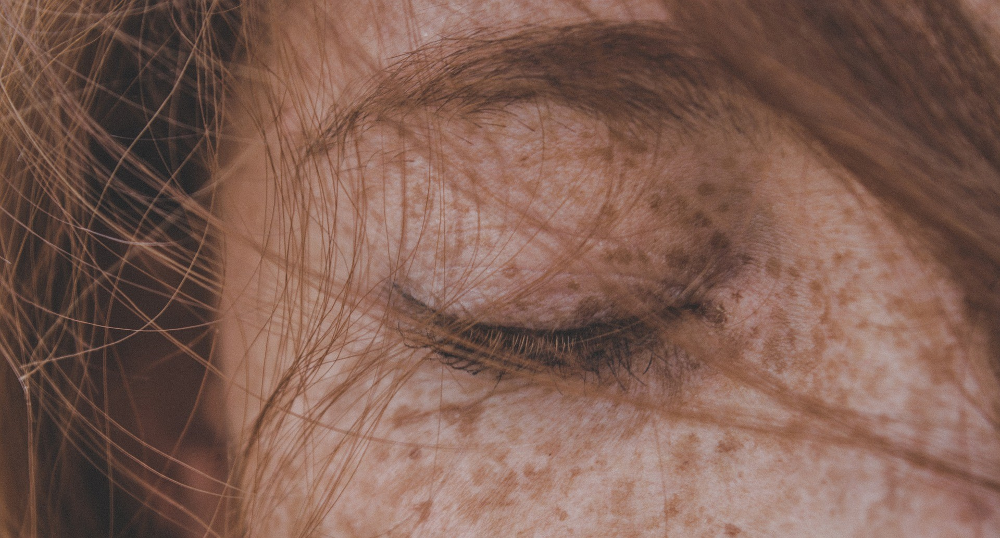
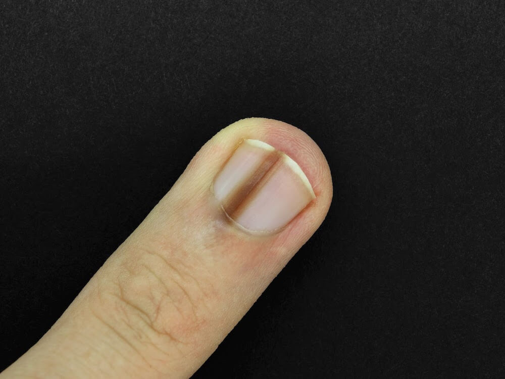

**Choroby nowotworowe należą do wyjątkowo podstępnych, a ich przebieg w początkowych stadiach jest bezobjawowy. Dolegliwości pojawiają się w późniejszych etapach ich rozwoju i nie są charakterystyczne. Wczesne wykrycie nieprawidłowości daje jednak szansę na całkowite wyleczenie. W przypadku nowotworów skóry możemy mieć problem z tym, jak odróżnić pieprzyk od czerniaka, jednak poprzez odpowiednią diagnostykę, możliwe jest ocenienie, czy zmiany na skórze, ich kolor, kształt czy wielkość stanowią objawy czerniaka. Zdjęcia czerniaka pozwalają zaobserwować różnorodność tego rodzaju nowotworów.**

### Czerniak – typowe objawy choroby

Do typowych objawów nasuwających podejrzenie czerniaka należą:

* wystąpienie owrzodzenia na skórze
* pojawienie się świądu
* zmiana kształtu znamienia lub asymetria w wyglądzie
* pojawienie się wielobarwnego wyglądu
*  zaczerwienienie wokół znamienia
*  krwawienie 
* pojawienie się blizny w znamieniu

<More link="https://twojeznamiona.pl/czerniak/objawy-czerniaka" text="Charakterystyczne objawy czerniaka złośliwego.  Zobacz" cta="Dowiedz się więcej" />

Podejrzenie czerniaka mogą nasuwać na myśl zmiany skórne zarówno pojawiające się de novo, ale i te na podłożu znamienia barwnikowego, jak np. pieprzyk. Samobadanie lub ocena znamion dokonywana przez lekarza wymaga zatem oceny fizykalnej skóry całego ciała, w tym miejsc trudno dostępnych, jak skóra głowy, stóp, przestrzenie między palcami czy okolice narządów płciowych i odbytu. Symptomatologia nowotworów skóry zależna jest jednak od lokalizacji zmiany oraz jej typu. Istnieje cały szereg [rodzajów czerniaka](https://twojeznamiona.pl/czerniak/rodzaje-czerniaka-zdjecia), dlatego też wymagają one odpowiedniego badania, które pozwoli rozpoznać czy zmiana na naszej skórze to nowotwór czy inny typ znamienia.

[Masz podobne objawy. Umów się na badanie.](https://twojeznamiona.pl/kontakt)

## Jak rozpoznać czy na naszej skórze pojawiły się objawy czerniaka? 

Objawy we wczesnych stadiach czerniaka mogą być zdradliwe.  Czerniak gołym okiem może przypominać znamię błękitne, plamy, zrogowacenia, znamię Spitza czy zmian pojawiające się w obrębie tatuażu. Oglądając znamiona bez specjalistycznego sprzętu często trudno odróżnić czerniaka od brodawki łojotokowej, włókniaka twardego skóry, naczyniak, wynaczynienia żylnego, ziarniaka, mięsaki, a w obrębie dłoni i stóp np. grzybicy paznokci czy krwiaka podpaznokciowego.

<!--StartFragment-->

[Czy czerniak boli?](https://twojeznamiona.pl/blog/czy-czerniak-boli) Objawy bólowe w przypadku nowotworów skóry z reguły nie występują. Pojawiają się najczęściej dopiero w wysokim stadiach zaawansowania nowotworu, gdy ten rozrasta w głąb skóry lub daje przerzuty.

Dla wczesnej diagnozy konieczne jest przeprowadzenie badania dermatoskopowego, a podstawą ostatecznego rozpoznania jest badanie histopatologiczne tzw. [biopsja](https://twojeznamiona.pl/chirurgiczne-usuwanie-znamion#biopsja), pozwalająca potwierdzić lub wykluczyć czerniak. Objawy, samopoczucie pacjenta, a w konsekwencji wczesna i dokładna diagnoza oraz leczenie pozwalają w wielu przypadkach skutecznie zwalczyć chorobę.

[Sprawdź, jak odróżnić pieprzyk od czerniaka](https://twojeznamiona.pl/blog/jak-odroznic-zwykly-pieprzyk-od-typowego-czerniaka-zdjecia)

### Badanie dermatoskopowe a objawy czerniaka

Pierwszym krokiem po zaobserwowaniu nowych znamion lub zmian w ich obrębie powinno być [badanie dermatoskopem](https://twojeznamiona.pl/dermatoskopia-badanie-znamion). W naszej [klinice](https://twojeznamiona.pl/kontakt) pomagamy w kompleksowej ocenie znamion i ich ewentualnym leczeniu. Za sprawą badania dermatoskopowego lekarz może ocenić typ zmiany, stosując np. metodę 3-punktową, określającą kryteria złośliwości według wzorca, ale i dogłębnie przyjrzeć się wyglądowi znamienia (asymetrie koloru i struktury, atypowej siatce barwnikowej, obecności struktur o niebiesko-białawym zabarwieniu). Badanie to pozwala wykryć czerniaka w bardzo wczesnym etapie.

 za pomocą dermatoskopu.")

Dermatoskopia jest metodą diagnostyki w zupełności nieinwazyjną, pozwalającą na precyzyjne uwidocznienie koloru i struktury naskórka, granicy śródnaskórkowej oraz warstwy brodawkowatej skóry właściwej. Dzięki jej wykorzystaniu możliwe jest rozpoznanie melanocytowych, niemelanocytowych, łagodnych i złośliwych zmian skórnych. Stosując dermatoskopię, zwiększamy szansę na rozpoznanie czerniaka o 27% w stosunku do oceny gołym okiem. Poprzez dermatoskopową analizę skóry możliwe jest stwierdzenie, czy podejrzana zmiana wymaga biopsji, bądź całkowitego [usunięcia](https://twojeznamiona.pl/chirurgiczne-usuwanie-znamion).

[Zobacz na zdjęciach, jak może wyglądać czerniak](https://twojeznamiona.pl/blog/jak-wyglada-czerniak-zdjecia)

### Ocena objawów czerniaka - kryteria ABCDE

Objawy [czerniaka](https://twojeznamiona.pl/czerniak) mogą być bardzo zróżnicowane, dlatego w przypadku pojawienia się niepokojących zmian lub gdy znajdujemy się grupie ryzyka zachorowania, warto regularnie odwiedzać lekarza i odbywać badania. Na co dzień możemy także samodzielnie dokonywać oceny znamion, korzystając z kryteriów [ABCDE](https://twojeznamiona.pl/dermatoskopia-badanie-znamion#abcde) (czasami również F). Dzięki nim możemy dokładnie opisać zmianę skórną. W kryteriach tych niepokojące znamiona mogą być:

* A (asymmetry) - asymetryczne, np. w postaci znamienia „rozlewającego się” w jedną stronę,
* B (borders) – o poszarpanych, nierównomiernych, posiadających zgrubienia brzegach,
* C (color) – w odcieniu czerwonym, czarnym, o niejednolitym kolorze,
* D (diameter) o niepokojącej średnicy – niepokoić może duży rozmiar, wielkość zmiany powyżej 6mm,
* E (elevation) - uwypuklone, czyli mogą zachodzić w nich postępujące zmiany,
* F (feeling) – dziwne w odczuciu, budzące niepokój.

Aby móc być spokojnym o swoje znamiona, najlepiej jest raz w miesiącu dokładnie je oglądać i jeżeli zauważymy coś niepokojącego, udać się do lekarza na badanie znamion. Każdy powinien odbyć takie badanie przynajmniej raz do roku, a w przypadku gdy lekarz wyznaczył znamiona do kontroli, przestrzegać jej terminów. To da nam pewność i spokój.

[Sprawdź, gdzie badamy znamiona](https://twojeznamiona.pl/kontakt)