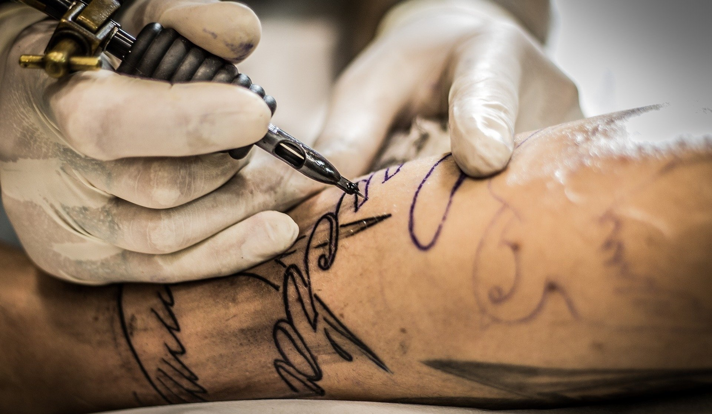
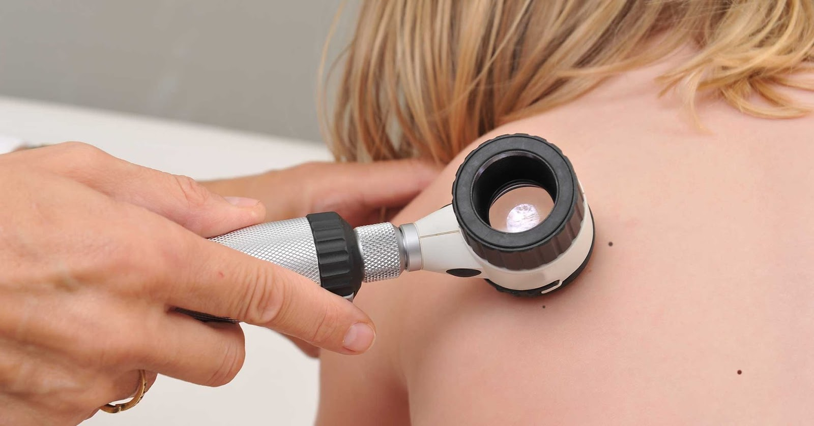
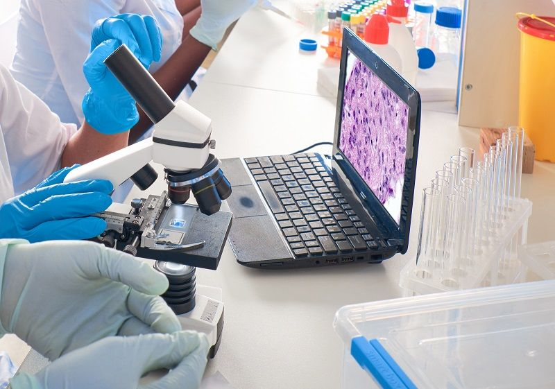

**Znamiona skórne to element naszej skóry już od dnia narodzin. Czasem stanowią ozdobę, czasem są przyczyną kompleksów, jednak pojawiające się u najmłodszych pieprzyki czy inne zmiany lub niejednokrotnie rozdrapane pieprzyki u dzieci mogą stwarzać zagrożenie dla ich zdrowia. Niemałą rolę w uchronieniu dzieci i młodzieży przed nowotworami skóry, w tym czerniaka, mają rodzice - profilaktyka i regularna kontrola to podstawa. Do tego potrzeba wiedzy, którą przekazujemy w tym artykule.**

### Czerniak u dzieci - jakie ma objawy?

Szczególną i najgroźniejszą zmianą, która może pojawić się u Twojego dziecka jest czerniak. Jest on klasyfikowany w dwóch grupach – przed okresem dojrzewania i po okresie dojrzewania. Dodatkowo wyróżnia się podtypy:
czerniaki wrodzone, niemowlęce (do 1 roku życia) oraz 
wieku dziecięcego (do okresu dojrzewania). 
Podstawowym czynnikiem rozwoju czerniaka u dzieci jest obecność wrodzonych znamion barwnikowych. Niestety bardzo często czerniak u najmłodszych nie wykazuje specyficznych cech klinicznych i nie daje objawów. U dzieci forma wrodzona czerniaków występuje rzadko - 1 na milion poniżej 15 roku życia, jednak w ostatnich latach niepokojąco zwiększyła się liczba małych pacjentów.

<More link="https://twojeznamiona.pl/kontakt" text="Umów się na badanie ze swoim dzieckiem - nie zwlekaj." cta="Sprawdź" />

### Kiedy pojawiają się znamiona u dzieci?

W zależności od wieku pojawienia się na skórze znamion barwnikowych, możemy podzielić je na znamiona wrodzone oraz nabyte. Te pierwsze znajdują się na skórze dziecka już w momencie narodzin bądź rozwijają się do pierwszego roku życia. Przyczyn powstawania znamion barwnikowych u dzieci może być wiele. Skóra dziecka, na której pojawiają się atypowe zmiany wymaga zatem prawidłowej oceny, w czym niezwykle pomocne jest badanie dermatoskopowe. 

## Znamiona wrodzone u dzieci

Jak wynika ze statystyk znamiona wrodzone dotyczą średnio 2% dzieci, z czego w większości występują u dziewczynek. Ryzyko rozwoju czerniaka ze znamion wrodzonych wynosi około 5% w skali populacji, a dodatkowo wzrasta wraz z wielkością znamienia – szczególnie w tych powyżej 1 cm.  

## Znamiona nabyte u dzieci

Znamiona nabyte dotyczą w zasadzie każdego człowieka, a częstość ich występowania zależy od tego, do której grupy znamion należą. Przyczyną ich powstania mogą być uwarunkowania genetyczne, jak i środowiskowe, w tym ekspozycja na światło ultrafioletowe (u dzieci np. oparzenia słoneczne), urazy, bliznowacenie, systemowa immunosupresja czy zaburzenia hormonalne. Liczba znamion pojawiających się na naszej skórze wzrasta wraz z wiekiem.

## Znamiona u dzieci - zdjęcia

Na skórze dzieci i młodzieży mogą pojawiać się różnego rodzaju pieprzyki. Poniżej przedstawiono zdjęcia kilku rodzajów znamion występujących u dzieci.

* **znamiona błękitne**, które charakteryzuje stalowoniebieskie zabarwienie i gładka powierzchnia,

* **znamiona Suttona** z typowym odbarwieniem skóry wokół zmiany, pojawiające się najczęściej na tułowiu,

* **znamiona Spitza** – szybko rosnące guzki lub grudki w kolorze jasnoróżowym do ciemnoczerwonobrązowego, najczęściej występujące na kończynach i twarzy,

* **znamiona Reeda** – odmiana znamion Spitza, w postaci płaskich lub płaskowyniosłych zmian w kolorze ciemnobrązowym lub czarnym.

<More link="https://twojeznamiona.pl/czerniak/rodzaje-czerniaka-zdjecia" text="Inne rodzaje znamion! Sprawdź" cta="Zobacz również:" />

## Znamiona u dziecka - kiedy iść do lekarza?

W chwili, gdy zauważymy na ciele naszej pociechy niepokojącą zmianę, dziecko skarży się na swędzący pieprzyk, rozdrapany pieprzyk niepokojąco krwawi czy też noszenie ubranek podrażnia skórę w określonym miejscu, nie należy zwlekać z wizytą u lekarza. Obserwacja i wczesne wykrywanie zmian skórnych jest kluczowe dla podjęcia skutecznego leczenia.

## Dermatoskopia pieprzyków u dzieci

Diagnostyka znamion barwnikowych oraz czerniaka u dzieci w uzasadnionych sytuacjach jest nieinwazyjna, bezbolesna i polega na badaniu [dermatoskopowym](https://twojeznamiona.pl/dermatoskopia-badanie-znamion), np. [wideodermatoskopowym](https://twojeznamiona.pl/wideodermatoskopia-komputerowe-badanie-znamion). Wybór odpowiedniego lekarza ze świetnym podejściem do dzieci pozwala na przeprowadzenie badania bez stresu dla dziecka. Problematyczne zmiany skórne należy sprawdzać regularnie, co pozwala oceniać ich obraz na przestrzeni lat. Nie należy też czekać z diagnostyką rozdrapanych pieprzyków na skórze.

<More link="https://twojeznamiona.pl/kontakt" text="Czy działamy w Twoim mieście.  Umów się." cta="Sprawdź" />

## Objawy czerniaka u dziecka - kontroluj dziecko regularnie w domu

W przypadku czerniaka wykorzystywana jest między innymi metoda ABCDE, dzięki której ocenia się cechy charakterystyczne zmiany i którą można stosować również samemu w domu. 

<More link="https://twojeznamiona.pl/czerniak" text="Czerniak - diagnostyka i leczenie" cta="Sprawdź" />

Rozbieramy dziecko i szukamy znamion na całym ciele, kolejno przyglądając się każdemu z nich. Przy ocenianiu pieprzyków kierujemy się 5 głównymi wskazówkami.

* **A jak asymetria** - znamię ma niespotykany kształt, rozchodzi się na którąś ze stron, “rozpływa”, jest nieregularne, ma różną strukturę,
* **B jak brzeg** - znamię ma poszarpany brzeg, 
* **C jak colour** - kolor znamienia wzbudza podejrzenia: jest czerwone, czarne, niebieskie, zielone lub niejednolite kolorystycznie, np. nieco czarne, nieco brązowe. 
* **D jak duży rozmiar** - znamię wyróżnia się wielkością spośród pozostałych, przekracza 0,5 cm, 
* **E jak ewolucja** - znamię zmienia się w czasie, powiększa się, zmienia kolor, strukturę. 

Lekarze, korzystając z tej metody, dodatkowo przyznają punkty, dzięki którym oceniają typ znamienia na łagodny, atypowy lub sugerujący czerniaka. 

## Czy usuwać znamiona u dzieci?

Znamiona podejrzane i potencjalnie groźne dla zdrowia usuwa się [chirurgicznie](https://twojeznamiona.pl/chirurgiczne-usuwanie-znamion), a następnie kieruje do [badania histopatologicznego](https://twojeznamiona.pl/chirurgiczne-usuwanie-znamion#histopatologia), które pozwala uzyskać pewność co do charakteru znamienia: czy było łagodne czy nowotworowe. Pozwala to na podjęcie ewentualnego szybkiego leczenia, które jest kluczowe przy nowotworach skóry. Odpowiednio wcześnie wykryty czerniak pozwala w większości przypadków na całkowite wyleczenie.

Nie potrzeba się jednak zawczasu martwić - znamiona barwnikowe u dzieci najczęściej są łagodne, szczególnej uwagi wymagają jednak znamiona wrodzone i znamiona Spritza ze względu na możliwość ich rozwoju w czerniaka. Regularne kontrole dermatoskopowe to najlepsza profilaktyka.

<More link="https://twojeznamiona.pl/blog/jak-chronic-sie-przed-nowotworem-skory" text="Sprawdź, jak chronić swoją rodzinę na co dzień" cta="Sprawdź" />

## Ochrona UV a czerniak

Jak wynika z badań, oparzenia słoneczne doznane w dzieciństwie zwiększają ryzyko rozwoju czerniaka, a nawet połowa dzieci, które przeżyły czerniaka doświadczyło oparzeń słonecznych w przeciągu roku od zachorowania. Ochrona przeciwsłoneczna jest zatem jednym z ważnych czynników przeciwdziałania nowotworom skóry u dzieci, dlatego warto zadbać o ich odpowiedni strój, w tym nakrycia głowy, kremy z filtrem, a także unikanie nadmiernej ekspozycji słonecznej.

<More link="https://twojeznamiona.pl/kontakt" text="Skontaktuj się z nami, by umówić się na badanie" cta="Sprawdź" />