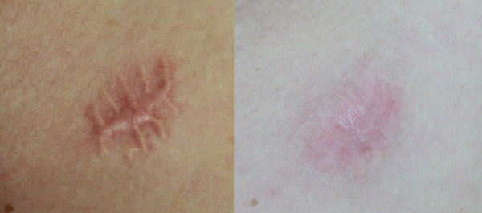

Znamiona to nieodłączny element naszej skóry. Wśród nich znajdziemy m.in. kaszaki, włókniaki, jak również znamiona barwnikowe (popularne pieprzyki). Jak stwierdzić, czy w którymś ze znamion rozwija się czerniak? Po co usuwać znamiona? Skąd wiedzieć, które znamiona wymagają usunięcia? Czy usuwanie znamion jest bezpieczne? Jak we właściwy sposób usunąć znamię? Odpowiadamy!

## Dlaczego usuwa się znamiona?

Znamiona barwnikowe, powszechnie znane jako pieprzyki, są zbudowane z namnażających się stopniowo komórek barwnikowych skóry, czyli melanocytów. Z częścią pieprzyków niektórzy z nas przychodzą na świat i stanowią one grupę znamion wrodzonych. Pozostałe – nabyte, powstają najczęściej pod wpływem nadmiernej ekspozycji skóry na promieniowanie ultrafioletowe UVA i UVB, które emitowane jest przez słońce. Najczęściej większość zmian ma charakter łagodny i jeśli prowadzimy odpowiedzialny styl życia - takimi pozostaną. Jednak część znamion może przerodzić się w czerniaka, głównie pod wpływem:

* słońca,
* przez korzystanie z solarium,
* poprzez otarcia, zadrapania, skaleczenia,
* czy w mniejszym stopniu odziedziczone geny.

## Czy usuwanie pieprzyków na twarzy jest bezpieczne?

## Czy po usunięciu pieprzyka z twarzy będę mieć bliznę?

## Chirurgicznie czy niechirurgicznie - od czego to zależy?

## Chirurgiczne usuwanie znamion - czy to boli?

## Przebieg zabiegu wycięcia

## Czy po usunięciu pieprzyka zostaje blizna? Wskazania po zabiegu

### Jak długo goi się rana po usunięciu znamienia?

## Jak wygląda wyciąganie szwów?

### Zdejmowanie szwów - procedura

### Nici rozpuszczalne, wchłanialne

## Badanie histopatologiczne - po co się wykonuje?

### Badanie histopatologiczne - cena, czas oczekiwania na wynik

## Biopsja - co to jest, rodzaje, przebieg zabiegu

### Po co wykonuje się biopsję?

### Biopsja cienkoigłowa
### Biopsja gruboigłowa
### Biopsja wycinająca
### Biopsja chirurgiczna
### Przeciwwskazania do wykonania biopsji
### Przygotowanie do zabiegu biopsji zmian skórnych
### Biopsja zmian skórnych - szczegółowy przebieg zabiegu
### Biopsja: jakie powikłania?

## Niechirurgiczne usuwanie znamion - laserowe, kriochirurgia, elektrokoagulacja

## Usuwanie znamion w Ogólnopolskim Centrum Twoje Znamiona

