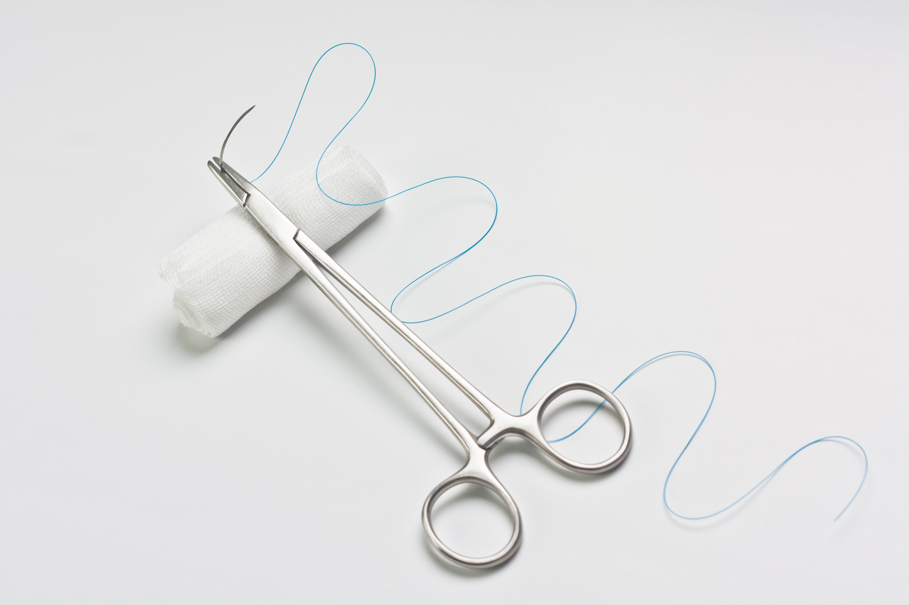

Znamiona to nieodłączny element naszej skóry. Wśród nich znajdziemy m.in. kaszaki, włókniaki, jak również znamiona barwnikowe (popularne pieprzyki). Jak stwierdzić, czy w którymś ze znamion rozwija się czerniak? Po co usuwać znamiona? Skąd wiedzieć, które znamiona wymagają usunięcia? Czy usuwanie znamion jest bezpieczne? Jak we właściwy sposób usunąć znamię? Odpowiadamy!

<span id="id1" />

## Dlaczego usuwa się znamiona?


Znamiona barwnikowe, powszechnie znane jako pieprzyki, są zbudowane z namnażających się stopniowo komórek barwnikowych skóry, czyli melanocytów. Z częścią pieprzyków niektórzy z nas przychodzą na świat i stanowią one grupę znamion wrodzonych. Pozostałe – nabyte, powstają najczęściej pod wpływem nadmiernej ekspozycji skóry na promieniowanie ultrafioletowe UVA i UVB, które emitowane jest przez słońce. Najczęściej większość zmian ma charakter łagodny i jeśli prowadzimy odpowiedzialny styl życia - takimi pozostaną. Jednak część znamion może przerodzić się w [czerniaka](/czerniak "czerniak"), głównie pod wpływem:

* słońca,
* przez korzystanie z solarium,
* poprzez otarcia, zadrapania, skaleczenia,
* czy w mniejszym stopniu odziedziczone geny.


```“Zwykły pieprzyk może zmienić się w czerniaka w ciągu kilku miesięcy. Kolejne kilka miesięcy to jego rozwój w głąb skóry. Niewykryty w odpowiednim momencie czerniak przechodzi przez naskórek i skórę właściwą, która ma około 1mm, I dociera do naczyń krwionośnych i limfatycznych. Gromadzi się w węzłach chłonnych i stąd przedostaje się do całego organizmu. Czerniak jest agresywny, co oznacza, że po przedostaniu się do krwioobiegu bardzo szybko zajmuje kolejne organy, w tym wątrobę, płuca czy mózg.” - tłumaczy prof. Piotr Rutkowski w filmie przygotowanym przez Akademię Czerniaka.```

<YoutubePlayer url="https://www.youtube.com/watch?v=YtCUGHPAIwI" start="112" end="148" label="Przebieg badania dermatoskopowego znamion"  />


Dlatego tak ważne jest samobadanie znamion i okresowe wizyty u specjalisty, który podczas [dermatoskopii](/dermatoskopia-badanie-znamion "dermatoskopia") lub [wideodermatoskopii](/wideodermatoskopia-komputerowe-badanie-znamion "wideodermatoskopia") ocenia Twoje znamiona. Jeśli któreś uzna za podejrzane, skieruje Cię na zabieg wycięcia. Można powiedzieć, że ma on na celu usunięcie czerniaka razem ze znamieniem, póki nie przedostał się głębiej. To od decyzji lekarza zależy, czy będzie to chirurgiczne czy niechirurgiczne usunięcie. Część osób decyduje się też na zabieg wycięcia z powodów estetycznych, chcąc w ten sposób poprawić swój wygląd.


<span id="id2" />

## Czy usuwanie pieprzyków na twarzy jest bezpieczne?

Jeśli chcemy usunąć pieprzyk z twarzy lub innych miejsc w celach estetycznych, nie możemy po prostu udać się do chirurga bezpośrednio na wycięcie. Tak jak w przypadku każdych innych znamion na skórze, pieprzyk ten musi zostać obejrzany przez lekarza z doświadczeniem w dermatoskopowej ocenie znamion. W tym celu należy się udać na badanie znamion: dermatoskopowe lub wideodermatoskopowe, dzięki któremu lekarz stwierdzi, czy znamię, którego chcemy się pozbyć można usunąć metodą chirurgiczną czy niechirurgiczną.

Usuwanie pieprzyków jest zabiegiem bezpiecznym, o ile decydujemy się na wykonanie go przez chirurga lub dermatologa, a nie kosmetyczkę. Kosmetyczka nie ma kwalifikacji do tego, by ocenić, czy znamię jest podejrzane onkologicznie (czy może “być w nim” nowotwór). Dlatego niezbędnym jest wizyta u dermatologa lub chirurga, którzy wykonują badanie znamion.


<br />

<span id="id3" />

## Czy po usunięciu pieprzyka z twarzy będę mieć bliznę?

W przypadku chirurgicznego wycięcia zazwyczaj powstaje blizna. O tym, jak bardzo będzie widoczna w dużej mierze decyduje wielkość znamienia oraz nasze zachowanie po zabiegu - dlatego warto przykładać dużą wagę do zaleceń wydanych przez chirurga. Blizna po zabiegu może pozostawać czerwona, z czasem blednie. Po usunięciu pieprzyka metodą niechirurgiczną, np. laserem, blizny są zazwyczaj słabiej widoczne. Pamiętajmy jednak, by przy usuwaniu znamion kierować się głównie naszym zdrowiem - jeśli lekarz kieruje nas na usunięcie chirurgicznego, należy mu zaufać. Możemy dzięki temu uniknąć czerniaka lub innych chorób nowotworowych skóry lub wykryć je w odpowiednim momencie, gdy są jeszcze wyleczalne.

<span id="id4" />

## Chirurgicznie czy niechirurgicznie - od czego to zależy?

O tym, którą z metod usuwania znamion wybierze dla Ciebie lekarz decyduje charakter znamienia.

W przypadku zmian złośliwych lub gdy istnieje podejrzenie zmiany nowotworowej niezbędny jest zabieg chirurgiczny, ponieważ usunięcie znamienia w ten sposób pozwala na wykonanie badania histopatologicznego, z którego można dowiedzieć się, czy znamię było czerniakiem. A przecież przekonanie się, czy był to nowotwór jest tutaj kluczowe, żeby zaplanować dalsze kroki. Metody niechirurgiczne dopuszczalne są tylko wtedy, gdy znamiona mają charakter łagodny. Można je stosować u osób w każdym wieku i są one całkowicie bezinwazyjne, co oznacza, że nie dochodzi do przerwania powłok skórnych.


<More link="/laserowe-usuwanie-znamion" text="Więcej o niechirurgicznym usuwaniu znamion." cta="Czytaj dalej" />


<More link="/blog/jak-odroznic-zwykly-pieprzyk-od-typowego-czerniaka-zdjecia" text="Jak odróżnić zwykły pieprzyk od typowego czerniaka" cta="Sprawdź" />


Podsumowując, przy wyborze metody należy postępować według postanowienia lekarza. Wówczas mamy pewność, że znamię zostanie usunięte we właściwy sposób.


<span id="id5" />

## Chirurgiczne usuwanie znamion - czy to boli?

Zabieg chirurgicznego wycinania zmian skórnych przeprowadza się w znieczuleniu miejscowym, podczas którego pacjent zachowuje całkowitą świadomość. Jest to zabieg prosty i bezpieczny, a skutki uboczne występują bardzo rzadko. Wyjątek stanowi sytuacja, kiedy pacjent jest uczulony na daną substancję stosowaną do znieczulania. Dlatego przed zabiegiem należy zgłosić lekarzowi wszelkie alergie. W przypadku potrzeby usunięcia rozległych znamion może zostać zastosowane znieczulenie ogólne.


<span id="id6" />

## Przebieg zabiegu wycięcia

Zmianę wraz z fragmentem zdrowej skóry wycina się za pomocą skalpela, a następnie zakłada się szwy, które zdejmowane są po 7–14 dniach, oraz opatrunek. Celem określenia charakteru zmiany oraz wykluczenia procesu nowotworowego materiał przesyłany jest do badania histopatologicznego. Na wynik tego badania oczekuje się ok. 14-21 dni. Wynik badania zostaje pacjentowi wydany wraz z komentarzem lekarskim na wizycie kontrolnej lub jest wysyłany drogą elektroniczną. Lekarz wskazuje, co pacjent powinien zrobić w następnej kolejności. Jeśli zostanie rozpoznany rak skóry, należy udać się na konsultację onkologiczną. W przypadku wykluczenia nowotworu, nie wolno zapominać o okresowej kontroli. Należy także pamiętać, iż w miejscu po usunięciu zmiany pozostanie mniej lub bardziej widoczna blizna.


<br />

<span id="id7" />

## Czy po usunięciu pieprzyka zostaje blizna? Wskazania po zabiegu

W wyniku chirurgicznego usunięcia znamienia najczęściej w miejscu wycięcia pozostaje mniej lub bardziej dostrzegalna blizna. Tuż po zabiegu jest dosyć dobrze widoczna, jednak z biegiem czasu blednie i ulega zmniejszeniu.


")


Staranna pielęgnacja blizny już na wczesnym etapie działa korzystnie na proces gojenia oraz hamuje rozwój tkanki łącznej, która odpowiada za powstawanie blizn przerostowych i bliznowców, dlatego ważne jest stosowanie się do kilku prostych zasad.

* Należy unikać naciągania skóry, wykonywania gwałtownych ruchów i moczenia opatrunku.
* Najlepiej w okresie pozabiegowym zrezygnować z ćwiczeń fizycznych.
* Trzeba ponadto uważać, by nie doszło do zabrudzenia lub urazu w obrębie rany. Dzięki temu zapobiegniemy wystąpieniu zakażenia.
* Do czasu usunięcia szwów, nie należy brać kąpieli, a jedynie prysznic.
* Po wzięciu prysznicu powinno się ranę osuszyć, zdezynfekować preparatem Octenisept lub Microdacyn, a następnie nałożyć opatrunek.

W trakcie kilku dni po zabiegu rana powinna być różowa, ale może się zdarzyć, że będzie z niej wyciekać przezroczysty płyn lub niewielka ilość krwi.

Jeżeli zaobserwujesz podane niżej niepokojące objawy, skontaktuj się z lekarzem:

* zaczerwienienie wokół rany,
* nieustępujące krwawienie,
* dotkliwy, niewspółmierny ból,
* biała lub żółta ropa sącząca się z rany,
* stan podgorączkowy,
* permanentne ogólne złe samopoczucie.

Jeśli to konieczne, w ustalonym przez lekarza terminie, należy zgłosić się na usunięcie szwów. Przez pół roku po wykonaniu zabiegu niewskazane jest opalanie miejsca, z którego pozbyliśmy się znamienia - nie powinniśmy go odsłaniać, nie zaszkodzi stosowanie kremów UV o wysokim faktorze. Przez ten okres unikamy odwiedzania basenów i saun.

### Jak długo goi się rana po usunięciu znamienia?

Na szybkość gojenia się rany ma wpływ wiele czynników, min. jaka była wielkość usuniętego pieprzyka, stopień ukrwienia czy lokalizacja. Nie mniej ważne jest stosowanie się do zasad, o których wcześniej pisaliśmy. Poniżej podajemy orientacyjny czas gojenia się ran w zależności od miejsca, z którego mieliśmy usuwane znamię. Podkreślamy jednak, że rzeczywisty czas ma charakter indywidualny i zależy od pacjenta.

#### Głowa

* dorosły 7-9 dni
* dorosły 7-9 dni

#### Twarz i szyja

* dorosły 4-6 dni
* dziecko 4-6 dni
#### Klatka piersiowa, brzuch, plecy

* dorosły 7-12 dni
* dziecko 7-9 dni
#### Ręce

* dorosły 8-10 dni
* dziecko 7-9 dni
#### Nogi

* dorosły 8-12 dni
* dziecko 7-10 dni
#### Stopy

* dorosły 10-12 dni
* dziecko 8-10 dni


<span id="id8" />


## Jak wygląda wyciąganie szwów?

Szwy zdejmuje się po 7-14 dniach od chirurgicznego usunięcia znamienia. O tym, kiedy dokładnie to nastąpi decyduje chirurg, który usuwał znamię. Na decyzję ma wpływ proces gojenia się - czy rana goi się dobrze czy wolno, jaka była wielkość usuniętego pieprzyka, stopień ukrwienia czy lokalizacja. Zbyt długie zwlekanie z usunięciem szwów może spowodować, że “wrosną” w skórę i pozostawią małe białe punkty tkanki bliznowatej, a tym samym blizna będzie wyglądać mniej estetycznie. Z kolei zbyt wczesne zdjęcie szwów może skutkować problemami z niezagojoną raną.


### Zdejmowanie szwów - procedura

Zdejmowanie szwów polega na uniesieniu pęsetą umieszczonego na skórze fragmentu nici, przecięciu go obok węzła i wyciągnięciu go ze skóry. Jak wygląda to w praktyce można zobaczyć na poniższym filmie dla chirurgów.

<YoutubePlayer url="https://www.youtube.com/watch?v=uiVNB2b7keo" start="28" end="115" label="Przebieg procedury zdejmowania szwów"  />

Zabieg jest zazwyczaj mało bolesny, możemy jedynie odczuć napinającą się skórę i lekkie swędzenie.


### Nici rozpuszczalne, wchłanialne

Niektórzy chirurdzy, jeśli pozwala na to charakter i miejsce usuniętej zmiany, zakładają tak zwane szwy rozpuszczalne lub inaczej szwy wchłanialne, które nie pozostawiają śladów i same wchłaniają się pod powierzchnię skóry. Zazwyczaj rozpuszczają się one przez kilka tygodni. Nie potrzeba wówczas udawać się do chirurga na zdjęcie szwów.




<br />
<span id="id9" />

## Badanie histopatologiczne - po co się wykonuje?

Badanie histopatologiczne ma szczególne znaczenie w diagnostyce chorób nowotworowych. Pozwala na rozpoznanie zmian nowotworowych, odróżnienie zmian złośliwych od niezłośliwych. Polega na mikroskopowej ocenie wycinka tkanki z podejrzanym pieprzykiem. Pobrany fragment tkanki umieszcza się w substancji utwardzającej, np. formalinie i transportuje do laboratorium. Skrawki tkanki są tam traktowane odpowiednim barwieniem, aby można było dokładniej przyjrzeć się składowym tkanki, a także by zaobserwować patologiczne struktury. Specjaliści patomorfolodzy oceniają je pod mikroskopem, a następnie wydają wynik.


<br />

### Badanie histopatologiczne - cena, czas oczekiwania na wynik

Czas, po którym otrzymamy wynik badania histopatologicznego zależy od laboratorium. Zazwyczaj trzeba na niego czekać niestety dosyć długo, bo ok. 2 tygodni, a czasem zdarza się, że i znacznie dłużej. Laboratoria zazwyczaj dają pacjentom możliwość bezpośredniego odbioru wyniku, jednak lekarzom zależy, żeby najpierw trafiły one do nich. Wówczas lekarz ma możliwość zapoznania się z wynikiem i przekazania go pacjentowi razem ze swoim komentarzem i wskazaniami co do dalszego postępowania. Jest to zdecydowanie korzystniejsza droga odbioru wyniku dla pacjenta, ponieważ, szczególnie w przypadku rozpoznania nowotworu, ma on od razu zapewnioną opiekę lekarską, profesjonalną pomoc oraz pewność, że wynik został zinterpretowany przez specjalistę.

Ceny badań histopatologicznych zależą od laboratorium, zazwyczaj wahają się między 75 a 100zł. Coraz częściej badanie histopatologiczne jest wliczone w cenę konsultacji.


<br />

<span id="id10" />

## Biopsja - co to jest, rodzaje, przebieg zabiegu

Biopsja jest specjalnym zabiegiem diagnostycznym, który polega na inwazyjnym pobraniu materiału tkankowego do badań mikroskopowych, gdy istnieje podejrzenie, że w zmianie może występować nowotwór. Istnieje kilka rodzajów biopsji:

* **cienkoigłowa**,
* **gruboigłowa**,
* wycinająca,
* szczoteczkowa,
* wiertarkowa (stosowana w badaniach kości),
* biopsja otwarta - czyli zabieg operacyjny.

### Po co wykonuje się biopsję?

Wykonanie biopsji i wysłanie do badania histopatologicznego lub cytologicznego pobranych tkanek pozwala na ocenienie materiału tkankowego przez patomorfologa i dowiedzenie się, czy nasze ciało zaatakował nowotwór. Badanie zleca lekarz, który w odpowiednim badaniu (fizykalnym lub obrazowym) zauważył niepokojącą zmianę.


### Biopsja cienkoigłowa

Wyróżnia się w niej dwa rodzaje:


* biopsję aspiracyjną cienkoigłową (BAC) - podczas której lekarz nakłuwa badaną tkankę strzykawką z jednorazową cienką igłą o średnicy około 0,5-0,6mm, pociąga tłok strzykawki i pobiera materiał komórkowy (aspiruje - stąd nazwa) z miejsca potencjalnie nowotworowego.
* biopsję aspiracyjną cienkoigłową celowaną (BACC) - która polega na tym samym co BAC, lecz jest wspierana poprzez badanie USG - lekarz na bieżąco ogląda tkanki.


Po pobraniu materiał tkankowy jest umieszczany przez lekarza na specjalnie do tego przeznaczonym szkiełku, na którym dokonuje rozmazania tkanki oraz barwienia. Następnie oddaje się go do badania, z którego będzie można dowiedzieć się, jaki był charakter zmiany - nowotworowy czy nie.

Biopsję aspiracyjną cienkoigłową lekarz zleca najczęściej do badania takich narządów jak tarczyca, gruczoł krokowy, sutek, szpik kostny czy płuca.


### Biopsja gruboigłowa

Ten rodzaj biopsji polega na pobraniu całego fragmentu tkanki lub narządu za pomocą specjalnej grubej igły biotycznej. Lekarz dokonuje cylindrycznego wycinka całego fragmentu tkanki, a nie tylko materiał ze zmiany). Następnie pobrany materiał kieruje do badania histopatologicznego. Biopsja gruboigłowa pozwala ocenić budowę i strukturę całej pobranej tkanki.


### Biopsja wycinająca

Biopsja wycinająca polega na usunięciu całej podejrzanej zmiany wraz z marginesem zdrowych tkanek.


### Biopsja chirurgiczna

Zabieg przeprowadza się w warunkach bloku operacyjnego, w znieczuleniu miejscowym lub ogólnym.


### Przeciwwskazania do wykonania biopsji

* niewyrównane zaburzenia krzepnięcia krwi,
* skaza krwotoczną,
* obecność ropnych zmian na skórze w miejscu planowanego nakłucia.

### Przygotowanie do zabiegu biopsji zmian skórnych

Biopsja nie wymaga szczególnego przygotowania. Przed wykonaniem biopsji lekarz zbiera wywiad lekarski. Na pewno będą go interesowały wszelkie informacje dotyczące stanu zdrowia ważne z punktu widzenia zabiegu, informacje o przyjmowanych lekach, szczególnie tych rozrzedzających krew i wpływających na jej krzepliwość.


### Biopsja zmian skórnych - szczegółowy przebieg zabiegu

W czasie wykonywania biopsji zmian skórnych niewymagających zabiegu operacyjnego, pacjent kładzie się na leżance. Lekarz dokładnie odkaża skórę, w którym będzie przeprowadzał biopsję. W przypadku biopsji wspieranej np. obrazem wideodermatoskopowym, lekarz używa dermatoskopu do odnalezienia i obserwacji fragmentu skóry. Lekarz podważa kawałek skóry igłą, a następnie z pomocą skalpela pobiera wycinek ze zmiany.

Potem pacjent przykłada do miejsca nakłucia jałowy gazik, który należy uciskać przez kilka minut - tak jak po zabiegu pobrania krwi.

Czas trwania badania to zaledwie kilka minut.

Czas oczekiwania na wynik to ok. 7- 14 dni - w zależności od laboratorium, do którego został skierowany materiał do badania.
### Biopsja: jakie powikłania?

Powikłania po wykonaniu tych rodzajów biopsji zdarzają się sporadycznie. Mogą to być: przedłużające się krwawienie oraz powstanie krwiaka.


<span id="id11" />

## Niechirurgiczne usuwanie znamion - laserowe, kriochirurgia, elektrokoagulacja


<More link="/laserowe-usuwanie-znamion" text="Poznaj niechirurgiczne metody usuwania znamion" cta="Czytaj dalej" />

<span id="id12" />


## Usuwanie znamion w Ogólnopolskim Centrum Twoje Znamiona


W naszych ośrodkach dążymy do tego, by pacjent miał dostęp do możliwie najszerszej oferty usług chirurgicznych. Przeprowadzamy:

* konsultacje chirurgiczne,
* zabiegi chirurgicznego wycięcia znamion małych i dużych,
* chirurgie aparatu paznokciowego,
* biopsje,
* kriochirurgie,
* usuwanie laserowe (laser CO2),

Współpracujemy z laboratoriami, do których kierujemy wycięte pieprzyki na badania histopatologiczne.


Stale powiększamy liczbę współpracujących z nami chirurgów, tak byś we wszystkich naszych ośrodkach mógł skorzystać na miejscu z ich pomocy. Dążymy do tego, żebyś we wszystkich miastach miał pełen dostęp do wszystkich usług chirurgicznych.


<More link="/cennik" text="Sprawdź cenny usuwania znamion w Twoim mieście." cta="Sprawdź" />

Jeśli okaże się, że w Twoim znamieniu skrył się czerniak lub inny nowotwór skóry, nie pozostawiamy Cię bez pomocy. Dzięki współpracy z doświadczonymi onkologami, którzy na co dzień zajmują się leczeniem czerniaka i innych nowotworów skóry, zapewniamy pacjentowi profesjonalną pomoc w całym procesie diagnostyczno-terapeutycznym. Podczas konsultacji onkologicznych otrzymasz kompleksową pomoc, poradę i wskazówki, co robić dalej. Możesz na nas liczyć!


<More link="/o-nas" text="Zobacz lekarzy, z którymi współpracujemy." cta="Sprawdź" />
