Czerniak skóry jest złośliwym nowotworem wywodzącym się z neuroektodermalnych komórek melanocytarnych. Melanina to barwnik, który odpowiada za ciemniejszy odcień skóry w kontakcie z promieniowaniem ultrafioletowym – słonecznym lub w solarium. W związku z tym najczęstszym miejscem występowania tego nowotworu jest skóra, jednak może on występować również w okolicach: ust, nosa, warg sromowych czy w gałce ocznej. Natomiast czerniak w zaawansowanym stadium może dawać przerzuty do wszystkich organów.

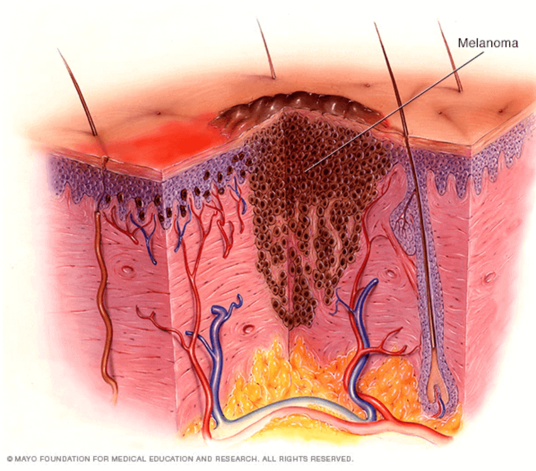
 

## Lokalizacja czerniaka

Na samej powierzchni skóry nowotwór pojawia się najczęściej na skórze tułowia. Dotyczy to dokładnie 37% przypadków. Praktycznie równie często powstaje w obszarze kończyn dolnych – 30%. Rzadziej dotyka skóry kończyn górnych (17%) oraz głowy i szyi (9%).

## Rodzaje czerniaka

Do tej pory wyróżniono kilka typów czerniaka:

- czerniaka szerzącego się powierzchownie SSM – 60-70% wszystkich przypadków,
  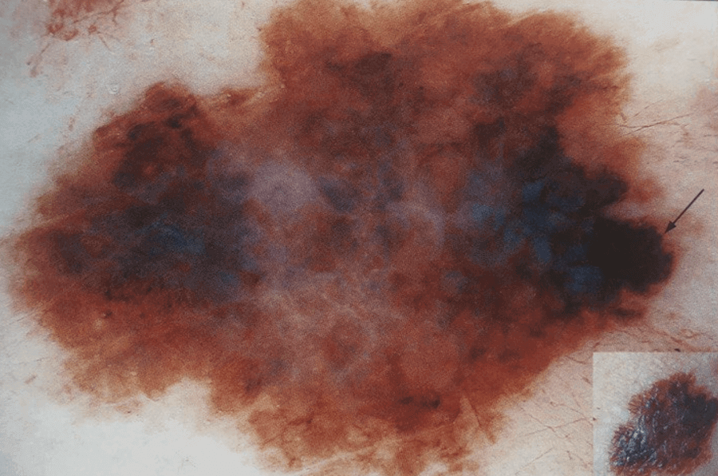
- czerniaka wywodzącego się z plamy soczewicowatej LMM – 5-20% przypadków, występującego głównie u pacjentów po 70 roku,
  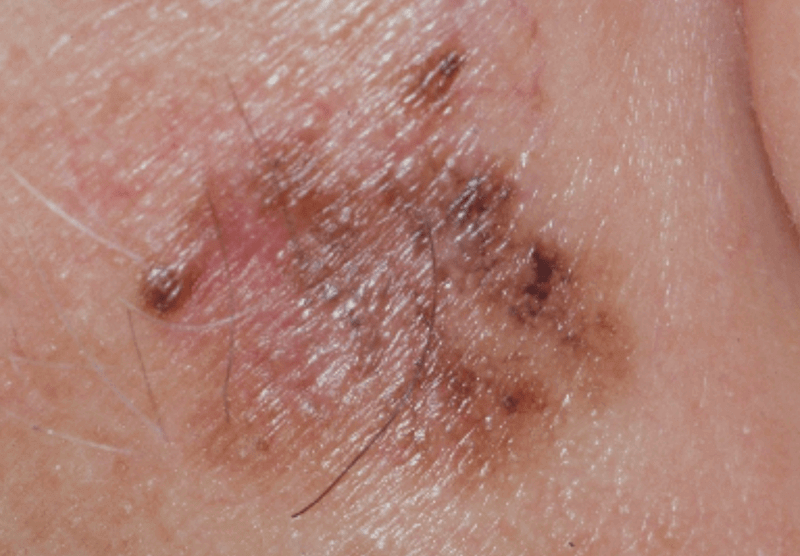
- czerniaka guzkowatego NM – 10-30% przypadków,
  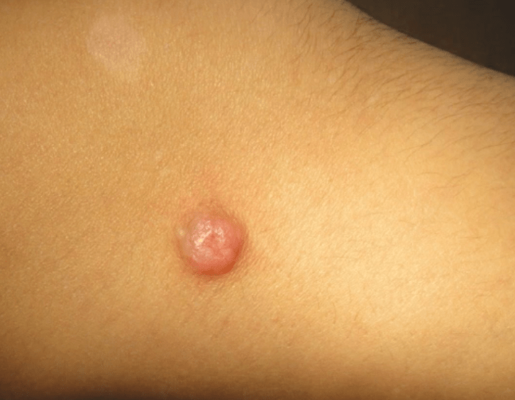
- [czerniaka akralnego na dłoniach i podeszwach stóp, ](/czerniak/rodzaje-czerniaka/czerniak-na-dloniach-i-podeszwach-stop "Czerniak akralny na dłoniach i podeszwach stóp")
  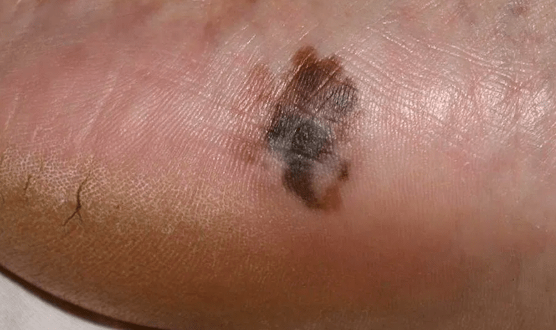
- czerniaka akralnego okolicy paznokci - najczęściej lokalizuje się na kciuku lub paluchu,
  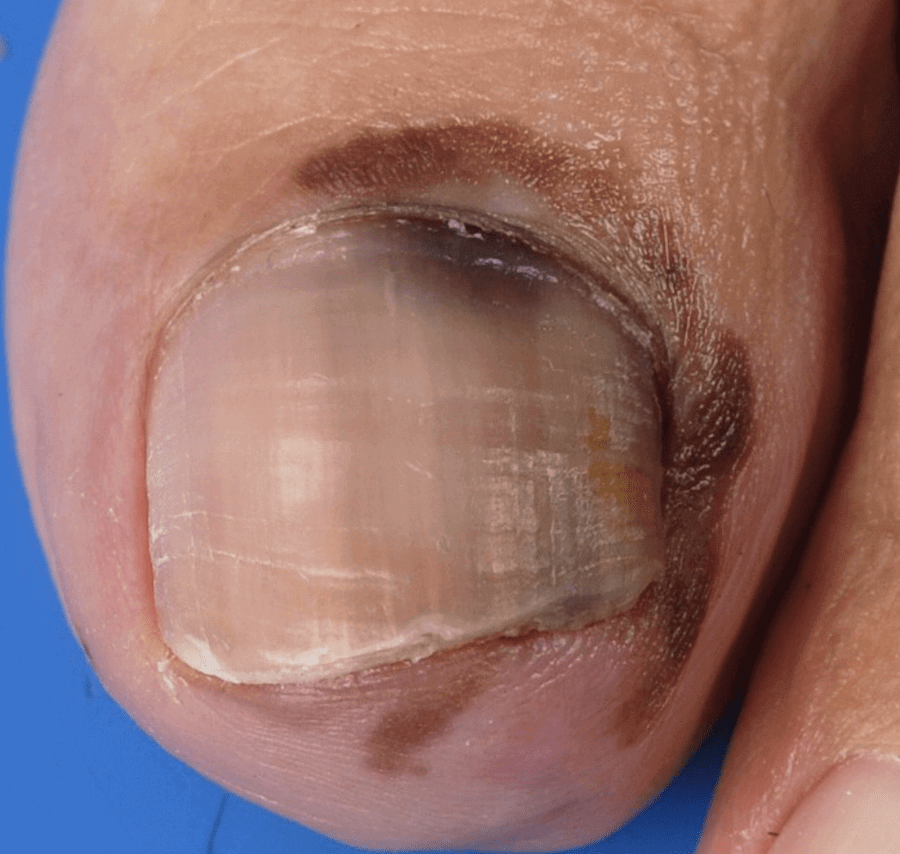

<More link="/czerniak/rodzaje-czerniaka-zdjecia" text="Jak wyglądają różne rodzaje czerniaka - zdjęcia" cta="Sprawdź" />

## Epidemiologia. Ile osób choruje?

Zachorowalność na czerniaka niestety wzrasta. Czerniaki pomimo tego, że stanowią 1% zachorowań na nowotwory są przyczyną większości zgonów z powodu nowotworów skóry na świecie. W latach 1980-2010 zachorowalność zwiększyła się niemal 4-krotnie! Obecne tempo to mniej więcej od 3 do 7% rocznie.

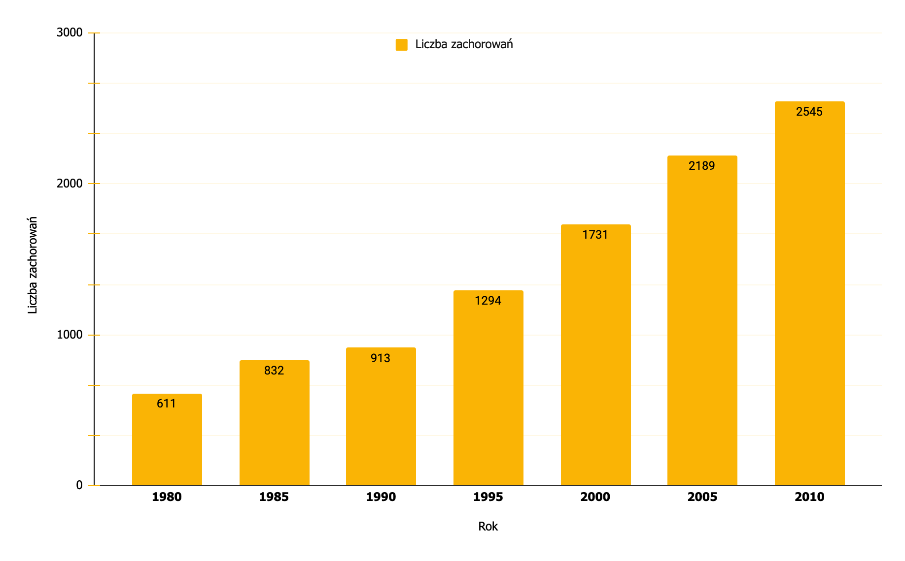

Zapadalność na czerniaka wykazuje znaczną zależność geograficzną. Jak podaje Krajowy Rejestr Nowotworów (2016) czerniak skóry z największą częstością występuje wśród u osób rasy kaukaskiej szczególnie narażonych na promieniowanie słoneczne. Rocznie na świecie notuje się ponad 100000 zachorowań. Najwyższą zachorowalność notuje się w Australii i Nowej Zelandii, w bogatych krajach europejskich (Szwajcaria, Norwegia, 

Szwecja oraz w Stanach Zjednoczonych. Polska ze względu na umiarkowane nasłonecznienie jest krajem o niskiej zachorowalności. Czerniaka stwierdza się u 6,5/100 000 osób, co odpowiada około 2400 zachorowaniom na rok w Polsce.       

Liczba zachorowań na czerniaka w Polsce w latach 1980 - 2010 - ([Źródło](http://onkologia.org.pl/ "Liczba zachorowań na czerniaka w Polsce")):

| Rok  | Liczba zachorowań |
| :--: | :---------------: |
| 1980 |        611        |
| 1985 |        832        |
| 1990 |        913        |
| 1995 |       1294        |
| 2000 |       1731        |
| 2005 |       2189        |
| 2010 |       2545        |

Nowotwór cechuje się niestety dużą śmiertelnością. Czerniaki pomimo tego, że stanowią 1% zachorowań onkologicznych, jednocześnie są przyczyną większości zgonów z powodu nowotworów skóry. Stanowią niemal 75% śmierci spowodowanych złośliwym przebiegiem raka.

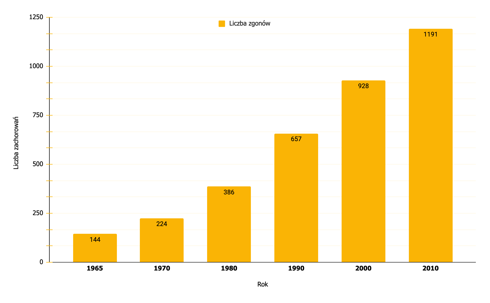

Liczba zgonów z powodu czerniaka także wzrasta na przestrzeni ostatnich lat i jest 7-krotnie większa niż z powodu innych nowotworów złośliwych skóry (Wojciechowska i in. 2011 ).

Liczba zgonów na czerniaka w Polsce w latach 1965 - 2010 - ([Źródło](http://onkologia.org.pl/ "Liczba zgonów na czerniaka w Polsce")):

| Rok  | Liczba zgonów     |
| :--: | :---------------: |
| 1965 |        144        |
| 1970 |        224        |
| 1980 |        386        |
| 1990 |       657         |
| 2000 |       928         |
| 2010 |       1191        |

Ryzyko zachorowania na czerniaka jest porównywalne u obu płci i wzrasta wraz z wiekiem już od 20 roku życia, przy czym największe ryzyko zachorowania notuje się pomiędzy 50 a 64 rokiem życia. Według Krajowego Rejestru Nowotworów większość zgonów z powodu czerniaka skóry występuje po 50 roku życia (około 15 % zgonów odnotowano w młodszym wieku), przy czym około 50% zgonów u mężczyzn i 60% u kobiet odnotowano po 65 roku życia. Najwięcej zgonów u mężczyzn notuje się w 8. dekadzie życia, u kobiet w dziewiątej dekadzie życia. Ryzyko zgonu z powodu tego nowotworu wzrasta wraz z wiekiem począwszy od piątej dekady życia.

Powyższe dane statystyczne pokazują ogrom problemu jakim jest stale rosnąca liczba zachorowań i zgonów z powodu czerniaka obserwowana w ostatnich latach w Polsce. Umieralność z powodu tego nowotworu w Polsce na tle innych krajów europejskich jest o 20% wyższa w porównaniu z umieralnością przeciętną w krajach Unii Europejskiej.

					

## Czerniak u dzieci i kobiet w ciąży

Niestety rośnie odsetek występowania czerniaków u małych pacjentów.

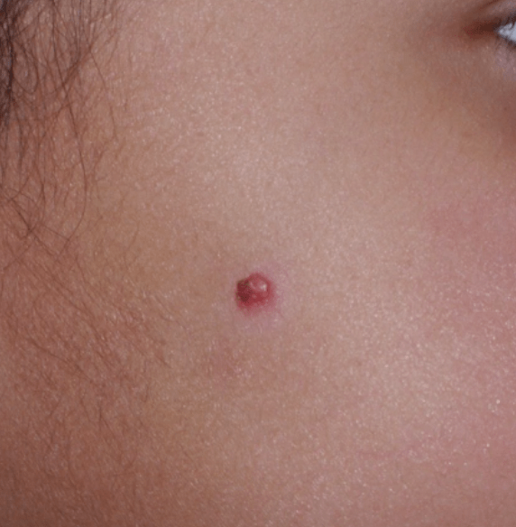

U dzieci wykazano większe prawdopodobieństwo przerzutów do węzłów chłonnych. Prawie 30 procent pacjentów pediatrycznych prezentowało 3 lub 4 stadium choroby. To 2 razy więcej niż w przypadku dorosłych, ponieważ czujność lekarzy co do możliwości wystąpienia czerniaka u dziecka jest znacznie obniżona.

W **Centrum Badania Znamion Twoje Znamion** możesz zbadać się razem z dzieckiem. 

<More link="/kontakt" text="Sprawdź wolny termin na badanie w Twoim mieście." cta="Sprawdź" />

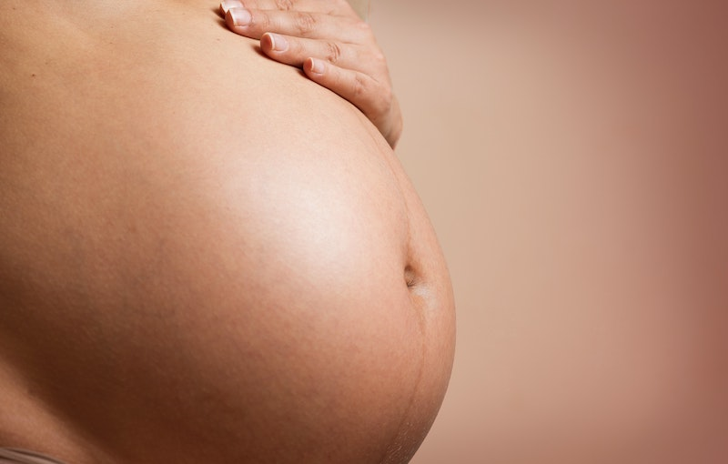

Czerniak jest ponadto jednym z nowotworów, które mogę występować u kobiet w ciąży ( 6-8% ) i jest najczęstszym nowotworem, który niestety daje przerzuty do łożyska i płodu.

## Czynniki ryzyka rozwoju czerniaka.

Powstanie melanoma malignum (taka jest jego łacińska nazwa) może mieć wiele źródeł. Za jedno najistotniejszych uznaje się promieniowanie ultrafioletowe. Według obserwacji międzynarodowej Agencji Badań Nowotworów ([IARC](https://www.iarc.fr/ "IARC")) promieniowanie UVA i UVB zalicza się do czynników rakotwórczych. Udowodnione zostało, że promieniowanie UVA( 320-400 nm) powoduje pośrednie uszkodzenie DNA poprzez działanie wolnych rodników, UVB natomiast (290-320nm) ma bezpośrednio destrukcyjne działanie. Oba typy promieniowanie działają też immunosupresyjnie - obniżają odporność, co ma zasadnicze znaczenie w rozwoju czerniaka.

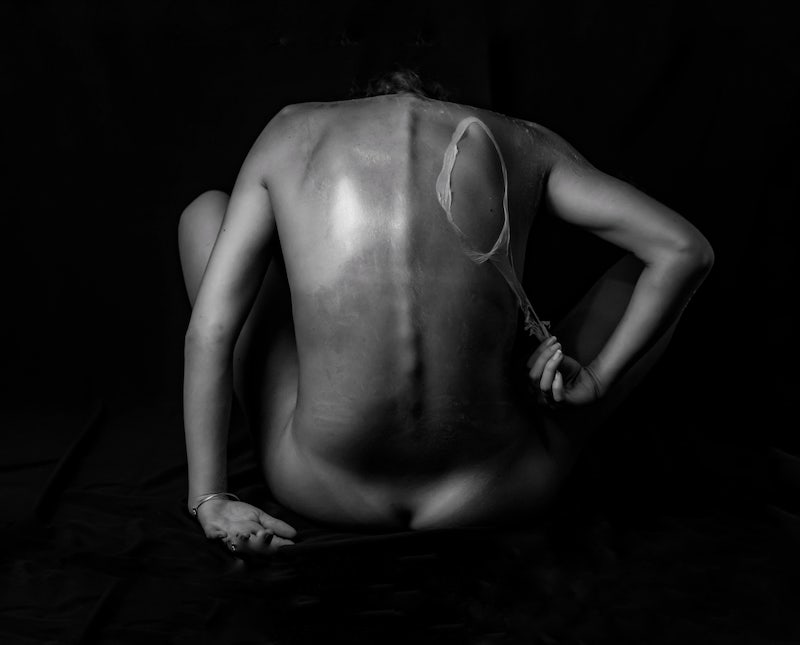

Uwaga na niebezpieczne wyjazdy wakacyjne w ciepłe kraje gdyż problemem nie jest tylko przewlekła ekspozycja, ale w dużej mierze krótkotrwałe intensywne narażenie na promienie (tzw.boost) prowadzące do poparzeń skóry z odczynem pęcherzowym, szczególnie przed 12-15 rokiem życia. Szkodliwość promieniowania jest w dużym stopniu uzależniona od samej szerokości geograficznej - im bliżej równika tym większe natężenie promieniowania UV.

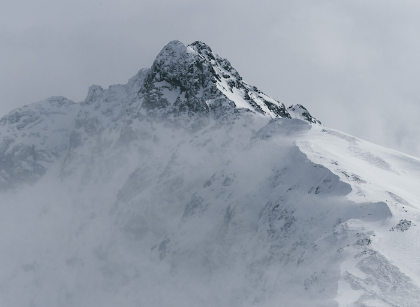

Podobnie wygląda to w przypadku wysokości nad poziomem morza – im większa tym silniejsze jest promieniowanie UV. W Polsce największe wartości Indeksu UV występują w Tatrach.

Kolejnym ważnym czynnikiem ryzyka raka skóry jest obecność na skórze dużej liczby znamion, w głównej mierze wrodzonych lub większych niż 2 cm. Szczególnie narażone są osoby z zespołem znamion dysplastycznych - atypowych, u których występuje minimum 50 znamion o średnicy powyżej 2 mm.

Inne czynniki ryzyka wystąpienia czerniaka to:

* jasny fenotyp skóry (jasna karnacja, blond włosy, duża skłonność do poparzeń),
* stałe drażnienie mechaniczne lub chemiczne powierzchni skóry,
* niską zawartość barwnika w skórze,
* predyspozycje genetyczne, przykładowo rodzinny zespół znamion atypowych (FAMS),
* zaburzenia odporności, AIDS
* stosowanie leków obniżających dporność - immunosupresyjnych
* zmiany hormonalne w okresie ciąży i połogu

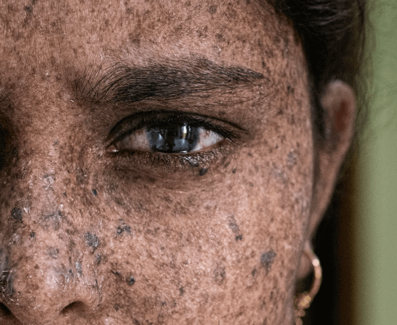

Najwyższe, nawet 1000-krotne w stosunku do populacji ogólnej ryzyko występuje u osób z rozpoznaniem xeroderma pigmentosum (skóra pergaminowata i barwnikowa). Jest to niezmiernie rzadka dermatoza, którą dziedziczy się autosomalnie recesywnie. W tym przypadku dochodzi do uszkodzeń genomu melanocytów pod wpływem promieniowania UV ze względu na defekt mechanizmów naprawczych DNA.

## Czy czerniak może występować genetycznie?

Czynniki dziedziczne są odpowiedzialne za zwiększenie ryzyka zachorowania na czerniaka w ok. 10 % przypadków. Należy pamiętać, że czerniak nie jest chorobą dziedziczną, dziedziczona jest natomiast predyspozycja do zachorowania, która związana z utrwalonymi zmianami w genomie.

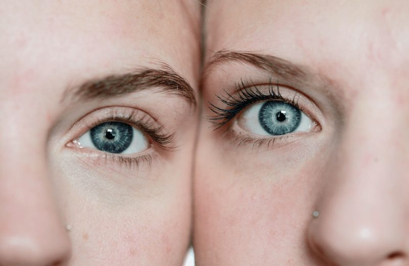

Dodatni wywiad rodzinny w kierunku czerniaka 3-8 krotnie zwiększa ryzyko zachorowania na ten nowotwór.

Za znaczeniem czynników dziedzicznych przemawia zwiększone ryzyko zachorowania u osób z dodatnim wywiadem rodzinnym w kierunku czerniaka oraz występowanie zachorowań na tę chorobę u bliźniąt monozygotycznych w tej samej lokalizacji. Udowodniono, że za rozwój czerniaka odpowiadają również zaburzenia pracy genów regulatorowych cyklu komórkowego – CDK2a i CDK4.

Potwierdzenie w 2002 roku kancerogennej roli mutacji BRAF w powstawaniu czerniaka przyniosło rewolucję w podejściu do jego leczenia. Obecnie znane są już trzy podstawowe mutacje w genach BRAF,C- KIT, NRAS, z których dwie pierwsze stanowią cele terapeutyczne u chorych na czerniaka w stadium zaawansowanym. Mutacja BRAF występuje w czerniaku skóry, a C-KIT w czerniaku podpaznokciowym lub błon śluzowych. Z danych jakimi obecnie dysponuje medycyna wynika, że:

* ponad 50% chorych na czerniaka posiada mutację w genie BRAF,
* 15-20% przypadków czerniaka znajdowane są zmiany w genie NRAS,
* u 15 % zaś w genie C-KIT.

## Jakie są objawy czerniaka?

Podejrzenie czerniaka skóry mogą nasuwać zmiany, które rozwinęły się nagle i wcześniej nie było ich na skórze lub zmiany, które zaszły na podłożu znamienia barwnikowego. Jeśli zwykły pieprzyk uległ podrażnieniu, nastąpiło zgrubienie, zmiana powierzchni, zabarwienia i brzegów lub wystąpiło swędzenie czy krwawienie należy niezwłocznie udać się na dermatoskopowe badanie znamion.

Często czerniak spełnia także kryteria syndromu „brzydkiego kaczątka”, wówczas znamię zaczyna znacznie różnić się od pozostałych zmian na skórze. Takie znamię należy zbadać dermatoskopowo i zazwyczaj usunąć chirurgicznie.

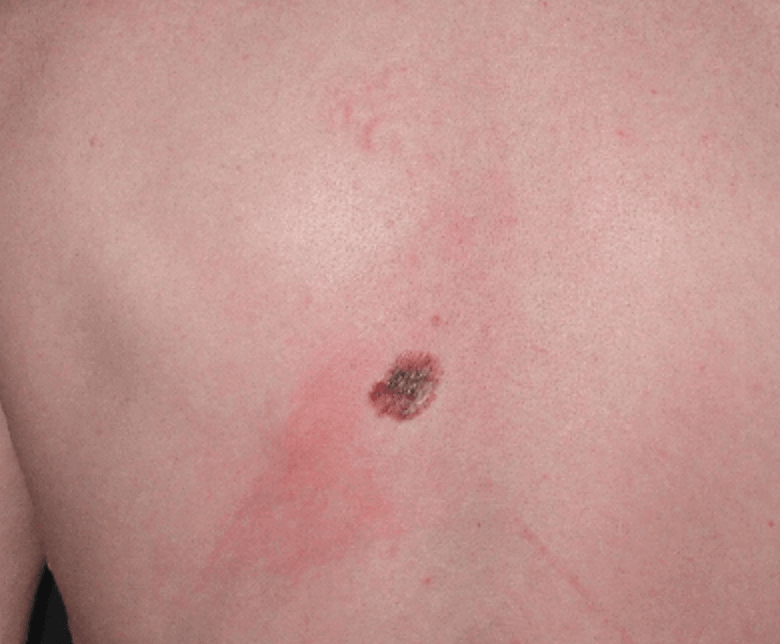

Do najtrudniejszych w diagnozie należą czerniaki rozwijające się pod płytką paznokciową. Zniekształcenie paznokcia, często mylone jest z wrastającymi paznokciami czy ich urazem mechanicznym. Bardziej specyficznym objawem czerniaka może być wysięk lub krwawienie spod płytki paznokciowej, ale dotyczy zwykle czerniaków bardziej zaawansowanych.

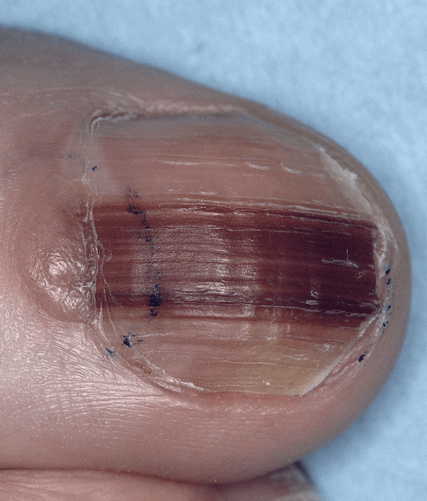

### Czerniak nie zawsze jest czarny!

Często myślimy, że czerniak powinien być czarny i nie zgłaszamy się do lekarza z różowymi plamkami na ciele, które szybko rosną lub są wypukłe. Dlatego bardzo trudnym do wykrycia i wykrywanym zwykle zbyt późno jest czerniak bezbarwnikowy (amelanotyczny).

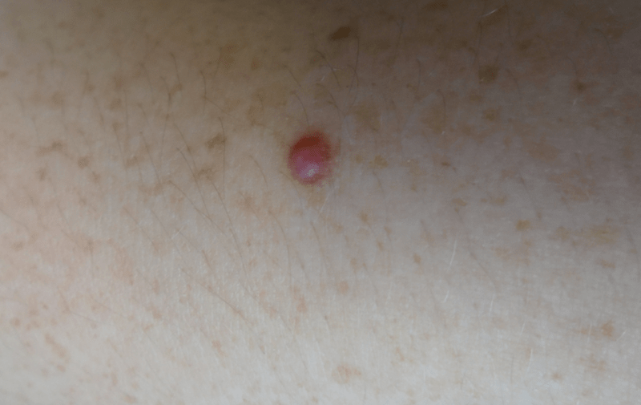

<More link="/blog/jak-wyglada-czerniak-zdjecia" text="Zdjęcia innych czerniaków." cta="Zobacz" />

Samobadanie i obserwacja skóry są niezwykle istotne, jednak wykrycie wszystkich zmian w ten sposób jest niezwykle trudne gdyż wczesne zmiany są widoczne jedynie w powiększonym obrazie znamion. Dlatego bardzo istotne jest wykonywanie badań wideodermatoskopowych przynajmniej raz w roku. Nie należy ich lekceważyć, bo zachorowalność na czerniaki niestety stale rośnie.

## Jak zdiagnozować czerniaka?

Dermatoskopowe badanie znamion (dermoskopia, mikroskopia epiluminescencyjna) jest najlepszą formą badania i monitorowania znamion skórnych. Mikroskopowe oglądanie powierzchni skóry przy pomocy kamery umożliwia skuteczną obserwację i ocenę struktur barwnikowych. W trakcie badania wideodermatoskopowego wykonane zdjęcia niepokojących zmian są archiwizowane, a wykonywane badanie w odpowiednich odstępach czasowych porównać i śledzić dynamikę zmian.

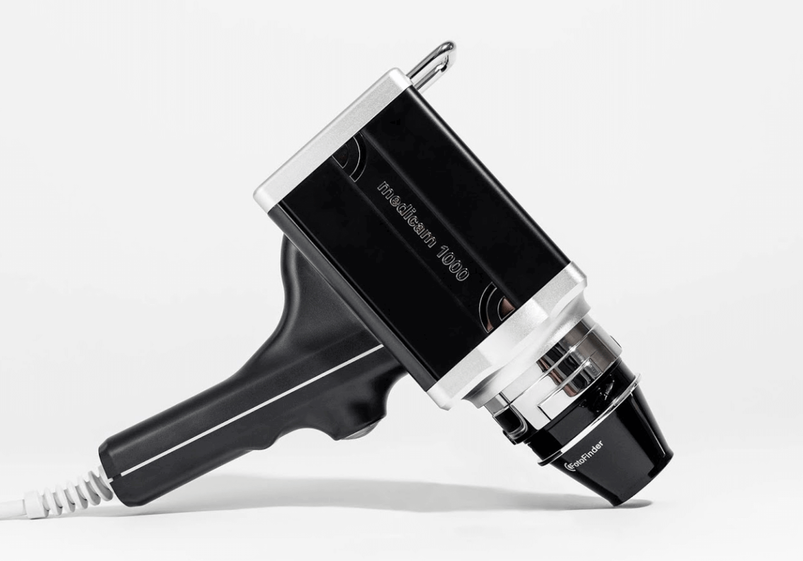

Mikroskopia konfokalna czyli inaczej refleksyjny mikroskop konfokalny to metoda uzupełniająca w diagnostyce czerniaka, szczególnie przydatna w diagnostyce dużej liczby znamion, często u osób z zespołem znamion atypowych. Pozwala na obserwację pełnej grubości naskórka oraz skóry właściwej przeważnie do głębokości warstwy brodawkowatej. Daje to możliwość wykonania tzw. „wirtualnej biopsji” z uniknięciem interwencji chirurga.

To istotne by stosować najnowocześniejsze z dostępnych metod, bowiem czerniak jest często mylony w zależności od stopnia zaawansowania z: brodawką łojotokową, znamieniem błękitnym, plamą soczewicowatą, rogowaceniem słonecznym barwnikowym, a także naczyniakiem czy chociażby podrażnionym znamieniem czy grzybicą paznokci. Dlatego aby móc właściwie różnicować wczesnego jak i zaawansowanego czerniaka przy każdym podejrzeniu czerniaka wysuniętym na podstawie badania znamion należy wykonać biopsję wycinającą, która jest jednocześnie pierwszym inwazyjnej diagnostyki.

<More link="/blog/jak-wyglada-czerniak-zdjecia" text="Zdjęcia typowego czerniaka i porównaj czym różni się od zwykłych znamion." cta="Zobacz" />

### Postępowanie chirurgiczne

W przypadku podejrzenia czerniaka postępowaniem z wyboru jest chirurgiczne wycięcie zmiany. Wyniki ograniczonej biopsji nie dostarczają bowiem wiarygodnych informacji o zmianie pierwotnej czerniaka zgodnie z wymogami systemu American Joint Cancer Committee/Union Internationale Contre le Cancer (AJCC/UICC). W każdym przypadku należy oczywiście pamiętać o wykonaniu badania histopatologicznego.

Gdy zmiana jest bardzo duża i owrzodziała, można rozważyć pobranie materiału do badania cytologicznego metodą odciskową polegającą na przyciśnięciu szkiełka podstawowego do powierzchni guza i przesłanie tak pobranego materiału do badania cytologicznego. Po wycięciu zmiany, która zostanie rozpoznana jako czerniak dokonuje się również chirurgicznego tzw. “docięcia blizny”.

### Jak duża będzie blizna po usunięciu czerniaka?

Margines cięcia, a tym samym wielkość blizny zależą od grubości czerniaka według tzw. skali Breslowa. W przypadku czerniaka “in situ” zalecany margines to 5 mm. Przy czerniak o grubości ≤ 2 mm margines ten wzrasta do 1 cm, natomiast czerniak o grubości > 2 mm będzie wymagał 2 cm marginesu cięcia.

### Biopsja węzłów wartowniczych - kiedy powinna być wykonana?

Węzły chłonne filtrują płyny w organizmie z czynników patogennych, takich jak wirusy czy bakterie. Mianem węzła wartowniczego określa się węzeł, który jako pierwszy znajdzie się na drodze naczynia limfatycznego biegnącego od strony guza.

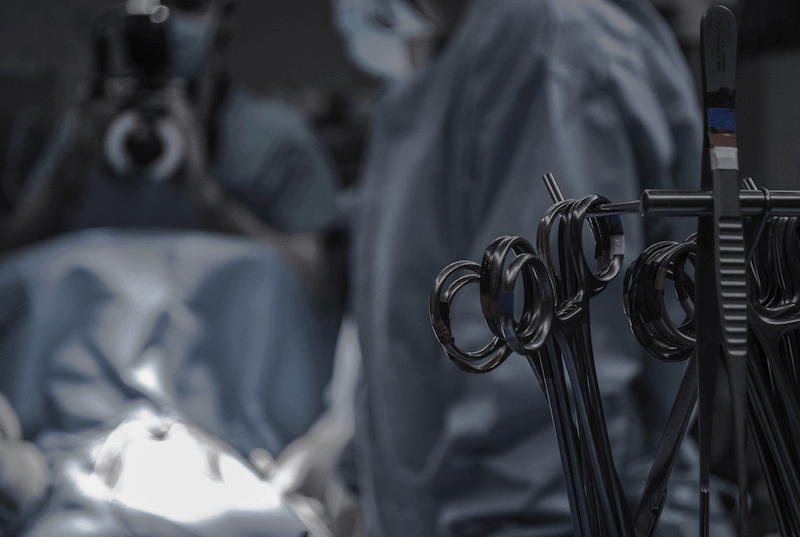

Biopsja węzłów wartowniczych stwarza unikalną możliwość wyleczenia czerniaka skóry, a przede wszystkim jest jedną ze standardowych technik diagnostyki złośliwości i stopnia zaawansowania tego nowotworu. Pomaga w zbadaniu określonej tkanki pod kątem obecności przerzutów komórek nowotworowych i przyczynia się też do mniejszego okaleczenia chorego oraz co niemniej istotnie skraca czas jego pobytu na oddziale.

**Do biopsji węzłów wartowniczych kwalifikowani są pacjenci:**

* po biopsji wycinającej z minimalnym marginesem, ale nie po szerokim wycięciu zmiany
* z grubością nacieku nowotworu od 0,8mm lub
* z mikroowrzodzeniem na powierzchni czerniaka

Do oceny stopnia zaawansowania czerniaka wykorzystuje się również dodatkowe badania takie jak:

* morfologia krwi, próby wątrobowe,
* aktywność dehydrogenazy mleczanowej – LDH,
* RTG klatki piersiowej (w projekcji tylno-przedniej i bocznej),
* USG jamy brzusznej.

Poniżej schemat postępowania diagnostyczno-terapeutycznego u chorych na czerniaki skóry.

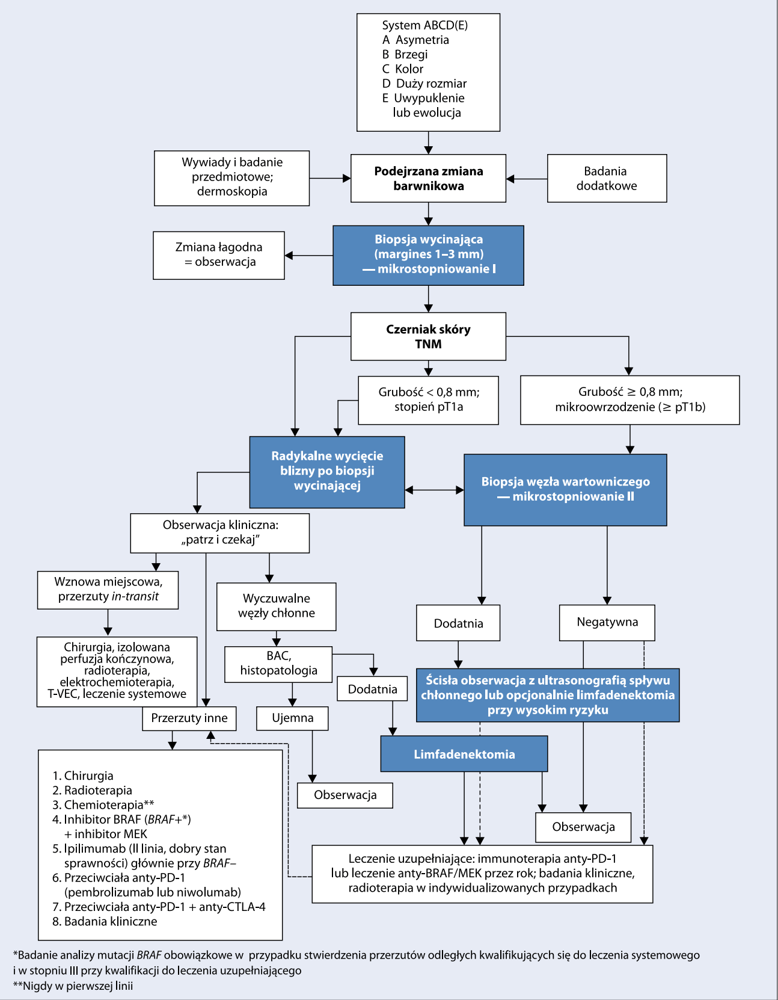

* BAC — biopsja aspiracyjna cienkoigłowa;
* TNM (tumor-node-metastases) — klasyfikacja stopnia zaawansowania guz/węzeł chłonny/przerzuty.

## Rokowanie - od czego zależy?

Ważnym czynnikiem przesądzającym o rokowaniu jest obecność bądź też brak przerzutów. Przy braku przerzutów decydującym czynnikiem jest grubość lub obecność owrzodzenia ogniska pierwotnego.

W pierwszej kolejności ocenia się grubość nacieku wg Breslowa mierzonej w milimetrach od warstwy ziarnistej naskórka lub dna owrzodzenia do najgłębiej naciekających gniazd melanocytów. Ważnym czynnikiem rokowniczym jest także obecność mikroowrzodzenia obejmującego całą grubość pokrywającego guz naskórka oraz jego rozległość na podstawie średnicy lub odsetka zajętej powierzchni guza, a także liczbę mitoz (w polu 1 mm2 o największej aktywności mitotycznej) w przypadku czerniaków “cienkich” - zmian poniżej 1mm ( pT1).

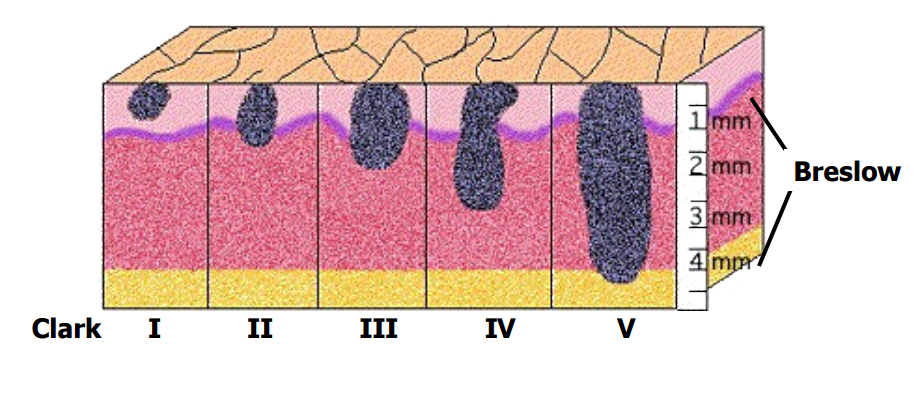

**Odsetek 10-letnich przeżyć u pacjentów, u których wystąpiło owrzodzenie ogniska pierwotnego jest niższy o 30%.**

Zespól czynników rokowniczych mieści się w klasyfikacji TNM (T-tumor, N-nodules, M-metastases) - określa on wielkość guza pierwotnego, obecność przerzutów w węzłach lokoregionalnych oraz przerzuty odległe

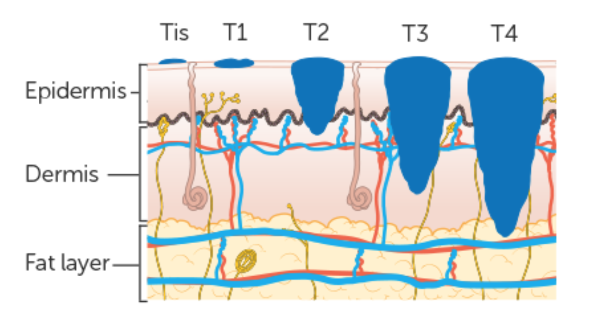

Najważniejszym czynnikiem rokowniczym u chorych na czerniaka jest obecność i liczba przerzutów do regionalnych węzłów chłonnych oraz obecność przerzutów odległych.

Ryzyko wystąpienia przerzutów w regionalnych węzłach chłonnych oraz przeżycia 5-letnie są ściśle skorelowane z grubością nacieku mierzoną w mm wg Breslowa , co przedstawiają poniższe dane .

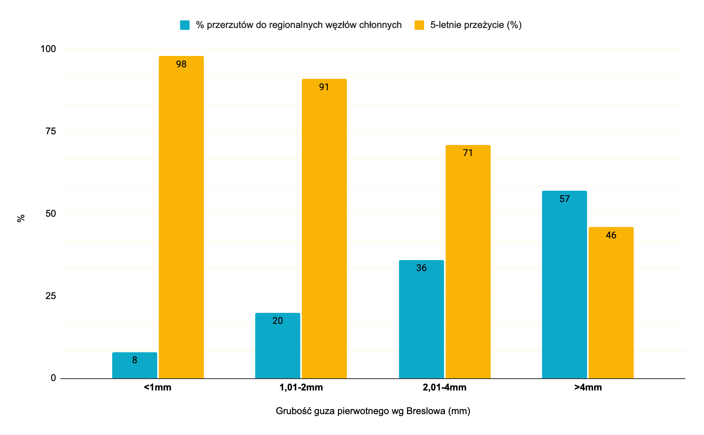

Poniższa tabela (Źródło. Michalska-Jakubus M. i in,. Medycyna Rodzinna 2/2006, s. 45-53) przedstawia zależność grubości guza pierwotnego wg Breslowa i ryzyka przerzutów w węzłach chłonnych wraz z odsetkiem przeżyć 5-letnich

| Grubość guza pierwotnego wg Breslowa (mm) | % przerzutów do regionalnych węzłów chłonnych | 5-letnie przeżycie (%) |
| :---------------------------------------: | :-------------------------------------------: | :--------------------: |
|                poniżej 1mm                |                       8                       |           98           |
|                1,01-2mm                |                       20                       |           91           |
|               2,01-4mm	               |                       36                       |           71           |
|               powyżej 4mm	               |                       57                       |           46           |

Powyższe dane pokazują jak istotne jest wykrycie zmiany pierwotnej we wczesnej fazie rozwoju, gdyż zaawansowanie miejscowe istotnie przekłada się na rokowanie pacjentów.

U pacjentów z zajęciem węzłów chłonnych odsetek przeżyć 5-letnich wynosi 25-50%, u chorych, u których nie stwierdza się przerzutów liczba ta sięga 90 %. "Istotnym czynnikiem jest rodzaj przerzutu – lepiej rokują chorzy z mikroprzerzutami (ogniska nowotworowe wykryte w trakcie badania mikroskopowego w niepowiększonym i klinicznie niewyczuwalnym węźle chłonnym pobranym podczas biopsji węzłów wartowniczych) w porównaniu z makroprzerzutami (ogniska nowotworu rozpoznane w badaniu mikroskopowym w powiększonym i wyczuwalnym klinicznie węźle chłonnym).

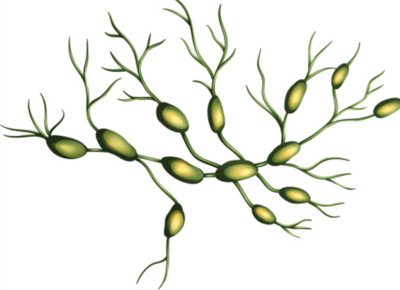

Dodatkowym istotnym czynnikiem wpływającym negatywnie na rokowanie chorych w grupie z przerzutami do węzłów chłonnych jest obecność naciekania poza torebkę węzła chłonnego przez komórki czerniaka." (Rutkowski P. i in. Przegl. Dermatol. 2016 103, str.7).

Jeśli chodzi o przerzuty odległe najlepiej rokują te do tkanki podskórnej i pozaregionalnych węzłów chłonnych oraz izolowane przerzuty do płuc. Wysoki poziom LDH w surowicy krwi jest niekorzystnym czynnikiem rokowniczym.

### Jaki typ czerniaka rokuje najlepiej ?

Znaczenie rokownicze ma także typ histologiczny związany z charakterystyką i dynamiką wzrostu zmiany. Najlepiej rokują czerniaki typu LMM z powodu długiego okresu wzrostu radialnego oraz małej tendencji do dawania przerzutów. Najgorsze rokowanie natomiast stwierdza się w podtypach rosnących od początku wertykalnie:

* czerniak guzkowy (NM),
* podpaznokciowo-kończynowy (ALM)
* amelanotyczny.

### Rokowanie a lokalizacja

Istotna w ocenie rokowania pacjentów jest też lokalizacja ogniska pierwotnego. Pierwotne umiejscowienia czerniaka skóry w części dystalnej kończyn, wiąże się z lepszym rokowaniem i mniejszą skłonnością do dawania przerzutów z uwagi na układ spływu chłonnego i sieci naczyń krwionośnych.

Złym rokowaniem charakteryzują się czerniaki występujące na skórze:

* tułowia,
* proksymalnej części kończyn górnych,
* szyi,
* głowy.

Gorszym rokowaniem charakteryzują się też czerniaki w miejscach nietypowych głównie wywodzące się z błon śluzowych jamy ustnej czy narządów moczowo-płciowych. Odsetek przeżyć 5-letnich u tych chorych nie przekracza 5 %. Wiąże się to głównie z późnym postawieniem rozpoznania - 50 % pacjentów w chwili postawienia diagnozy ma już przerzuty w regionalnych węzłach chłonnych, a u 20 % stwierdza się przerzuty w narządach odległych.

## Leczenie czerniaka.

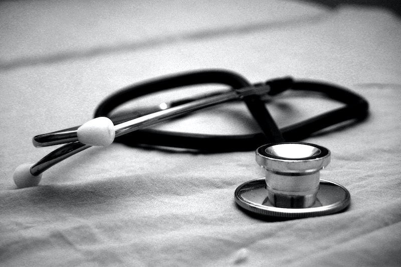

Głównym sposobem leczenia czerniaka w każdym stadium jest leczenie chirurgiczne, które występuje w różnych postaciach.

* biopsja wycinającej zmiany podejrzanej
* poszerzenie marginesów po stwierdzeniu czerniaka
* limfadenektomia regionalną przy przerzutach do węzła wartowniczego
* wycięcie przerzutów w narządach miąższowych
* wycięcie wznowy miejscowej

W przypadku wznowy miejscowej i przerzutów ponownie podejmuje się leczenie chirurgiczne, ale rokowania niestety są gorsze. Oscylują one pomiędzy 20-30% szans na przeżycie w ciągu następnych 10 lat.

Radioterapię i chemioterapię stosuje się m.in w leczeniu choroby uogólnionej podobnie jest w przypadku przerzutów do ośrodkowego układu nerwowego. Jednak ta ostatnia cechuje się ograniczoną odpowiedzią. Pozytywne wyniki obserwowane są jedynie u 15% chorych. A 4 miesięczny czasokres odpowiedzi również nie napawa optymizmem.

Mimo to na przestrzeni ostatnich lat nastąpił **ogromny postęp w leczeniu**.

### Leczenie uzupełniające - adjuwantowe.

Aktualnie zarejestrowane leki do leczenia uzupełniającego u pacjentów po radykalnej limfadenektomii to : dabrafenib z trametynibem, nivolumab ( także po wycięciu przerzutów w IV stopniu zaawansowania) i pembrolizumab. Udowodniono, że zastosowanie w leczeniu uzupełniającym leków immunologicznych - inhibitorów punktów kontrolnych ( nivolumab i pembrolizumab) oraz leczenia celowanego inhibitorami BRAF i MEK ( dabrafenib/trametynib) poprawia przeżycia pacjentów.

W Polsce powyższe leczenie jest dostępne jedynie w ramach RDTL na indywidualnie napisane wnioski w III stopniu zaawansowania oraz w IV po wycięciu przerzutów oraz w ramach badań klinicznych w IIb i IIc stopniu zaawansowania klinicznego. Nie ma obecnie dostępnego leczenia w ramach standardowych programów lekowych.

### Leczenie choroby zaawansowanej

W leczeniu choroby zaawansowanej szerokie zastosowanie ma obecnie immunoterapia przeciwciałami anty-PD-1 ( niwolumab, pembrolizumab) lub przeciwciałem anty-CTLA-4 w monoterapii lub preferencyjnie w skojarzeniu z anty= PD-1. Immunoterapia w leczeniu czerniaka kilkukrotnie wydłuża przeżycia chorych na zaawansowaną postać tego nowotworu. Leczenie to jest niezależne od statusu mutacji BRAF.

Poniżej schemat leczenia chorych na zaawansowane czerniaki (IV lub nieresekcyjnym III stopień zaawansowania)

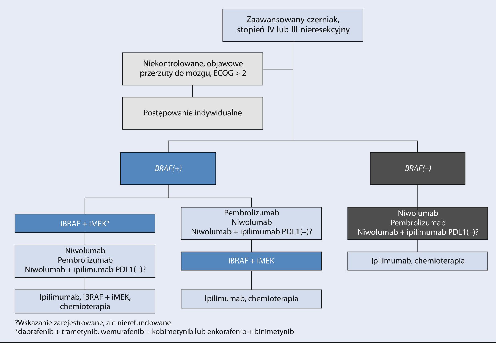

U pacjentów z obecnością mutacji BRAF V600 lekarze stosują leczenia celowane - inhibitor BRAF wraz z inhibitorem MEK. Nie jest znana optymalna sekwencja leczenia u tych pacjentów. Leczenie celowane skojarzone daje duży odsetek odpowiedzi ok. 70 % oraz szybką poprawę kliniczną i wycofanie objawów choroby. Leczenie immunologiczne wydaje się natomiast bardziej trwałe, przy mniejszym odsetku odpowiedzi.

**Posłuchaj profesora Piotra Rutkowskiego** mówiącego o aktualnych standardach postępowania w **leczeniu pacjentów chorych na czerniaka**.

Pan profesor jest kierownikiem Kliniki Nowotworów Tkanek Miękkich, Kości i Czerniaków Narodowego Instytutu Onkologii im. Marii Skłodowskiej-Curie w Warszawie.

<YoutubePlayer url="https://www.youtube.com/watch?v=ljtZ99i5QKY" start="76" label="Standardy postpowania w leczeniu pacjentów chorych na czerniaka" />

 

## Programy lekowe - refundowane nowoczesne leczenie

Leki dostępne w ramach tzw. “programów lekowych” to terapia refundowana w zakresie kontraktów z Narodowym Funduszem Zdrowia. Udział w programie jest całkowicie bezpłatny dla pacjenta, a o włączeniu do programu na podstawie kryteriów kwalifikacyjnych decyduje lekarz prowadzący.

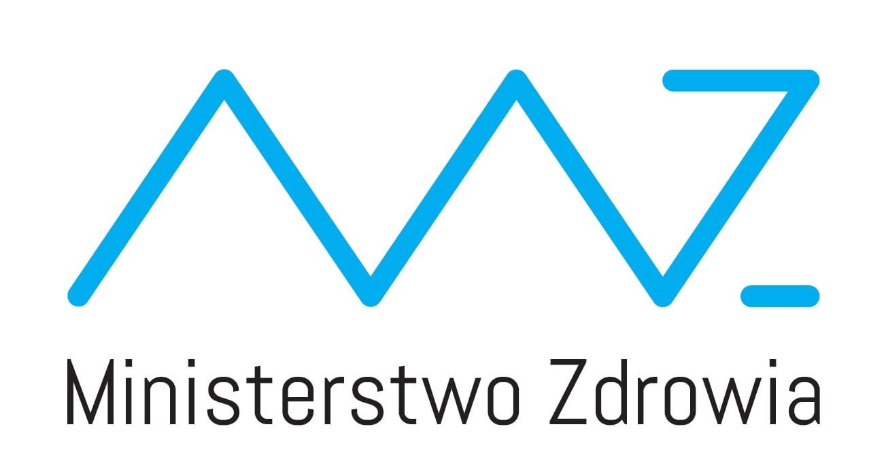

Programy lekowe to tzw. gwarantowane świadczenia. Oznacza to, że są to:

* innowacyjne metody leczenia,
* obejmują wybraną grupę chorych, którzy spełniają konkretne kryteria kwalifikacyjne,
* są prowadzone w wybranych ośrodkach medycznych, o których informacje można znaleźć na stronach wojewódzkich NFZ,
* zwykle związane z dużymi nakładami finansowymi.

<!--

Pobierz aktualny Program lekowy dla czerniaka:

 [LECZENIE CZERNIAKA SKÓRY LUB BŁON ŚLUZOWYCH (ICD-10 C43)](/docs/leczenie_czerniaka.pdf "LECZENIE CZERNIAKA SKÓRY LUB BŁON ŚLUZOWYCH (ICD-10 C43)") -->

Aktualnie pacjenci mogą skorzystać z leczenia:

* ipilimumabem,
* niwolumabem,
* pembrolizumabem,
* niwolumabem z ipilimumabem w ramach terapii skojarzonej,
* wemurafenibem z kobimetynibem w ramach terapii skojarzonej,
* dabrafenibem z trametynibem w ramach terapii skojarzonej,
* enkorafenibem z binimetynibem w ramach terapii skojarzonej.

Program szczegółowo podaje jakie są warunki, które zarówno lekarz jak i pacjent muszą spełnić w ramach udziału w programie terapeutycznym.

Program określa:

* kryteria kwalifikacji np. odpowiedni stopień zaawansowania
* kryteria wyłączenia z programu np. pojawienie się progresji
* dawkowanie leku i sposób jego podawania
* badania diagnostyczne wykonywane przed włączeniem do programu i w trakcie leczenia ( np. badania krwi, badania obrazowe)

Treść programów lekowych dotyczących schorzeń onkologicznych publikowana jest przez Ministerstwo Zdrowia: [Onkologia - Programy Lekowe](https://www.gov.pl/web/zdrowie/choroby-onkologiczne "Onkologia - Programy Lekowe") jako załączniki do [Obwieszczenia nr 65 Ministra Zdrowia z dnia 30 sierpnia 2019 r. w sprawie wykazu refundowanych leków, środków spożywczych specjalnego przeznaczenia żywieniowego oraz wyrobów medycznych.](http://dziennikmz.mz.gov.pl/DUM_MZ/2019/65/akt.pdf "Obwieszczenia nr 65 Ministra Zdrowia z dnia 30 sierpnia 2019 r. w sprawie wykazu refundowanych leków, środków spożywczych specjalnego przeznaczenia żywieniowego oraz wyrobów medycznych.")

Leczenie w specjalistycznych ośrodkach z dostępem do wszystkich metod leczenia w tym także programów lekowych daje pacjentom szansę na lepsze rokowanie!

[Zobacz, które ośrodki zajmują się kompleksowym leczeniem czerniaka w Polsce.](https://www.akademiaczerniaka.pl/akademia-czerniaka/nasze-kampanie/masz-czerniaka-sprawdz-gdzie-sie-leczyc/mapa-i-lista-osrodkow-leczacych-czerniaka "Zobacz, które ośrodki zajmują się kompleksowym leczeniem czerniaka w Polsce.")

## Ratunkowy Dostęp do Technologii Lekowych (RDTL)

Procedura RDTL to mechanizm finansowania leków w sytuacjach „ratunkowych” i szansa na indywidualną refundację leczenia i wydłużenie życia pacjenta.

Minister Zdrowia może wydać indywidualną zgodę na pokrycie kosztów leczenia jeśli:

* służy ratowania życia lub zdrowia pacjenta,
* lek jest dopuszczone w Polsce do obrotu,
* jest skuteczny zgodnie z aktualną wiedzą medyczną,
* jeśli wyczerpano wszystkie dostępne możliwości leczenia refundowane przez NFZ

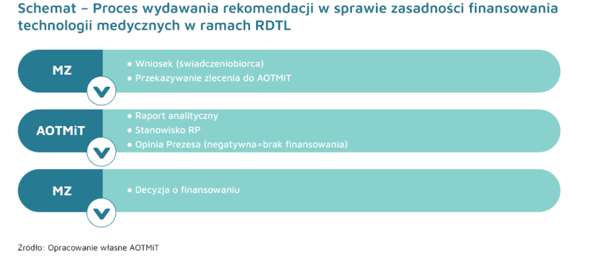

 

## Badania kliniczne - szansa na nowoczesne leczenie.

Szansą na podjęcie skutecznego i nowoczesnego leczenia czerniaka bez względu na stopień jego zaawansowania są badania kliniczne. Są to badania naukowe, których głównym celem jest określenie bezpieczeństwa i skuteczności zastosowania nowych terapii w leczeniu konkretnego schorzenia.

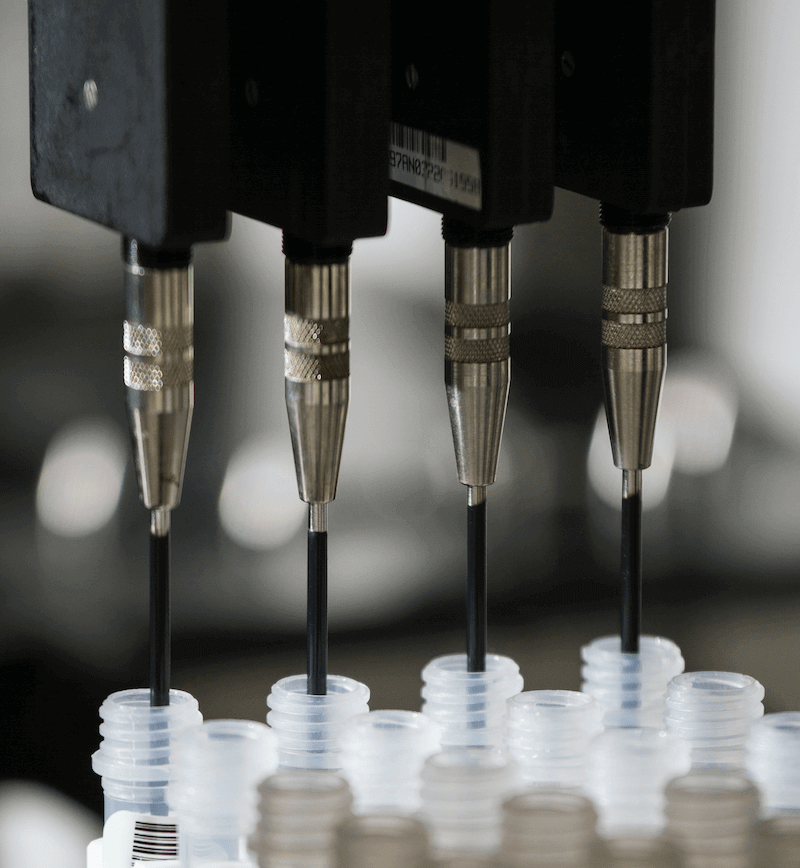

Proces rejestracji leku jest ściśle skorelowany z wynikami przeprowadzanych badań klinicznych. Pozytywne wyniki skłoniły Radę Przejrzystości działająca przy Agencji Oceny Technologii Medycznych i Taryfikacji do uznania za zasadne finansowania ze środków publicznych leku niwolumab w ramach programu lekowego „Leczenie czerniaka skóry lub błon śluzowych (ICD-10 C 43) i wydania stosownej [rekomendacji](https://bipold.aotm.gov.pl/assets/files/zlecenia_mz/2019/051/REK/RP_41_2019_Opdivo_MKP.pdf "rekomendacja").

Wyszukiwarkę aktualnie toczących się badań klinicznych w czerniaku pacjenci mogą znaleźć [TUTAJ](https://clinicaltrials.gov/ "Wyszukiwarka aktualnie toczących się badań klinicznych").

## Zakończyłem leczenie z powodu czerniaka - co dalej, jak wygląda obserwacja po leczeniu?

Obserwacja po zakończeniu terapii czerniaka zależy ściśle od stopnia zaawansowania i indywidualnego ryzyka nawrotu choroby. Nawrót może nastąpić nawet 10 lat po wyleczeniu, największe ryzyko nawrotu jest jednak w ciągu 3 pierwszych lat od zakończenia leczenia. Podstawą obserwacji po leczeniu jest ocena blizn po wycięciu ogniska pierwotnego i limfadenektomii. Do oceny regionalnych węzłów chłonnych — oprócz metody palpacyjnej można stosować badania USG. Badania obrazowe są wskazane jedynie u chorych, u których doszło do rozwoju cięższego stadium czerniaka. Mówiąc o obrazowaniu mówimy o tomografii komputerowej lub rezonansie magnetycznym.

Poniżej zalecenia [Polskiego Towarzystwa Onkologii Klinicznej](https://ptok.pl "PTOK") w ramach rekomendowanych badań kontrolnych po zakończeniu leczenia z powodu czerniaka złośliwego.

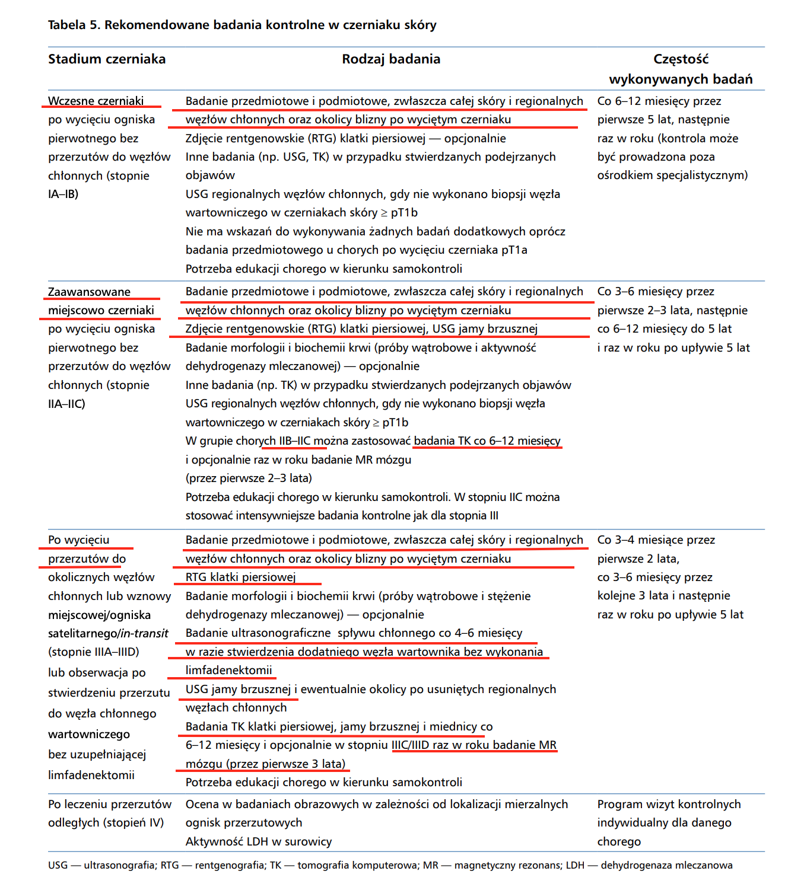

Dodatkowo wideodermatoskopii raz na kwartał w pierwszych 3 latach powinien poddawać się każdy, kto ma za sobą leczenie czerniaka. Podczas badań kontrolnych obowiązuje badanie całej skóry chorego, a nie tylko okolicy, w której rozwinął się wcześniej nowotwór, dlatego że istnieje duże prawdopodobieństwo rozwoju drugiego niezależnego ogniska czerniaka lub innego nowotworu skóry.

<More link="/kontakt" text="Sprawdź czy w Twoim mieście można wykonać badanie wideodermatoskopowe" cta="Sprawdź" />

