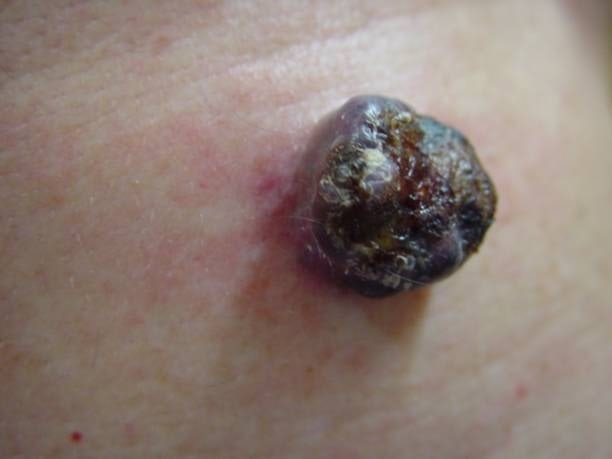

Czerniak skóry jest złośliwym nowotworem wywodzącymi się z neuroektodermalnych komórek melanocytarnych. Melanina to barwnik, który odpowiada za ciemniejszy odcień skóry w kontakcie z promieniowaniem ultrafioletowym – słonecznym lub w solarium. W związku z tym najczęstszym miejscem występowania tego nowotworu jest skóra, jednak może on występować również w okolicach: ust, nosa, warg sromowych czy w gałce ocznej. Natomiast czerniak w zaawansowanym stadium może dawać przerzuty do wszystkich organów.

<a id="id1" />

## Lokalizacja czerniaka

Na samej powierzchni skóry nowotwór pojawia się najczęściej na skórze tułowia. Dotyczy to dokładnie 37% przypadków. Praktycznie równie często powstaje w obszarze kończyn dolnych – 30%. Rzadziej dotyka skóry kończyn górnych (17%) oraz głowy i szyi (9%).

<a id="id2" />

## Rodzaje czerniaka

Do tej pory wyróżniono kilka typów czerniaka:
* czerniaka szerzącego się powierzchownie SSM – 60-70% wszystkich przypadków,

* czerniaka wywodzącego się z plamy soczewicowatej LMM – 5-20% przypadków, występującego głównie u pacjentów po 70 roku,

* czerniaka guzkowatego NM – 10-30% przypadków,

* [czerniaka akralnego na dłoniach i podeszwach stóp, ](/czerniak/rodzaje-czerniaka/czerniak-na-dloniach-i-podeszwach-stop "Czerniak akralny na dłoniach i podeszwach stóp")

* czerniaka akralnego okolicy paznokci - najczęściej lokalizuje się na kciuku lub paluchu,

<More link="/costam/costam" text="Jak wyglądają różne rodzaje czerniaka - zdjęcia" />

<a id="id3" />

## Epidemiologia. Ile osób choruje?

<a id="id4" />

## Czerniak u dzieci i kobiet w ciąży

<a id="id5" />

## Czynniki ryzyka rozwoju czerniaka.

<a id="id6" />

## Czy czerniak może występować genetycznie?

---

### Czerniak zdjęcia
#### Czerniak zdjęcia
##### Czerniak zdjęcia

Rzadziej  **od kilkudziesięciu lat obserwujemy w Polsce stały trend wzrostowy zachorowalności na czerniaka**. 

Rzadziej  **od kilkudziesięciu lat obserwujemy w Polsce stały trend wzrostowy zachorowalności na czerniaka**. 

<a id="test1" />
* test
* te
* test

Warunkiem wyleczalności jest wczesne wykrycie nowotworu i szybkie wycięcie chirurgiczne znamienia, dlatego też tak ważna jest profilaktyka czerniaka.

Dlatego _kladzieemy_ tak duży nacisk na [badanie wszystkich znamion na ciele](https://twojeznamiona.pl/badanie-znamion "Badanie Znamion"), w celu usunięcia chirurgicznego tych, które mogą przekształcić się w czerniaka.

> no nie wiem
asd
asd

asd

`a co to takiego`

[[Zobacz] Czerniak i inne nowotwory skóry](https://twojeznamiona.pl/czerniak "Czerniak")

| Tables        | Are           | Cool  |
| ------------- |:-------------:| -----:|
| col 3 is      | right-aligned | $1600 |
| col 2 is      | centered      |   $12 |
| zebra stripes | are neat      |    $1 |

<a id="test2" />

Markdown | Less | Pretty
--- | --- | ---
*Still* | `renders` | **nicely**
1 | 2 | 3

https://www.gatsbyjs.com/docs/mdx/getting-started/

