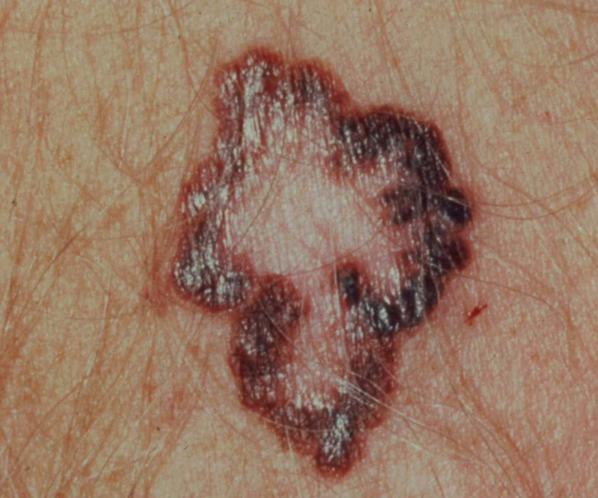
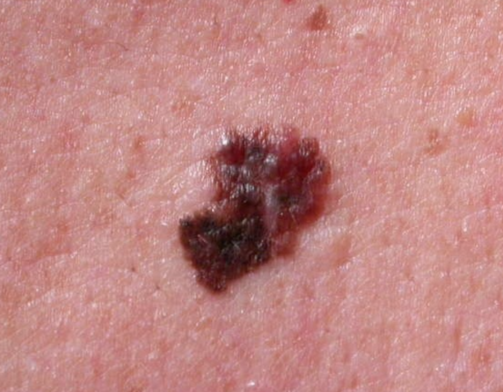
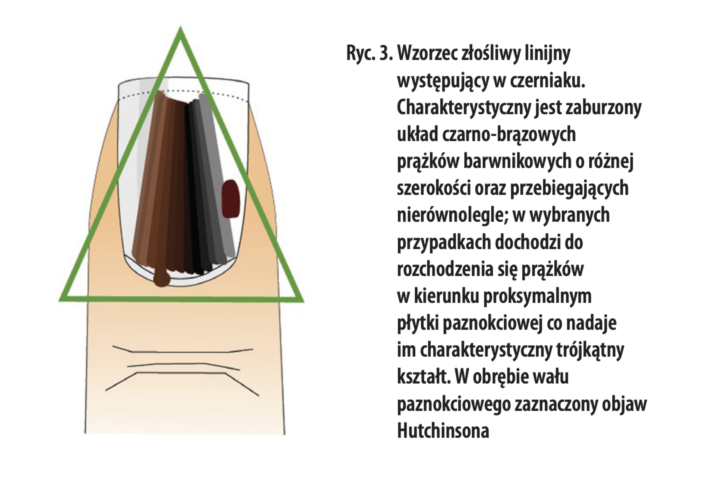
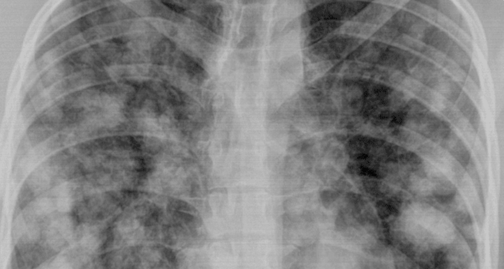

Podejrzenie czerniaka skóry mogą nasuwać objawy związane ze zmianami skórnymi, które rozwinęły się nagle - de novo (częściej) lub zmiany, które zaszły na podłożu już istniejącego znamienia barwnikowego. 


<span id="id1" />

## Objawy czerniaka związane ze zmianą skórną

Do najważniejszych sygnałów, które mogą być identyfikowane z objawami czerniaka i powinny skłonić do NIEZWŁOCZNEJ konsultacji lekarskiej i wykonania badania dermatoskopowego należą:
- pojawienie się nowej, szybkorosnącej zmiany na skórze, innej od pozostałych
- dynamiczny wzrost znamienia
- nagła zmiana wyglądu 
- zmiana zabarwienia - zarówno ściemnienie jak i przejaśnienie zmiany
- uwypuklenie zmiany skórnej - pojawienie się guzka w pieprzyku
- sączenie, krwawienie ze zmiany
- zaczerwienienie bez uprzedniego urazu
- pojawienie się asymetrii 
- “znikanie” znamienia - regresja



Umawiając się pilnie na dermatoskopowe badanie niepokojącego znamienia należy pamiętać o zbadaniu innych znamion, gdyż czerniak może ukrywać się w każdym pieprzyku na skórze, nawet  w małej niepozornej różowej plamce. Czerniak w początkowej fazie rozwoju może przebiegać bez żadnych niepokojących objawów.

<More link="/kontakt" text="Zbadaj swoje znamiona" cta="Umów się"  label="Masz podobne objawy?"/>

**Inne objawy, które mogą być niepokojące i świadczyć o rozwoju czerniaka złośliwego:**

- swędzenie
- przeczulica lub pieczenie
- ból
- powolne powiększanie się zmiany
- zgrubienie
- podrażnienie 
- zmiana powierzchni
- zmiana w obrębie brzegów zmiany 
- pojawienie się białej obwódki wokół pieprzyka




Bardzo częstym objawem czerniaka obserwowanym w przypadku znamion jest objaw „brzydkiego kaczątka”, kiedy znamię zaczyna w sposób znaczący różnić się od pozostałych zmian na skórze. To także ważny objawy czerniaka, na który należy zwracać uwagę. Taki atypowy pieprzyk należy zbadać dermatoskopowo i zazwyczaj poddać chirurgicznej resekcji wraz z wykonaniem badania histopatologicznego. 


Każda osoba sama może obserwować znamiona i posługiwać się algorytmem ABCDE w ich domowej ocenie. Objawy ukryte w tym akronimie sugerują objawy, które mogą towarzyszyć rozpoznaniu czerniaka i powinny skłonić do wykonania badania dermatoskopowego.

A (Asymmetry) - asymetria

B (Borders) - nierówne, poszarpane brzegi

C (Color) - zmiana koloru

D (Diameter) - wielkość zmiany powyżej 6mm

E (Evolution) - zmiany zachodzące w znamieniu


Nie zapominajmy jednak, że znamiona pomimo braku niepokojących objawów należy badać regularnie metodą wideodermatoskopii, gdyż czerniaka na wczesnym etapie rozwoju można zdiagnozować jedynie oglądając znamię w powiększeniu z zastosowaniem dermatoskopów.


[Dowiedz się więcej o czerniaku](https://twojeznamiona.pl/czerniak "Czerniak - objawy, diagnostyka, leczenie")


<span id="id2" />

## Czerniak podpaznokciowy - objawy

Do najtrudniejszych w diagnozie należą czerniaki rozwijające się pod płytką paznokciową. Zniekształcenie paznokcia, często mylone jest z wrastającymi paznokciami czy ich urazem mechanicznym. Bardziej specyficznym objawem czerniaka podpaznokciowego mogą być:
linijny prążek na paznokciu o kolorze brązowo-czarnym, nierównym poszarpanym brzegu, szerszy niż 3 mm
szybkie wzrastanie zmiany i powiększenie wymiarów
wystąpienie w obrębie kciuka, palca wskazującego lub palucha
wysięk
krwawienie spod płytki paznokciowej, ale dotyczy zwykle czerniaków bardziej zaawansowanych
ciemniejsze zabarwienie skóry wokół paznokcia

[Niepokoi Cię zmiana na paznokciu? Sprawdź to! ](https://twojeznamiona.pl/kontakt "Czerniak - objawy, diagnostyka, leczenie")



[Inne rodzaje czerniaka.](https://twojeznamiona.pl/czerniak/rodzaje-czerniaka-zdjecia "Czerniak - orodzaje - zdjęcia")

<span id="id3" />

## Ogólnoustrojowe objawy czerniaka

Ogólne objawy czerniaka pojawią się zazwyczaj na późniejszym etapie choroby, kiedy postrzegane przez nas atypowe znamię zaczyna dawać przerzuty i komórki nowotworowe ze zmiany pierwotne rozprzestrzeniają się w organizmie. 
Posłuchaj Profesora Piotra Rutkowskiego, specjalistę w diagnostyce i leczeniu czerniaka i zobacz jak rozwija się czerniak w naszym organizmie.

<YoutubePlayer url="https://www.youtube.com/watch?v=YtCUGHPAIwI&t=13s&ab_channel=AkademiaCzerniaka" start="111" end="165" label="Rozwój czerniaka - Prof. Piotr Rutkowski" />

```Wcześnie wykryty czerniak może być w 100% uleczalny i tylko to zależy od nas” - podkreśla prof. dr hab. n. med. Piotr Rutkowski```

### Objawy czerniaka związane z pojawieniem się przerzutów w węzłach chłonnych:
- wyczuwalne powiększone węzły chłonne zwykle powyżej 2 cm 
- może pojawić się ból przy dotyku
- węzły chłonne mogą tworzyć tzw. pakiety tzn. są nieprzesuwalne względem otaczających tkanek


### Objawy czerniaka związane z pojawieniem się przerzutów do narządów odległych - samopoczucie chorych.

W przebiegu zaawansowanej choroby nowotworowej może pojawić się wiele objawów związanych z szerzeniem się procesu nowotworowego w organizmie. Objawy wynikają zwykle z zajęcia przerzutami różnych narządów i są to niespecyficzne objawy, które mogą towarzyszyć innym zaawansowanym chorobom i w sposób oczywisty wpływać na samopoczucie pacjentów.

**Objawy czerniaka, które mogą towarzyszyć pojawieniu się przerzutów do płuc:**
- zapalenie płuc
- duszność
- ból w klatce piersiowej
- krwioplucie



**Inne objawy czerniaka wynikające z zaawansowanej choroby:**
- spadek masy ciała - chudnięcie
- ogólne złe samopoczucie
- obrzęki kończyn dolnych
- gromadzenie się płynu w jamie brzusznej
- żółtaczka
- zaburzenia krzepnięcia
- wybroczyny na skórze
- bóle kości
- patologiczne złamania kości
- bóle głowy
- nudności
- zaburzenia widzenia
- drgawki
- utrata przytomności

<More link="/blog/czy-czerniak-boli" text="Czy czerniak boli?" cta="Sprawdź" label="Dowiedz się więcej" />


Czerniak we wczesnym stadium w większości przypadków nie daje objawów ogólnoustrojowych - tym samym samopoczucie pacjentów z wczesnym czerniakiem w znamieniu jest zazwyczaj bardzo dobre.

Dodatkowo wcześnie wykryty czerniak może być niemal całkowicie wyleczony. Wystarczy wykonywać regularnie dermatoskopowe badania znamion i usuwać znamiona, które budzą niepokój onkologiczny aby ustrzec się przed wystąpieniem niepokojących ogólnoustrojowych objawów czerniaka,złego samopoczucia, uporczywego leczenia, a być może nawet śmierci. 


