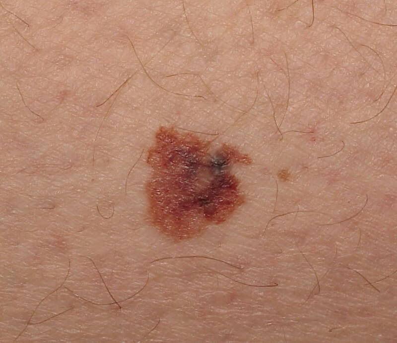
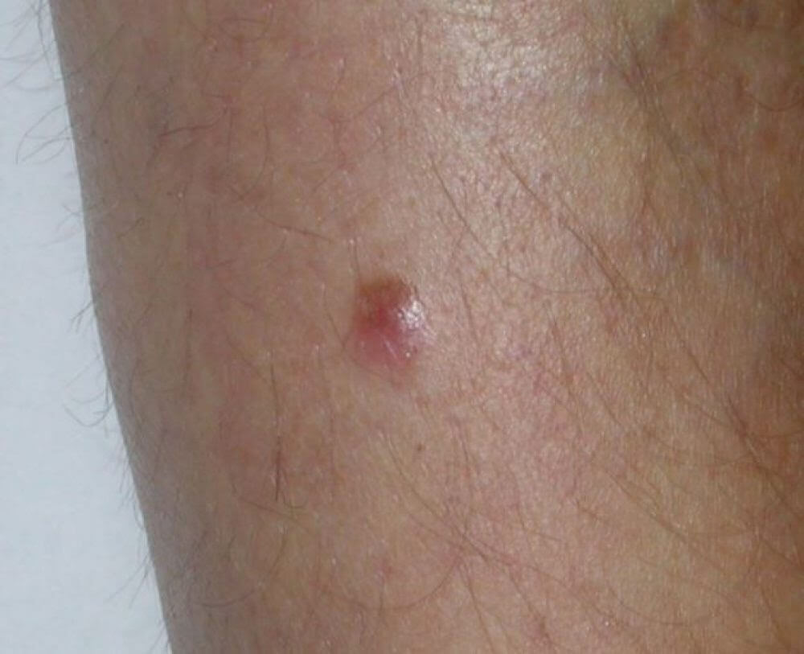
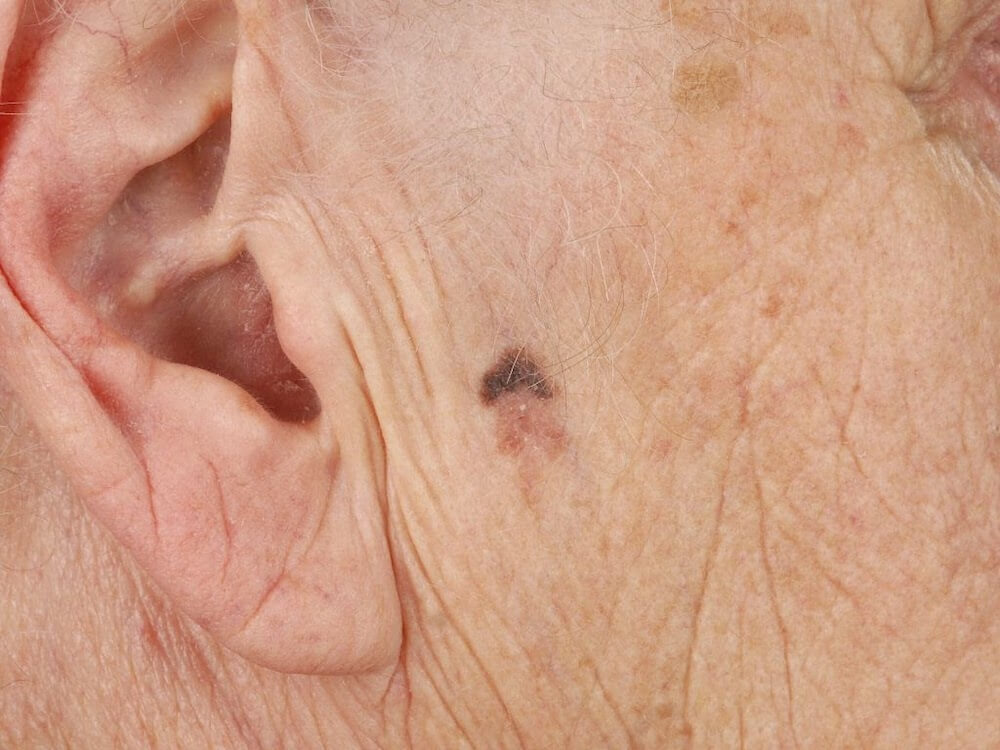
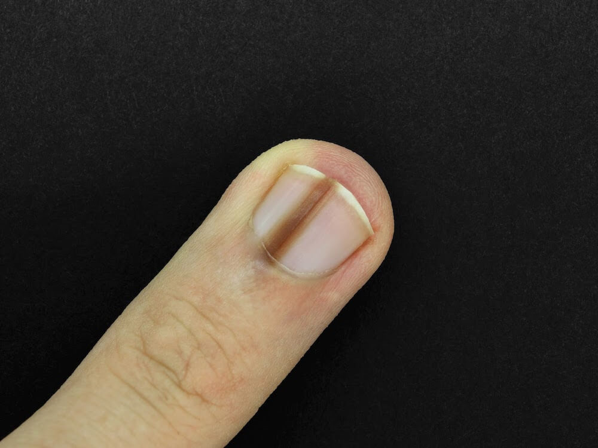
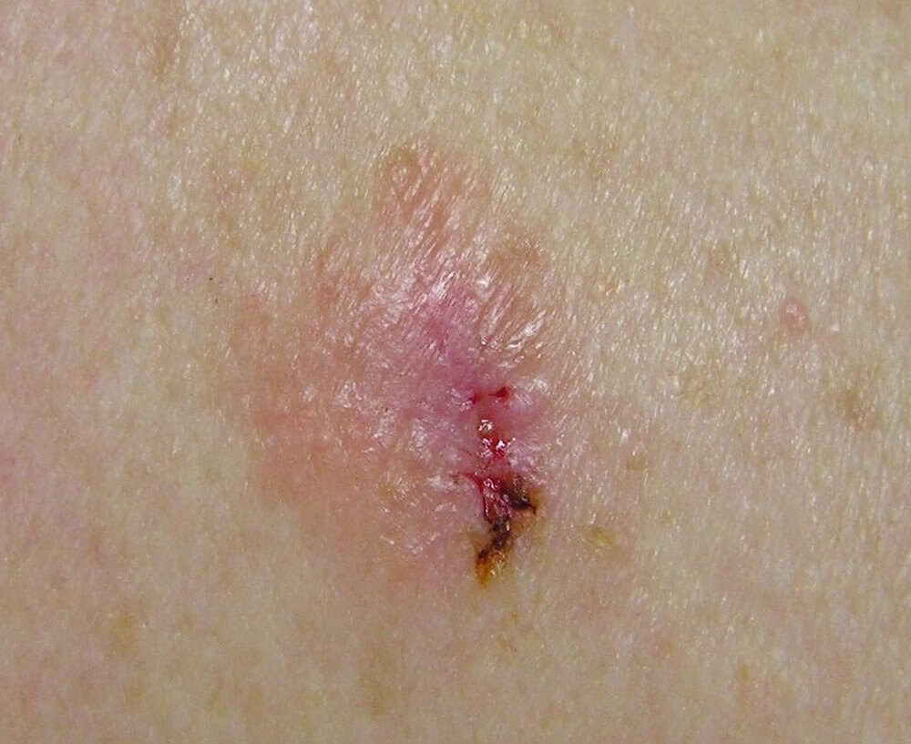

Poniżej prezentujemy **rodzaje czerniaka** o największym znaczeniu klinicznym oraz ich zdjęcia:

* czerniak szerzący się powierzchownie (ang. superficial spreading melanoma),
* czerniak z plamy soczewicowatej (ang. lentigo maligna melanoma),
* czerniak guzkowy (ang. nodular melanoma),
* czerniak akralny w tym podpaznokciowy (ang. acral lentiginous melanoma).

## Czy czerniak występuje tylko na skórze?

Pomimo tego , że najczęstszym punktem wyjścia czerniaka jest skóra (90%), może się on rozwinąć w innych lokalizacjach i niemal co 10-ty czerniak rozwija się pierwotnie w gałce ocznej oraz błonach śluzowych najczęściej jamy ustnej i narządów płciowych.

Należy pamiętać, że każda osoba, u której został zdiagnozowany czerniak lub inny nowotwór skóry powinna poddawać się regularnym badaniom znamion co 4- 6 miesięcy. Najlepszą metodą jest komputerowe badania znamion czyli wideodermatoskopia z możliwością archiwizacji zdjęć znamion wyznaczonych do obserwacji przez lekarza.

<More link="/dermatoskopia-badanie-znamion" text="Dowiedz się więcej o badaniu znamion" cta="Zobacz" />

## Gdzie czerniak lokalizuje się najczęściej?

Według Mazowieckiego Rejestru Nowotworów - w populacji mieszkańców województwa mazowieckiego czerniaki występowały najczęściej:

* w skórze tułowia( ok.37%),
* kończyn dolnych (ok. 30%),
* kończyn górnych ( ok. 17%),
* głowy i szyi ( ok. 9%).

U kobiet czerniak najczęściej umiejscowiony jest na kończynach, w przypadku mężczyzn jest to tułów.

Czerniaki zwykle pojawiają się na podłożu niezmienionej skóry ( de novo) natomiast mogą też rozwinąć się już w istniejącym znamieniu.

## Czerniak szerzący się powierzchownie

Najczęstszą postacią histologiczną (70-80%) jest [czerniak szerzący się powierzchownie](http://dermoscopic.blogspot.com/2011/07/back-lesion.html "Czerniak szerzący się powierzchownie") - superficial spreding melanoma malignum ( SSMM). To typ czerniaka rosnącego najwolniej - najpierw następuje zwiększanie powierzchni, dopiero w następnej kolejności przyrost na grubość. Typowy czerniak SSMM pojawia się zwykle u osób młodych lub w średnim wieku po krótkich ale intensywnych ekspozycjach na słońce, na skórze odsłoniętej, bez cech uszkodzenia posłonecznego. U kobiet najczęściej lokalizuje się na kończynach, u mężczyzn na tułowiu. Charakteryzuje się długim okresem wzrostu śródnaskórkowego, późnym dawaniem przerzutów oraz stosunkowo dobrym rokowaniem.

## Czerniak guzkowy

U około 10-15 % pacjentów w skórze klinicznie niezmienionej można spotkać czerniaka guzkowego - melanoma malignum nodularis (MMN). To postać bardziej agresywna charakteryzująca się jednoczesnym przyrostem grubości i zwiększaniem powierzchni zmiany oraz szybkim dawaniem przerzutów. Wywiad wzrostu zmiany obejmuje zwykle 1-2 lata, pojawia się głównie w okolicy skóry głowy, karku i górnej części pleców. Klinicznie jest to zwykle wyniosły guzek o bardzo ciemnym zabarwieniu , szybko się powiększający.

## Czerniak wywodzący się z plamy soczewicowatej

Czerniak może wywodzić się też z plamy soczewicowatej - lentigo maligna melanoma ( LMM). Występuje głównie u osób starszych, częściej u kobiet po 60 roku życia w miejscach narażonych na ekspozycję UV, na skórze z cechami uszkodzenia posłonecznego, głównie w obrębie skóry twarzy. Klinicznie jest to zwykle nieostro odgraniczona, płaska zmiana dość dużych wymiarów, rozwijająca się powoli.

## Czerniak akralny w tym podpaznokciowy

Rzadko mamy też do czynienia z czerniakami podpaznokciowo-kończynowymi (5-8%) - acral lentigo melanoma (ALM). nie są to zmiany typowe, są trudne w rozpoznaniu z uwagi na swoją specyficzną lokalizację i z uwagi na późne rozpoznanie charakteryzują się złym rokowaniem. Klinicznie jest to zmiana o nieregularnym zabarwieniu, zwykle zniekształcająca płytkę paznokciową

<More link="/czerniak/rodzaje-czerniaka/czerniak-na-dloniach-i-podeszwach-stop" text="Czerniak na dłoniach i podeszwach stóp - akralny" cta="Sprawdź" />

## Czy czerniak jest czarny? Uwaga na czerniaka bezbarwnikowego!

Najrzadszą postacią czerniaka jest postać bezbarwnikowa - czerniak amelanotyczny. Utrata zdolności do syntezy melaniny w tym przypadku nie jest jeszcze procesem do końca wyjaśnionym. Brak lub niewielka ilość barwnika jest wyrazem niskiego zróżnicowania komórek, a co za tym idzie ich większej złośliwości.

Więcej zdjęć czerniaka bezbarwnikowe możesz zobaczyć [tutaj](https://www.skincancer.net.au/amelanotic-melanoma-pictures "Zdjęcia czerniaka bezbarwnikowego")

