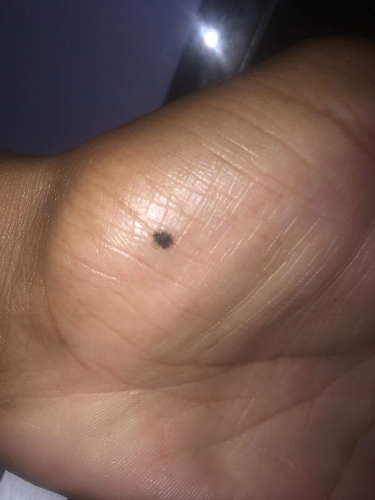
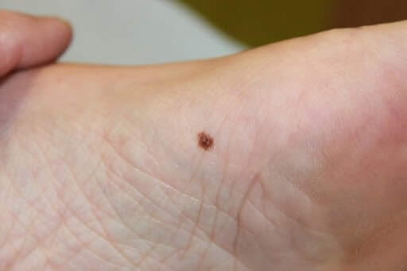
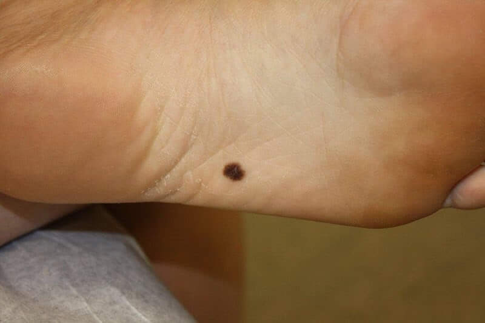
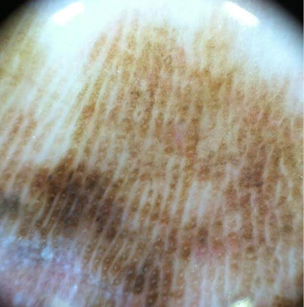
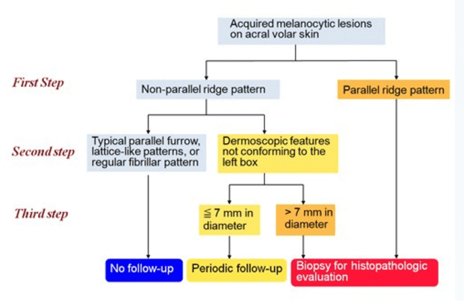

**Czerniak** w okolicach **akralnych** rozwija się stosunkowo rzadko, ale z uwagi na małą świadomość społeczną jego rozpoznanie w tej lokalizacji jest zwykle opóźnione, co wpływa na pogorszenie **rokowania**. Obraz zmian na dłoniach i podeszwach różni się znacznie od zmian w innych lokalizacjach z powodu występowania na skórze o grubej warstwie rogowej naskórka, nieowłosionej, nieustannie narażonej na czynniki mechaniczne.

Ocena zmian w tych lokalizacjach jest w zasadzie niemożliwa gołym okiem dlatego tak ważne jest wykonanie **badania dermatoskopowego** zmian, które zauważymy na dłoni czy stopie.

## Jakie zmiany powinny być skonsultowane z lekarzem w trakcie badania wideodermatoskopowego?

Poniżej prezentujemy zdjęcia znamion, które powinny zostać poddane badaniu dermatoskopowemu.

 

## Czy znamię na stopie to czerniak?

W lokalizacji akralnej najczęściej różnicujemy z krwotokiem śródnaskórkowym lub obecnością barwnika zewnątrzpochodnego. Ostro odgraniczony wykwit o czerwonym lub czarnym zabarwieniu przemawia zwykle za krwotokiem śródnaskórkowym. W przypadku obecności barwnika zewnątrzpochodnego trudno odróżnić go od zmiany melanocytowej, dlatego kluczową rolę w tym przypadku odgrywa wywiad z pacjentem. W razie jakichkolwiek wątpliwości należy wykonać biopsję zmiany.

Zmiany występujące w lokalizacji akralnej posiadają charakterystyczne dla nich wzory strukturalne widoczne w [badaniu dermatoskopowym](/dermatoskopia-badanie-znamion "badanie dermatoskopowe") i na tej podstawie mogą zostać rozpoznane i zróżnicowane ze zmianami łagodnymi, które nie wymagają interwencji chirurgicznej.

Linie równoległe na grzebieniach - silny wzorzec złośliwości widoczny w badaniu dermatoskopowym zmian akralnych

Czerniaki in situ w tej lokalizacji posiadają zwykle jeden wzorzec w postaci linii równoległych na grzebieniach ( ang. parallel ridge pattern- PRP)- jest to w tym przypadku najważniejszy wzór charakterystyczny dla tego rozpoznania.

Z praktycznego punktu widzenia wiedza, iż grzebienie są szersze od bruzd, a na ich powierzchni znajdują się ujścia gruczołów potowych (widziane jako lekko wybarwione kropki) znacznie ułatwia ocenę.

## Test atramentowy wykonywany przez lekarza w trakcie badania znamion

Pomocny może okazać się też test atramentowy. Atrament należy nanieść na zmianę, poczekać do wyschnięcia i nadmiar usunąć wacikiem. Pozostały atrament wnika w bruzdy - czyli tam gdzie w zmianie łagodnej powinien gromadzić się barwnik. Próba ta pomaga odróżnić bruzdy od grzbietów. W każdym przypadku wystąpienia linii równoległych w grzebieniach należy wykonać biopsję lub wycięcie chirurgiczne z badaniem histopatologicznym.

Innymi wzorami złośliwości pojawiającym się w lokalizacji akralnej jest wzór typu rozlanej pigmentacji opisywany zwykle jako bezstrukturalny, nieregularny obszar o różnych odcieniach od brązu do czarnego, a także wzorzec równoległy pogrubiały (ang.diffuse pigmentation pattern).

Do łagodnych wzorów w badaniu wideodermatoskopowym zaliczamy:

* linie równoległe w bruzdach (ang. parallel furrow pattern - PFP) - występuje w postaci pojedynczej lub podwójnej linii, opcjonalnie z obecnością kropek i siateczkowatego tła.
")
* wzorzec typu kratka (ang. lattice-like pattern - LLP) - komórki barwnikowe układają się równolegle i prostopadle w poprzecznie biegnących mostach. Najczęściej spotykany jest w okolicy łuku stóp oraz w bocznych okolicach dłoni i stóp.
")
* wzorzec włókienkowy (ang. fibrillar pattern - FB) - gęsty układ linii biegnący skośnie do bruzd i grzbietów, najczęściej spotykany w okolicy stopy noszącej ciężar.
")

Oczywiście w lokalizacji akralnej mogą pojawiać się też inne wzorce, takie jak kropki, grudki, obszary bezstrukturalne, koła, linie siateczkowate czy stosunkowo rzadko linie promieniste i pseudopodia.

Na podstawie wielu badań stwierdzono, iż czerniak akralny powstaje w skórze pierwotnie niezmienionej, niezależnie od wcześniej istniejących zmian melanocytowych (Saida T. 2005).

Oczywiście w lokalizacji akralnej mogą wystąpić też inne wzory specyficzne dla czerniaka gdyż wraz ze wzrostem czerniaka pojawia się w jego obrazie coraz więcej cech czerniaka występującego w innej lokalizacji. Należy pamiętać jednak, że linie równoległe w bruzdach w przypadku wykwitów z więcej niż jednym wzorem nie wykluczają diagnozy czerniaka.

Tanioka ( 2009 ) zaproponował podczas oceny akralnych zmian melanocytowych 3-stopniowy algorytm postępowania

Zgodnie z powyższym algorytmem w pierwszej kolejności lekarz ocenia obecność linii równoległych na grzebieniach - w przypadku ich obecności niezwłocznie wykonuje biopsję chirurgiczną. W zmianach, w których stwierdza linie równoległe w bruzdach lub inne łagodne wzory : sieteczkowaty lub fibrylarny lekarz może zdiagnozować zmianę łagodną, niewymagającą obserwacji. W przypadku zmian, w których nie stwierdza się typowych łagodnych wzorów znamion akralnych, zaleca się okresową kontrolę dermatoskopową- jeśli zmiana jest mniejsza lub równa 7 mm; w przypadku zmian większych - należy rozważyć wykonanie biopsji chirurgicznej z następowym badaniem histopatologicznym. Po rozpoznaniu czerniaka bardzo ważnym elementem dalszego postępowania jest regularna kontrola dermatoskopowa wszystkich znamion na ciele!

<More link="/blog/jak-wyglada-czerniak-zdjecia" text="Jak wygląda czerniak? ZDJĘCIA" cta="Zobacz" />
