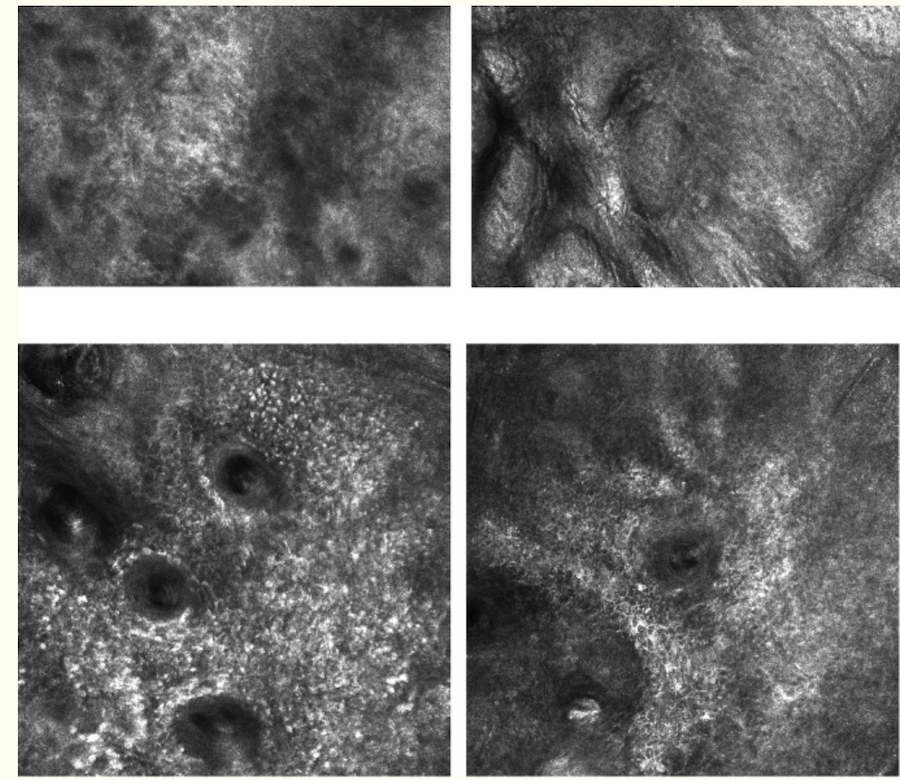

Jest to oglądanie skóry za pomocą narzędzia zwanego dermatoskopem, który jak szkło powiększające umożliwia bardzo dokładną obserwację i analizę struktur barwnikowych oglądanych znamion, pieprzyków, przebarwień skóry czy plam soczewicowatych. Dermatoskopia pozwala odróżnić lekarzowi zmiany łagodne od niebezpiecznych.


<span id="id1" />

## Dermatoskopia

Dermatoskopia (dermoskopia, mikroskopia epiluminescencyjna) jest jak do tej pory najlepszą formą badania i monitorowania znamion skórnych potocznie zwanych pieprzykami.

<YoutubeGif url="https://www.youtube.com/watch?v=U5CBLvj8jrI" />

Zgodnie z definicją światowej klasy autorytetu w dziedzinie dermatoskopii Giuseppe Argenziano “Dermatoskopia jest nieinwazyjną metodą diagnostyczną, która umożliwia oglądanie w powiększeniu zmian skórnych. Badanie dermoskopowe wykorzystujące światło i immersję pozwala na ocenę wzorców, struktury oraz dystrybucji i ilości barwnika w barwnikowych zmianach skórnych na różnej głębokości (naskórek, granica skórno-naskórkowa, warstwa brodawkowata skóry właściwej).” (Argenziano G. 2001).


Dermatoskopowe badanie znamion to prosta metoda wspomagająca ocenę wzrokową, która stała się w ciągu ostatnich lat klinicznym standardem badań profilaktycznych. Dzięki możliwości wykonania badania w trybie ambulatoryjnym, coraz większej dostępności urządzeń badawczych oraz prostocie metody możliwe jest coraz wcześniejsze wykrywanie zmian nowotworowych.

***To dzięki dermatoskopii lekarz może stwierdzić jak odróżnić zwykłe znamię od czerniaka i innych nowotworów skóry.***


Badanie dermatoskopowe wykonuje się także w przypadku diagnostyki innych schorzeń dermatologicznych i zmian skórnych, takich jak naczyniaki, rogowacenie łojotokowe czy choroby pasożytnicze celem np. potwierdzenia rozpoznania świerzbu.


<br />
<span id="id2" />

## Reguła ABCDE - kiedy znamię może być niebezpieczne?

Dzięki dermoskopii lekarz może szczegółowo ocenić wszystkie znamiona i pieprzyki na ciele pacjenta. Dermatolog zgodnie z regułą ABCDE w pierwszej kolejności w szczególności zwraca uwagę na asymetrię - nierówny kształt pieprzyków, poszarpane brzegi, różnorodność koloru - wielobarwność, wielkość - znamiona > 6mm średnicy powinny zwracać szczególna uwagę, a także na ewolucję, czyli dynamiczną zmianę kształtu, wielkości, struktury czy zabarwienia badanych znamion.


```“Każdy bez względu na zajmowane stanowisko i wiek powinien stosować się do zasad profilaktyki nowotworowej. Czerniak jest groźną i śmiertelną chorobą a wczesne wykrycie daje 100 % szans na wyleczenie” ```

mówił w trakcie VII Tygodnia Świadomości Czerniaka Prezydent Rzeczypospolitej Andrzej Duda:

<YoutubePlayer url="https://www.youtube.com/watch?v=IV0avSgIjsg" start="0" end="0" label="Tydzień Świadomości Czerniaka - Prezydent Andrzej Duda" />

```“Jeśli wiesz, na co zwrócić uwagę - rozpoznanie czerniaka będzie dziecinnie proste"```

podkreśla Pani doktor dermatolog-wenerolog Monika Słowińska.


<span id="id3" />

## Efektywność badań dermatoskopowych

**Dermatoskopia zmniejsza zachorowalność i umieralność z powodu czerniaka!**

Istotę przesiewowych badań dermatoskopowych podkreśla fakt, iż po wprowadzeniu dermoskopii, zanotowano malejącą zachorowalność i umieralność z powodu nowotworów skóry.

**Wprowadzenie techniki badania dermatoskopowego do rutynowej oceny znamion poprawiło wykrywalność czerniaka o około 30%.**


Dane z programu Skin Cancer Research to Provide Evidence for Effectiveness of Screening in North Germany ([SCREEN](https://pubmed.ncbi.nlm.nih.gov/22074699/ "SCREEN")) wskazują na potencjalne zmniejszenie stopnia zaawansowania i śmiertelności z powodu czerniaka przy wprowadzeniu skriningu populacji (Breitbart E.W. i in., 2012).


Dwie duże metaanalizy przeprowadzone w 2002 i w 2008 roku potwierdzają większą skuteczność badań z zastosowaniem dermatoskopu w porównaniu do oceny klinicznej “gołym okiem”( Kittler H. i in.; Lancet Onkol. 2002; Vestergaard M.E. i in.; Br.J.Dermatol. 2008).


<span id="id4" />

## Jakie są wskazania do wykonania badania dermatoskopowego znamion?

**Badanie wideodermatoskopowe powinno zostać wykonane u wszystkich osób, które mają na swoim ciele pieprzyki.** Do grupy pacjentów charakteryzujących się szczególnym ryzykiem wystąpienia nowotworu skóry zaliczają się osoby:

* z dużą liczbą znamion - pacjenci powyżej 50 roku życia, posiadający ponad 50 znamion lub powyżej 20 znamion na ramionach lub z zespołem znamion atypowych - dysplastycznych


* z licznymi piegami na ciele

* z jasną karnacją (jasne lub rude włosy, często niebieskie tęczówki)

* spędzające dużo czasu na słońcu lub korzystające z solarium, szczególnie pacjenci powyżej 50 roku życia z objawami fotouszkodzenia skóry

* posiadające znamiona wrodzone, które charakteryzują się większym ryzykiem "zezłośliwienia"

* z czerniakiem w wywiadzie lub dodatnim wywiadem rodzinnym w kierunku czerniaka - [Dowiedz się więcej o czerniaku](/czerniak "Dowiedz się więcej o czerniaku")

* z zaburzoną odpornością lub przyjmujące leki obniżające odporność
* kobiety w okresie ciąży i połogu

* ulegające poparzeniom słonecznym w dzieciństwie, szczególnie przed 12 rokiem życia


<br />
<span id="id5" />

## Ile kosztuje badanie znamion?

Cena badanie dermatoskopowego zależy od czasu jaki lekarz poświęca na jego wykonanie w trakcie wizyty oraz od jakości sprzętu, którym się posługuje. Koszt zwykłej konsultacji u dermatologa, który ręcznym dermatoskopem obejrzy niepokojące zmiany to koszt ok. 100-200 zł. Jeśli natomiast zależy nam na wykonaniu wideodermatoskopii z mapowaniem znamion do obserwacji, musimy się liczyć z większymi kosztami - 200-600 zł w zależności od rejonu Polski.

<More link="/cennik" text="Jaka jest cena dermatoskopowego badania znamion w Twoim mieście?" cta="Sprawdź" />

<span id="id6" />

## Jakie są przeciwwskazania do wykonania dermatoskopii?

Badanie dermatoskopowe znamion jest bezinwazyjne i bezbolesne, nie ma żadnych przeciwwskazań do jego przeprowadzenia. Wykonywane jest u pacjentów w każdym wieku - także u dzieci oraz u kobiet ciężarnych i karmiących piersią.


Badanie pieprzyków polega na przyłożeniu dermatoskopu przez lekarza do powierzchni skóry i na oglądaniu znamion w dużym powiększeniu.

<span id="id7" />

## Gdzie się badać - do jakiego lekarza się udać?

Badanie dermatoskopowe powinien wykonywać lekarz, który posiada odpowiednie doświadczenie w ocenie znamion. Badanie znamion nie powinno być przeprowadzane przez osoby do tego nieuprawnione, gdyż postawienie mylnej diagnozy może być niebezpieczne. Badania znamion wykonują w swojej praktyce dermatolodzy, onkolodzy, chirurdzy onkolodzy, lekarze rodzinni lub lekarze innych specjalności, którzy w swojej codziennej praktyce zajmują się diagnostyką zmian skórnych.

Pamiętajmy, że **badanie znamion** jako świadczenie zdrowotne - działanie służące zachowaniu, ratowaniu, przywracaniu lub poprawie zdrowia (Dz.U. z 2020 r. poz. 295) - **powinno być wykonane przez lekarza**.

<More link="/kontakt" text="Sprawdź terminy na badanie w Twoim mieście!" cta="Sprawdź" />

```Zanim zdecydujesz się wobec powyższego zbadać i usunąć laserem znamiona u kosmetyczki, pomyśl o niebezpiecznych konsekwencjach, które mogą się z tym wiązać!```


<br />
<span id="id8" />

## Bezpłatne badanie znamion na NFZ?


Celem wykonania **bezpłatnego badania znamion** należy udać się do **lekarza rodzinnego po skierowanie** do dermatologa i następnie zarejestrować się na konsultację dermatologiczną w przychodni.

Pamiętajmy, że jeśli zauważymy niepokojące objawy np. szybki wzrost znamienia, zmianę jego kształtu, struktury czy koloru, konsultacja dermatologiczna powinna zostać wykonana niezwłocznie, bez zbędnych opóźnień, które niestety zdarzają się z powodu często odległych terminów na wizytę. W trakcie bezpłatnej wizyty lekarskiej lekarz posiada ponadto ograniczony czas na przyjęcie pacjenta, co może przekładać się na brak możliwości obejrzenia w trakcie takiej wizyty wszystkich zmian na skórze.


Bezpłatne badanie znamion refundowane przez Narodowy Fundusz Zdrowia polega zazwyczaj na dermatoskopowym badaniu niepokojących zmian na skórze i oczywiście przy założeniu krótkiego czasu oczekiwania na wizytę jest wartościowym badaniem, stanowiącym ważny element diagnostyki nowotworów skóry.

Należy jednak pamiętać, że istotą badania znamion jest porównywanie zmian zachodzących w czasie i dermatoskopowe badanie znamion powinno być badaniem wykonywanym regularnie co najmniej co 12 miesięcy, a u osób z grupy podwyższonego ryzyka nawet częściej!

Badaniem z wyboru w przypadku badań wykonywanych regularnie jest wideodermatoskopia, która umożliwia mapowanie znamion wymagających obserwacji celem ich późniejszej analizy porównawczej - dopiero takie badanie jest pełnowartościowym badaniem profilaktycznym.


<span id="id9" />

## Jak przygotować się do badania znamion?

Przed badaniem znamion obejrzyj dokładnie całą swoją skórę, sprawdź, gdzie zlokalizowane są wszystkie znamiona, zwróć uwagę na lokalizacje trudne, np. skórę na głowie czy przestrzenie międzypalcowe.

Pamiętaj, aby w trakcie badania pokazać lekarzowi wszystkie znamiona na ciele i zwrócić uwagę na zmiany, których lekarz może nie zauważyć w trakcie badania! Celem poprawy jakości obrazu dermatoskopowego przytnij włosy w okolicy znamion, tak żeby nie zasłaniały obrazu dermatoskopowego znamion - ułatwisz lekarzowi pracę!


Znamiona występują także na twarzy - przed badaniem wykonaj demakijaż, żeby drobinki podkładu albo różu do policzków nie zaburzały obrazu w trakcie badania znamion w gabinecie.

<span id="id10" />

## Jak wygląda dermatoskopowe badanie znamion?

Przed wykonaniem badania lekarz zbiera szczegółowy wywiad z pacjentem. Lekarz pyta o to, czy pacjent chorował kiedyś na czerniaka lub czy czerniak był zdiagnozowany u kogoś z jego rodziny. Ważne są także choroby przewlekłe, gdyż występowanie niektórych z nich (np. chorób autoimmunologicznych) lub zażywanie leków immunosupresyjnych może zwiększać ryzyko wystąpienia czerniaka. Pacjent odpowiada też na pytania dotyczące ilości czasu spędzonego na słońcu, w solarium oraz o ostatnią ekspozycję na promieniowanie UV, a także o poparzenia słoneczne w dzieciństwie, które są bardzo niebezpieczne.


W trakcie badania należy też wskazać znamiona, które pojawiły się w ostatnim czasie “de novo” oraz znamiona, które znajdują się na ciele od urodzenia - znamiona wrodzone. Dokładnej analizie podlegają także wszystkie zmiany i przebarwienia na paznokciach.

W trakcie badania lekarz ogląda wszystkie znamiona u pacjenta - bada go "od stóp do głów", uwzględniając trudno dostępne miejsca, takie jak skóra głowy, stopy czy przestrzenie międzypalcowe lub lokalizacje, których pacjent sam nie może zobaczyć, np. okolica pleców. W trakcie badanie niezmiernie ważne jest, aby nie pominąć żadnej części ciała i przyjrzeć się każdej zmianie na skórze.

<YoutubePlayer url="https://www.youtube.com/watch?v=iznwZKQVXug" start="59" end="111" label="Przebieg badania dermatoskopowego znamion" muted={true} />

Badanie trwa zwykle ok. 30-40 min. w zależności od liczby pieprzyków znajdujących się na ciele. Badanie nie boli, gdyż jest zupełnie bezinwazyjne i można je wykonać u każdej osoby. Lekarz ocenia, czy zmiany są niebezpieczne i czy należy je [usunąć chirurgicznie](/chirurgiczne-usuwanie-znamion "usunąć chirurgicznie") oraz poddać badaniu histopatologicznemu na obecność komórek nowotworowych (komórek rakowych).

Po badaniu pacjent otrzymuje wynik lekarski, w którym lekarz wskazuje, które znamiona należy poddać kontroli, a które wymagają usunięcia. Lekarz wydaje pacjentowi zalecenia dotyczące terminu następnego badania kontrolnego. Jeśli po usunięciu chirurgicznym niepokojącego znamienia zostaje postawiona diagnoza raka skóry - wówczas konieczna może okazać się konsultacja z onkologiem.

Zgodnie z Inicjatywą Polskiego Towarzystwa Chirurgii Onkologicznej powstała "Karta konsultacyjna pacjenta ze zmianą barwnikową", którą lekarz może wspomagać się w trakcie całego procesu diagnostyczno-terapeutycznego pacjenta ze znamiona na ciele. Karta powstała we współpracy z Sekcją Dermatologii Onkologicznej oraz Polskim Towarzystwem Patologów.


<br />
<span id="id11" />

## Badanie wideodermatoskopowe

Jeśli pacjent wymaga monitorowania zmian skórnych, powinien mieć wykonaną wideodermatoskopię, która pozwala na zapisywanie zdjęć znamion wyznaczonych do obserwacji celem oceny dynamiki zmian w nich zachodzących w trakcie badania kontrolnego na podstawie porównania obrazów. Komputerowe badanie znamion jest najlepszą metodą diagnostyki znamion i z uwagi na lepszą rozdzielczość obrazu oraz możliwość archiwizacji obrazów dermatoskopowych powinna być metodą z wyboru. Lekarz wykonuje badanie z zastosowaniem specjalnej kamery, za pomocą której znamiona zostają zobrazowane na ekranie komputera.

Zdarza się, że po pierwszym badaniu następny termin kontroli wyznaczony jest na za 3-4 miesiące z uwagi na konieczność oceny zmian zachodzących w znamionach przed podjęciem ostatecznej decyzji odnośnie ich usunięcia. Badania kontrolne są niezmiernie ważne, gdyż monitoruje się wówczas znamiona, które mogą ewoluować w zmiany złośliwe.

<More link="/wideodermatoskopia-komputerowe-badanie-znamion" text="Wideodermatoskopia - komputerowe badanie znamion" cta="Czytaj dalej" />

<span id="id12" />

## Czy pacjent sam powinien wybrać znamiona do badania ?

Często pacjenci zgłaszający się na badanie lekarskie chcą przebadać jedynie kilka zmian, które w ich odczuciu są niepokojące. Zbadanie przez lekarza tylko kilku zmian na ciele jest badaniem niepełnym i nie ma nic wspólnego z badaniami profilaktycznymi. Pacjent, któremu zostały zbadane tylko wybrane znamiona wymaga wykonania pełnego badania dermatoskopowego wszystkich znamion na ciele w późniejszym czasie.

Zbadanie wszystkich zmian barwnikowych na ciele pacjenta pozwala na ustalenie profilu znamion uwarunkowanego m.in. fototypem skóry badanego i często wpływa na decyzje terapeutyczne. Standardem zatem powinna być ocena nie tylko znamion niepokojących, innych od pozostałych (tzw. ugly duckling), ale wszystkich znamion na ciele.

**Pamiętajmy o badaniu wszystkich znamion podczas dermatoskopowej wizyty lekarskiej.**


Jeśli niepokojący wzór pojawia się w większej liczbie znamion, może świadczyć to o tym, że jest to charakterystyczny wzór dla danego pacjenta i takie znamiona nie budzą niepokoju onkologicznego, tym samym pozostają w obserwacji dermatoskopowej. Konieczność całościowej oceny pacjenta potwierdza badanie Argenziano i wsp. (2011), gdzie po pierwszej ocenie ograniczonej do badania tylko jednej niepokojącej zmiany, eksperci skierowali na chirurgiczne wycięcie 55,1% zmian, natomiast w kolejnej ocenie dokonanej w odniesieniu do zmian pozostałych, odsetek skierowań do interwencji chirurgicznej zmniejszył się o 41%. Zbadanie wszystkich znamion może ustrzec przed rozpoznaniem nowotworu skóry, ale też może zapobiec konieczności niepotrzebnego ich usuwania, a pamiętajmy, że każde chirurgiczne usunięcia zmiany skórnej wiąże się z blizną na skórze.


<span id="id13" />

## Jak często powinno się wykonywać dermatoskopowe badanie znamion?

Każdy powinien zbadać znamiona raz na rok - co 12 miesięcy celem sprawdzenia, czy nie dzieje się w nich coś niepokojącego. Należy pamiętać, że w znamionach mogą zachodzić zmiany, wobec tego jednorazowe badanie jest niestety niewystarczające.


U osób z grupy ryzyka badanie należy wykonywać częściej zgodnie ze wskazaniami lekarskimi nawet co 3-4 miesiące - szczególnie u osób, u których zdiagnozowano już wcześniej nowotwór skóry, taki jak np. rak podstawnokomórkowy, rak kolczystokomórkowy czy czerniak złośliwy skóry. Należy pamiętać, że badania znamion nie powinno się wykonywać bezpośrednio po ekspozycji na słońce, gdyż opalanie może zmieniać obraz dermatoskopowy znamion i uniemożliwiać postawienie prawidłowej diagnozy.

Każdy niepokojący objaw w postaci szybkiego wzrostu, zmiany barwy, struktury, pojawienia się asymetrii lub nierównych brzegów, zmiany kształtu, uwypuklenia się lub zanikania znamienia oraz sączenia lub krwawienia ze zmiany, a także pojawienia się bólu swędzenia czy przeczulicy powinien zostać natychmiast skonsultowany z lekarzem w trakcie badania dermatoskopowego.

Poniżej algorytm postępowania ze zmianą barwnikową opracowany przez [Towarzystwo Chirurgii Onkologicznej](http://ptcho.pl/ "Towarzystwo Chirurgii Onkologicznej"). Jak widzimy, decyzja odnośnie chirurgicznego usunięcia zmiany jest podejmowana na podstawie regularnych badań kontrolnych u pacjenta, które opierają się na porównaniu obrazu dermatoskopowego zmian na przestrzeni czasu.


<br />

<span id="id14" />

## Mikroskopia konfokalna - Reflectance Confocal Microscopy (RCM)

**Metodą wspomagającą w diagnostyce nowotworów skóry** w tym czerniaka jest mikroskopia konfokalna. Ta metoda diagnostyki sprawdza się bardzo dobrze zwłaszcza u pacjentów z obecnością mnogich atypowych znamion.


To odmiana mikroskopii świetlnej, która cechuje się lepszym kontrastem i rozdzielczością obrazu i służy do oglądania niewidocznych dla oka struktur. Daje ona możliwość wykonania tzw. “wirtualnej biopsji” i uniknięcia zabiegu chirurgicznego.

<YoutubePlayer url="https://www.youtube.com/watch?v=YRLgXRrYeq0" start="147" end="181" label="Przebieg badania mikroskopem konfokalnym" muted={true} />

Refleksyjny mikroskop konfokalny daje możliwość obserwacji pełnej grubości naskórka a także skóry właściwej, zwykle aż do głębokości warstwy brodawkowatej.


Diagnostyka z pomocą mikroskopii konfokalnej pomaga też w ocenie zmian, których obraz jest niejednoznaczny w badaniu wideodermatoskopowym.

Najczęstsze wskazania do wykonania mikroskopii konfokalnej:

* zmiany obecne na twarzy
* liczne atypowe znamion u pacjentów z zespołem znamion atypowych
* zmiany na śluzówkach
* zmiany podejrzane o czerniaka na fotouszkodzonej skórze

Ograniczeniami do stosowania tej metody diagnostycznej są : zmiany guzowate, zmiany typu "Spitz" oraz zmiany bezbarwnikowe.




<br />

<span id="id15" />

## Rodzaje dermatoskopów

Dermatoskopia to badanie znamiona z zastosowaniem dermatoskopów ręcznych, które oferują zazwyczaj powiększenie maksymalnie 20-30 i nie nadają się do monitorowania większej liczby znamion, gdyż mają ograniczoną możliwość ich zapisywania i późniejszej analizy porównawczej. Wykorzystywane są zwykle do wstępnej oceny znamion u pacjenta jako dodatkowe narzędzie diagnostyczne w gabinecie dermatologa czy lekarza rodzinnego.


Zastosowanie dermatoskopu ze źródłem światła niespolaryzowanego wymaga zastosowania imersji celem zmiany odbicia światła i tym samym zwiększenia przezierności warstwy rogowej naskórka. Do immersji można wykorzystać olejek syntetyczny, płyn dezynfekcyjne czy też wodę, a w ocenie zmian trudno dostępnych, takich jak błony śluzowe, przestrzenie międzypalcowe, zaleca się stosowanie żelu ultrasonograficznego. W niektórych sytuacjach można odstąpić od immersji, wówczas badanie dermoskopowe nosi nazwę tzw. suchej dermoskopii, co ma szczególne znaczenie w ocenie włosów meszkowych, ujść gruczołów potowych dłoni i stóp oraz linii papilarnych skóry. Dermatoskopy ze spolaryzowanym źródłem światła nie wymagają natomiast stosowania immersji.

### Przykłady dermatoskopów w ręcznych wykorzystywanych w diagnostyce zmian skórnych.


Wybór urządzeń do wykonywania badań jest bardzo szeroki. Do podstawowej oceny w ramach badań przesiewowych wydaje się, że wystarczy dermatoskop ręczny z podstawowym 10-krotnym powiększeniem - jest to powiększenie najczęściej stosowane w rutynowej diagnostyce.


<span id="id16" />

## Główne metody lekarskiej oceny dermatoskopowej

Jest wiele systemów oceny dermatoskopowej, które zmieniają się dynamicznie na przestrzeni ostatnich lat. Dzięki istnieniu prostych systemów oceniania badający może na podstawie podanych algorytmów postawić właściwą diagnozę. Poniżej przedstawiono kilka z nich. Najprostszą metodą wydaje się być trzypunktowa skala dermatoskopowa i to ona jest rekomendowana do stosowania przez lekarzy rozpoczynających ocenę dermatoskopową bez dużego doświadczenia w tej dziedzinie. Czułość tej metody diagnostycznej sięga 96,3 %, a jej swoistość 94,2 %. Inne metody analizy, w tym metoda ABCDE, 7- punktowa lista Argenziano, analiza wzory, metoda Menziesa czy algorytm CASH charakteryzują się bardzo podobną czułością przy nieco większej swoistości.


### Jakie struktury lekarz ocenia w trakcie badanie dermatoskopowego?


**Struktury te nie są widoczne gołym okiem**, dlatego pacjent sam, bez użycia dermatoskopu, nie jest w stanie ocenić, czy zmiana ma niebezpieczny charakter czy jest łagodna.

Lekarz w trakcie badania wideodermatoskopowego pacjenta ocenia następujące struktury, które widzi w powiększonym obrazie znamion:

* linie - dwuwymiarowa struktura , której długość znacznie przekracza szerokość: siateczkowate (A), rozgałęzione (B), równoległe (C), promieniste (D), zakrzywione (E),
* pseudopodia (F) - linie zakończone buławkowato,
* koła (G) - linia zakrzywiona równo oddalona od punktu środkowego,
* grudki (H) - zwarty obszar większy od kropki, może przyjmować dowolne kształty,
* kropki (I) - obszar zbyt mały, aby mógł przyjąć określony kształt,
* obszary bezstrukturalne (J) - cechuje go brak struktur dominujących.

Jedną z prostszych i częściej stosowanych przez lekarzy metod oceny dermatoskopowej jest **3-punktowa skala oceny**.

Opiera się ona na ocenie trzech kryteriów diagnostycznych:

* Asymetria koloru oraz struktury w jednej lub dwóch prostopadłych osiach,
* Atypowa siatka barwnikowa - siatka o nieregularnych oczkach połączona z występowaniem grubych linii,
* Niebiesko-białe struktury - dowolny odcień koloru niebieskiego i/lub białego.

Obecność dwóch lub trzech z ww. kryteriów sugeruje wysokie prawdopodobieństwo czerniaka. Stosując 3-punktową skalę, można uzyskać wysoką czułość i specyficzność ocen - porównywalną z innymi metodami oceny dermoskopowej.

```“Wyniki wstępnego badania 231 podejrzanych pod względem klinicznym barwnikowych zmian skórnych wykazały, że po zaledwie jednogodzinnym wprowadzeniu sześciu niedoświadczonych dermoskopistów, potrafili oni, stosując tę metodę, prawidłowo sklasyfikować 96,3% przypadków czerniaka złośliwego.” - ( Soyer H.P i in., Dermoskopia; str 2).``` 

Czułość metody jest znacznie większa, niż specyficzność, tak aby żaden przypadek czerniaka złośliwego nie został pominięty.

Zaleca się, aby wszystkie zmiany spełniające 2 lub 3 pkt były usuwane chirurgicznie. Należy podkreślić, iż nie powinno się stosować tej metody do ocen znamion w lokalizacjach szczególnych - skóra owłosiona głowy, lokalizacja akralna czy błony śluzowe. Dla tych przypadków stosuje się odrębne algorytmy oceny dostosowane do danej specyfiki.


Na powyższym obrazie zmiana spełnia wszystkie kryteria z 3-punktowej listy kontrolnej, a mianowicie: wykazuje asymetrię we wszystkich osiach, atypową siatkę barwnikową (zakreślony obszar) oraz obecność niebiesko-białych struktur (gwiazdki).


