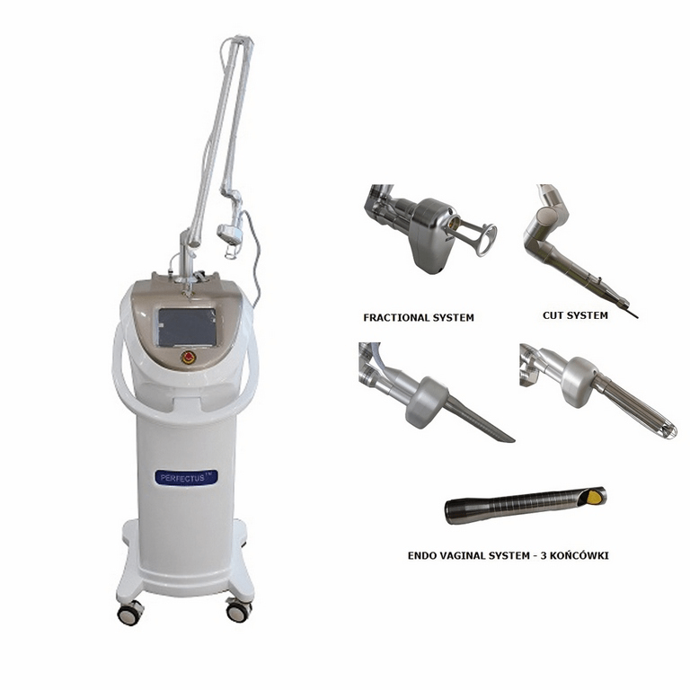
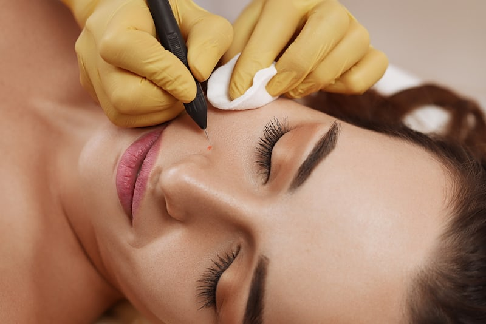
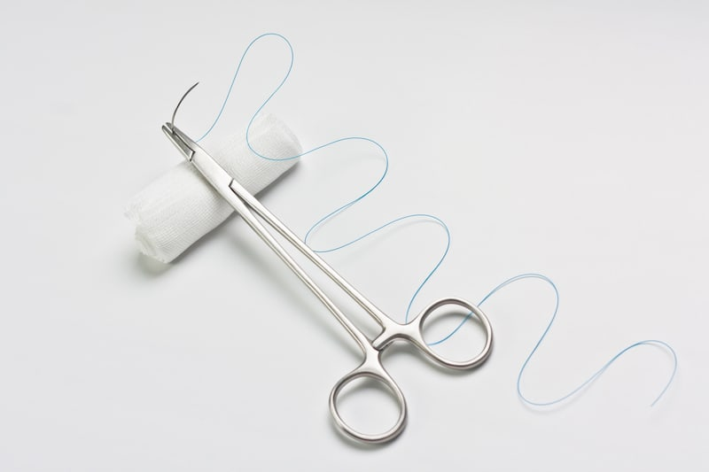

Metody niechirurgiczne dopuszczalne są tylko wtedy, gdy znamiona mają charakter łagodny. Można je stosować u osób w każdym wieku i są one całkowicie bezinwazyjne, co oznacza, że nie dochodzi do przerwania powłok skórnych. Jednak to nie do nas należy wybór, czy znamię zostanie usunięte metodą niechirurgiczną czy chirurgiczną - decyduje o tym lekarz.

## Niechirurgiczne usuwanie znamion - kiedy może zostać wykonane?

Jeśli zmiana wygląda na złośliwą i lekarz ma podejrzenie, że może być zmianą nowotworową, wówczas skieruje Cię na chirurgiczne usunięcie. To bardzo ważne. Wycięty pieprzyk jest wtedy wysyłany do badania histopatologicznego, dzięki któremu możesz dowiedzieć się, czy Twój pieprzyk był np. czerniakiem czy nie. Jeśli lekarz jest spokojny co do charakteru znamienia, wówczas bez przeszkód możemy się wybrać na usunięcie bezinwazyjne. Warto jednak pamiętać, że nie uzyskamy wówczas informacji o znamieniu od patomorfologa.

<More link="/blog/jak-wyglada-czerniak-zdjecia" text="Zobacz na zdjęciach, jak wygląda typowy czerniak" cta="Zobacz" />

Metod niechirurgicznego usuwania znamion jest kilka. Poniżej przedstawiamy bardziej szczegółowo najważniejsze z nich.

## Laserowe usuwanie pieprzyków

Zabieg usunięcia znamienia laserem CO2 polega na skierowaniu promienia lasera na usuwane tkanki, które odparowują. Dzieje się to w wyniku przemiany wody zawartej w przestrzeni międzykomórkowej w parę wodną. Dochodzi w ten sposób do termicznych zniszczeń tkanki.

Laserowe usuwanie znamion jest metodą bezinwazyjną, nie wymaga użycia skalpela, ani żadnych innych narzędzi chirurgicznych, a także ogranicza ryzyko krwawienia. Obędzie się też bez szwów, bez względu na miejsce, z którego znamię było usuwane.

<YoutubePlayer url="https://www.youtube.com/watch?v=TtFn3XvSCSE" label="Laserowe usuwanie pieprzyków" />

### Jakie są przeciwwskazania do laserowego usuwania znamion?

* aktywna infekcja bakteryjna lub wirusowa w miejscu zabiegowym lub jego pobliżu (np. opryszczka),
* choroby nowotworowe skóry
* stany przedrakowe,
* bielactwo,
* łuszczyca,
* cukrzyca.
* zaburzenia krzepnięcia krwi,
* stosowanie leków światłouczulających.

### Przebieg zabiegu

Zabieg, jeśli jest taka potrzeba, jest przeprowadzany w znieczuleniu miejscowym, ale w przypadku zmian płytkich podawanie znieczulenia nie jest konieczne. Miejsce usunięcia zmiany skórnej zostaje najpierw odkażone, a dopiero po tym znieczulone. Sam zabieg trwa kilka, kilkanaście minut - dokładny czas zależy od wielkości i głębokości usuwanej zmiany. Nie odczuwa się bólu, można jedynie poczuć ciepło oraz delikatne pieczenie.

Po zabiegu w miejscu usunięcia znamienia zauważymy strupek, który pozostanie z nami przez około 4 tygodnie. Należy uważać, by go nie dotykać, nie podrażniać, a tym bardziej nie rozdrapać. Jeśli strupek znajduje się na twarzy, musimy niestety zrezygnować z makijażu w tym miejscu. Jeżeli usuwana zmiana była dość duża, w miejscu pracy lasera zostanie założony opatrunek. Po wygojeniu rany należy unikać ekspozycji na promieniowanie słoneczne, unikniemy w ten sposób brzydkich przebarwień.

<More link="/kontakt" text="Sprawdź, czy wykonujemy ten zabieg w Twoim mieście" cta="Sprawdź" />

## Kriochirurgia

Kriochirurgia to zabieg, podczas którego dochodzi do zamrażania tkanek za pomocą ciekłego azotu, podtlenku azotu lub dwutlenku węgla. Potraktowanie komórek zlokalizowanych w obrębie zmiany skórnej skrajnie niską temperaturą sprawia, że spowalniają one swój wewnętrzny metabolizm. Finalnie dochodzi do martwicy tkanek, a jej rezultatem jest oddzielenie się tkanek zmienionych chorobowo od tkanek zdrowych. Organizm następnie samodzielnie wytwarza nową, zdrową skórę.
### Opis zabiegu
Zabieg polega zwykle na dwukrotnym zamrożeniu tkanki przy pomocy specjalnego krioaplikatora, czyli końcówki przeznaczonej do aparatury chłodzącej. Może on mieć różny kształt, wielkość, np. igły, walca, stożka, łopatki. Znieczulenie miejscowe nie jest wymagane. Pacjent podczas zabiegu może odczuć jedynie chłód, lekkie pieczenie lub swędzenie. Zabieg trwa krótko - ok 10-15 minut. Orientacyjny okres gojenia trwa do kilku tygodni, ale wszystko zależy od rodzaju i wielkości usuwanej zmiany. Po zabiegu może czasami utrzymywać się jedynie lekki obrzęk lub rumień. Czasem mogą powstać mało widoczne blizny (tzw. blizny kosmetyczne), zazwyczaj udaje się ich jednak uniknąć.

Kriochirurgia to zabieg bezpieczny - może być przeprowadzany zarówno u dorosłych, jak i u dzieci.

 

### Zastosowanie kriochirurgii - wskazania

Kriochirurgia znajduje szerokie zastosowanie w leczeniu wielu schorzeń skórnych, takich jak:

* znamiona,
* włókniaki,
* ziarniaki,
* brodawki wirusowe,
* brodawki łojotokowe,
* opryszczki zwykłe,
* trądzik pospolity i różowaty,
* gruczolak łojowy i potowy,
* naczyniak starczy,
* naczyniak jamisty,
* naczyniak gwiaździsty,
* rogowacenie słoneczne,
* plamy soczewicowate.

Czasem kriochirurgię wykorzystuje się do leczenia nowotworów skóry u osób starszych i pacjentów z przeciwwskazaniami do zabiegów operacyjnych.
### Jakie są przeciwwskazania do zabiegu kriochirurgii?

O tym, czy zabieg jest dla nas bezpieczny decyduje lekarz po przeprowadzeniu wywiadu. Najpopularniejsze przeciwwskazania przy zabiegu kriochirurgii to:

* pokrzywka z zimna,
* rumień z zimna,
* zapalenie tkanki podskórnej z zimna,
* choroba i objaw Raynauda,
* choroby tkanki łącznej i autoimmunologiczne,
* leczenie immunosupresyjne,
* dializoterapia.

Zabieg odradza się także min. u pacjentów z:

* ciężkimi chorobami serca i układu krążenia,
* znaczną niedokrwistością,
* aktywną anginą lub przeziębionym,
* nadciśnieniem nieregulowanym,
* niedoczynnością tarczycy,
* zaawansowaną miażdżycą tętnic,
* zaawansowaną chorobą nowotworową.

<YoutubePlayer url="https://www.youtube.com/watch?v=78iqSbz7mu0" start="155" end="180" label="Przebieg zabiegu kriochirurgii" muted={true} />

Zalety kriochirurgii

* bezpieczna - używa się jednorazowych narzędzi,
* bardzo skuteczna,
* rany szybko się goją,
* bezbolesna - podczas zabiegu możemy odczuć niewielki dyskomfort,
* blizny (o ile powstają) są mało widoczne,
* może być wykonana dla osób w każdym wieku, dorosłych i dzieci,
* ryzyko powikłań jest niskie
* skutki uboczne praktycznie nie występują.

<More link="/kontakt" text="Sprawdź, czy wykonujemy ten zabieg w Twoim mieście" cta="Sprawdź" />

## Elektrokoagulacja

To zabieg polegający na usuwaniu zmian na skórze przy użyciu prądu elektrycznego zmiennego o wysokiej częstotliwości. Wykorzystuje się w tym celu elektrody o różnym kształcie, a wytworzona z ich użyciem bardzo wysoka temperatura powoduje ścinanie białka znajdującego się w tkance. Efektem jest wypalenie tkanki tworzącej zmianę skórną. W trakcie zabiegu eliminowane są m.in.: włókniaki, prosaki, torbiele oraz brodawki, jednak elektrokoagulację wykorzystuje się także do zamykania naczyń krwionośnych.

Zabieg trwa od kilku do kilkunastu minut - dokładny czas zależy od charakteru zmiany, jej wielkości i głębokości. Przed zabiegiem lekarz zbiera dokładny wywiad i podejmuje decyzję, czy znamię może zostać zakwalifikowane do zabiegu.

### Czy elektrokoagulacja boli?

Elektrokoagulacja nie jest niestety zabiegiem całkowicie bezbolesnym. Ból występujący podczas zabiegu w dużym stopniu zależy od wielkości zmiany i jej lokalizacji, a także wrażliwości pacjenta.
### Przeciwwskazania elektrokoagulacji

Przeciwwskazaniem do przeprowadzenia elektrokoagulacji mogą być:

* ciąża,
* karmienie piersią,
* ogólny zły stan zdrowia,
* wszczepiony rozrusznik serca,
* problemy z krążeniem krwi,
* problemy z krzepnięciem krwi,
* cukrzyca.

Elektrokoagulacja niewskazana jest także dla osób:

* z rozrusznikiem serca,
* z pompą insulinową,
* ze świeżą opalenizną.

Bezpośrednio po zabiegu usuwania znamion skóra może pozostać zaczerwieniona i może występować delikatny obrzęk. Najczęściej znika po kilku dniach. Nie wolno drapać skóry w miejscu przeprowadzenia zabiegu - w innym przypadku mogą powstać małe blizny. Rzadko na skórze mogą pojawić się plamy lub przebarwienia.

## Znamię podejrzane o nowotwór?

Pamiętaj, że jeśli: znamię wzbudza niepokój i lekarz nie ma pewności, czy znamię jest nowotworowe czy nie - nie powinno się korzystać z niechirurgicznych metod! Tylko wycięcie chirurgiczne pozwala dowiedzieć się, jaki był charakter znamienia.

<More link="/chirurgiczne-usuwanie-znamion" text="Sprawdź, jak wygląda chirurgiczne wycięcie pieprzyka!" cta="Sprawdź" />

