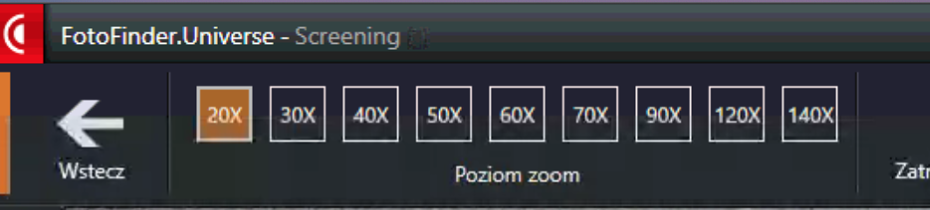

Wideodermatoskopia polega na komputerowym badaniu znamion za pomocą urządzenia zwanego wideodermatoskopem, wyposażonego w specjalną kamerę, która umożliwia oglądanie znamion w bardzo dużym powiększeniu oraz dokładną ich analizę.

<YoutubeGif url="https://www.youtube.com/watch?v=E_qZwzFpBb4" />

## Przebieg badania wideodermatoskopowego

- Lekarz zbiera szczegółowy wywiad oraz dokonuje oględzin całego ciała - przykłada kamerę wideodermatoskopu do każdego znamienia na skórze pacjenta, dokonując oceny obrazu, który pojawia się na ekranie komputera.
- W trakcie wstępnego badania lekarz zaznacza znamiona, które będą wymagały kontroli lub usunięcia.
- Dane pacjenta zostają zapisane w systemie komputerowym i lekarz dokonuje mapowania znamion wyznaczonych do obserwacji lub usunięcia.
- Lekarz udziela pacjentowi szczegółowej informacji o wyniku badania i dalszych zaleceniach diagnostycznych oraz terminie kolejnego badania kontrolnego, a także omawia z pacjentem wszelkie wątpliwości, które pojawiły się w trakcie wizyty.
- Lekarz generuje raport z badania, uzupełnia wynik oraz dokumentację medyczną.
- Pacjent otrzymuje wynik badania oraz raport z systemu wideodermatoskopu w postaci zdjęć wszystkich zapisanych przez lekarza znamion - drogą elektroniczną w postaci chronionego indywidualnym hasłem pliku.

<YoutubePlayer url="https://www.youtube.com/watch?v=poNXsnlfk-g" start="118" end="138" label="Przebieg badania wideodermatoskopowego" muted={true} />

**Czas trwania komputerowej oceny znamion - 30-40 min. w zależności od liczby znamion na skórze.**

<More link="/kontakt" text="Sprawdź wolne terminy badania w Twoim mieście." cta="Sprawdź" />

### Jak wygląda wynik badania dermatoskopowego?

Po badaniu wideodermatoskopowym pacjent otrzymuje szczegółową informację, które znamiona zostały zakwalifikowane do obserwacji, a które do usunięcia. Wynik oraz raport z badania jest podstawą dalszego postępowania diagnostycznego, np. resekcji chirurgicznej podejrzanej zmiany.

### Jak wygląda raport z badania wideodermatoskopowego?

Raport z badania wideodermatoskopowego zawiera zarówno zdjęcia lokalizacyjne, jak i zdjęcia w powiększeniu. Na jego podstawie pacjent wie, na które znamiona powinien zwrócić uwagę w okresie obserwacji zaleconej przez lekarza do czasu kolejnej wizyty kontrolnej.

W przypadku badań kontrolnych pacjent otrzymuje także zdjęcia porównawcze obserwowanych znamion.

## Archiwizacja zdjęć

Dedykowane wideodermatoskopom oprogramowanie umożliwia także zapisywanie wykonanych zdjęć znamion w trakcie badania celem ich szczegółowej analizy oraz ich archiwizowanie w systemie. Umożliwia to porównanie i śledzenie dynamiki zmian zachodzących w strukturze znamion w odpowiednich odstępach czasowych. Lekarz przykłada kamerę do skóry pacjenta wykonuje zdjęcie na ekranie obrazu znamion w wybranym powiększeniu w rozdzielczości Full HD.

W trakcie badania kontrolnego specjalista może porównać aktualny obraz znamienia do obrazu, który był zapisany w czasie poprzednich badań kontrolnych i na tej podstawie jest w stanie bardzo szczegółowo oceniać zmiany zachodzące w znamionach - w ich wielkości, kolorze i strukturze. W precyzyjnej ocenie pomaga możliwość identycznych ustawień kamery w trakcie wykonywania badań kontrolnych. Z uwagi na zastosowanie nowoczesnej technologii, co bezpośrednio przekłada się na jakość obrazu, czas wizyty lekarskiej wydłuża się oraz [koszt badania](/cennik "koszt badania") w porównaniu do klasycznego badania dermatoskopowego jest nieco wyższy.

 

## Mapowanie znamion

Wraz z zastosowaniem wideodermatoskopów pojawiła się także możliwość tzw. “mapowania ciała” - to znaczy wykonywania zdjęć lokalizacyjnych poszczególnych części ciała pacjenta i zaznaczenia na nich znamion wymagających obserwacji wraz z ich obrazem mikroskopowym. Technicznie wszystkie znamiona są przypisane konkretnej, szczegółowej lokalizacji na ciele pacjenta.

W trakcie mapowania znamion lekarz przypisuje konkretną lokalizację każdej zapisanej zmianie skórnej.

Zdjęcie lokalizacyjne i mikroskopowe znamienia na stopie prawej - znamię zostało oznaczone markerem 01 w trakcie badania i przypisane konkretnej lokalizacji.

Dodatkowo każdemu zapisanemu markerowi, odpowiadającemu konkretnemu znamieniu, lekarz może przepisać adnotację: normalne/podejrzane/bardzo podejrzane/do wycięcia - wówczas pacjent otrzymuje taką informację w raporcie z wizyty.

Ocena dermatoskopowa to w głównej mierze analiza porównawcza zmian zachodzących w znamionach na przestrzeni czasu, dlatego badanie wideodermatoskopowe - komputerowa ocena znamion - to obecnie najlepsza metoda wykorzystywana w diagnostyce zmian skórnych

Niewątpliwie w przypadku prowadzenia regularnych kontroli dermatoskopowych w gabinecie, lekarz powinien dysponować urządzeniem umożliwiającym zapis wykonanego zdjęcia celem dokonania późniejszej analizy porównawczej pod kątem dynamiki rozwoju zmiany. Idealnym i zalecanym obecnie rozwiązaniem jest badanie wideodermatoskopowe z możliwością kompleksowej archiwizacji i późniejszej analizy wspomaganej komputerową oceną badanych znamion pacjenta.

<More link="/dermatoskopia-badanie-znamion#id4" text="Wskazania do wykonania badania dermatoskopowego znamion" cta="Sprawdź" />

## Wideodermatoskopowe badania kontrolne

Zdjęcia znamion wykonane w trakcie badania zapisywane są w systemie dedykowanym dla danego ośrodka medycznego. Żeby móc dokonać analizy porównawczej znamion w innym ośrodku, pacjent powinien dostarczyć raport z badania wykonanego w poprzednim ośrodku - wówczas na jego podstawie lekarz będzie miał możliwość wykonania oceny porównawczej celem podjęcia odpowiednich decyzji terapeutycznych.

Najwygodniej jest natomiast wykonywać regularne badania z wykorzystaniem tego samego urządzenia, w którym znajduje się dokumentacja z poprzednich badań, gdyż na ich podstawie lekarz może podjąć prawidłowa decyzję odnośnie dalszego procesu diagnostycznego i odpowiedzieć na pytanie, czy znamię jest niepokojące i powinno zostać usunięte czy może nie budzi na tym etapie niepokoju onkologicznego i nadal może pozostać w obserwacji.

 

## System komputerowej oceny znamion

Programem, który służy do wspomagania lekarza w pracy jest m.in. program Moleanalyzer Pro, który oferuje wsparcie dla lekarzy w stawianiu diagnozy i podejmowaniu decyzji terapeutycznych. Oprogramowanie dostarcza szczegółowych informacji dotyczących pola powierzchni zmiany, jej obwodu, średnicy oraz ocenia zmiany zachodzące w znamionach pod kątem granic, osi symetrii oraz obecnych struktur.

<More link="/czerniak/rodzaje-czerniaka-zdjecia" text="Zobacz jak wyglądają różne rodzaje czerniaka." cta="Zobacz" />

W analizie znamion wspomaganej systemem Moleanalyzer stosuje się 3-stopniową skalą przesiewową oraz 7-punktową skalę Glasgow. Oprogramowanie stosuje algorytm oparty na „sztucznej inteligencji” AI (Artificial Intelligence) oraz umożliwia także ocenę ryzyka złośliwości. Oprogramowanie zostało przyuczone na podstawie 25000 potwierdzonych histopatologicznie obrazów zmian skórnych.

Z uwagi na wydłużony czas oceny i brak pewności trafnej diagnozy na tym etapie oraz fakt, iż obecnie jest to z założenia system wspomagający ocenę lekarską - z oprogramowania korzystają tylko niektóre placówki i lekarze niechętnie sięgają po to narzędzie, opierając się w ocenie głównie na swojej wiedzy i zebranym doświadczeniu. Systemy oparte na sztucznej inteligencji stanowią obecnie temat wielu prac badawczych, których wyniki są obiecujące i na pewno w przyszłości zmienią oblicze wielu dziedzin medycyny, w tym także oceny wideodermatoskopowej. Wiele badań pokazuje już, że systemy oparte na sztucznej inteligencji potrafią diagnozować zmiany skórne na podobnym poziomie co doświadczenie dermatolodzy.

Więcej artykułów dotyczących sztucznej inteligencji AI (Artificial Intelligence) i jej wykorzystaniu w diagnostyce zmian skórnych znajdziesz tutaj:

* https://onlinelibrary.wiley.com/doi/full/10.1111/jdv.16165?af=R
* https://www.nature.com/articles/s41591-020-0942-0
* https://pubmed.ncbi.nlm.nih.gov/32534243/
* https://pubmed.ncbi.nlm.nih.gov/31972395/

Czekamy na dalsze doniesienia!

## Rodzaje wideodermatoskopów

Wiodącym producentem widoedermatosków jest niemiecka firma Fotofinder www.fotofinder.de , będąca pionierem i światowym liderem w dziedzinie wideodermatoskopii cyfrowej, umożliwiającej wczesne wykrywanie raka skóry. Firma skupia się przede wszystkim na rozwoju systemów do cyfrowej dermoskopii oraz mapowania ciała. Dzięki połączeniu odpowiedniej jakości oprogramowania, nowoczesnej technologii ze sprzętem komputerowym oraz dedykowaną kamerą, możliwe jest tworzenie wysokiej jakości zdjęć w sposób szybki i intuicyjny, usprawniający tym samym pracę lekarza oraz skracający czas badania i podnoszący jego jakość.

Wideodermatoskop Fotofinder Medicam 1000 Portable, rozdzielczość Full-HD, opatentowany obiektyw, wersja mniejsza od klasycznej - mobilna.

Kolejnym urządzeniem stosowanym w gabinetach lekarskich jest Wideodermatoskop Mikroderm D200 Evo o zmiennym powiększeniu w zakresie od 15 do 200 x, kamerą HD, rozdzielczością obrazu 6,5 MPx oraz oprogramowaniem DermaGraphix.

### Bodystudio ATBM - komputerowe automatyczne mapowanie znamion

<YoutubePlayer url="https://www.youtube.com/watch?v=HYHWJnBVaLc_1" start="5" end="107" label="Mapowanie znamion z BodyStudio ATBM" />

Bodystudio to rozszerzenie klasycznej wideodermatoskopii o możliwość przeprowadzenia automatycznej mapy ciała - w szczególności dedykowanej dla pacjentów z bardzo dużą liczbą znamion na ciele lub z zespołem znamion dysplastycznych. System umożliwia wykrycie oraz analizę nowych znamion, które pojawiły się na skórze pacjenta w porównaniu do badania poprzedniego. Bodyscan automatycznie porównuje zdjęcia całego ciała (aktualne i poprzednie), nakładając na siebie dwa obrazy, i wykrywa wszystkie nowe znamiona, zaznaczając je na zdjęciu.

